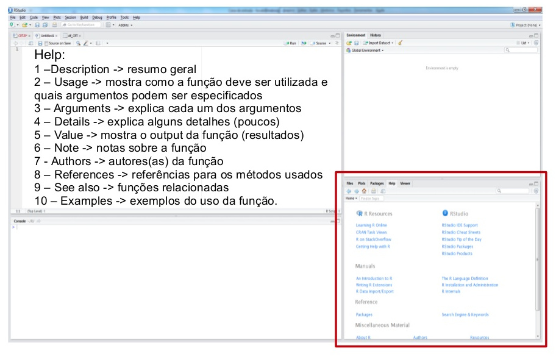
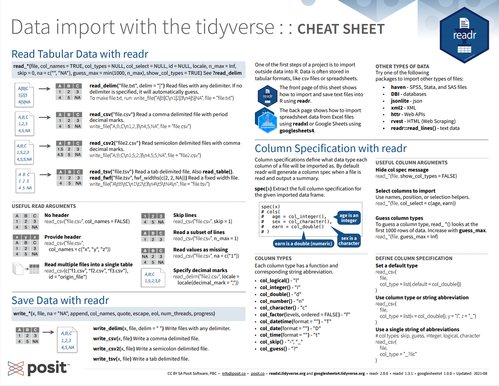
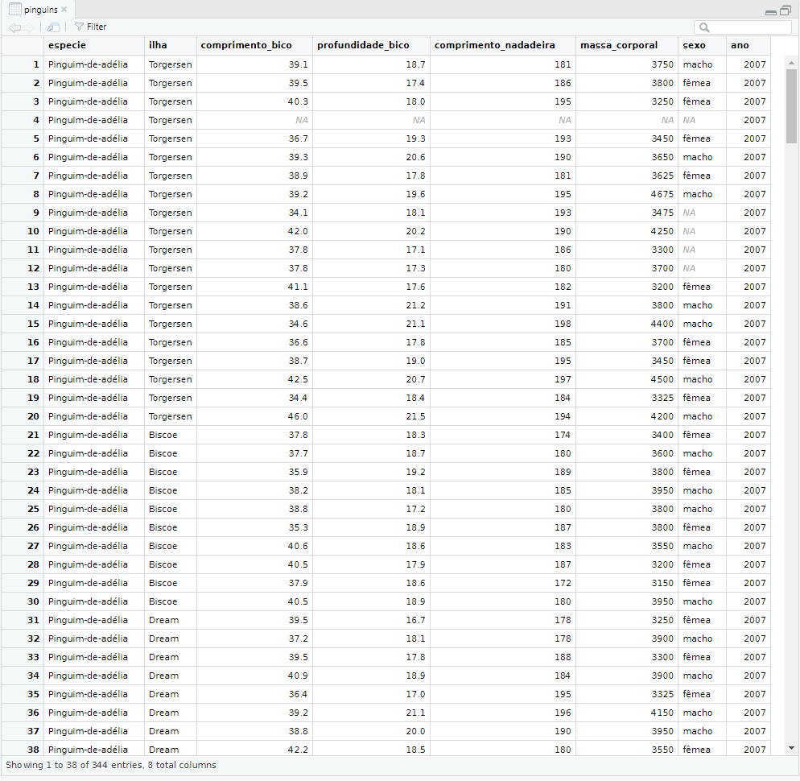
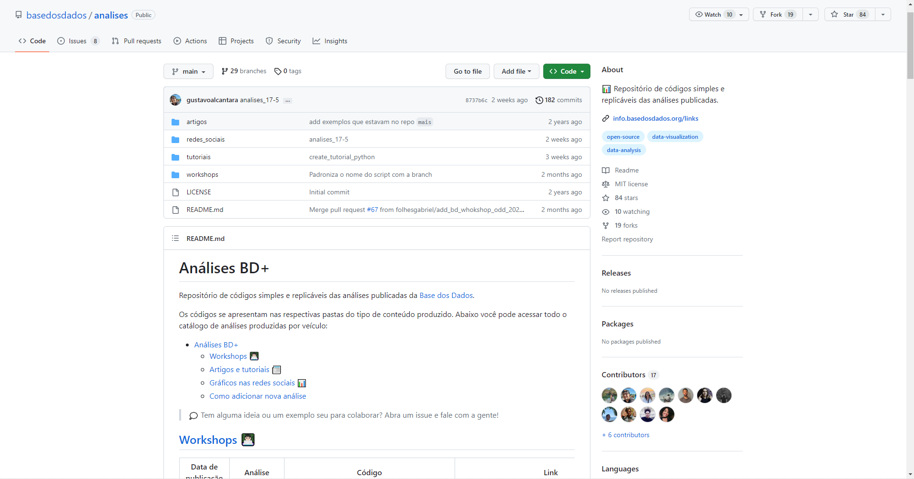
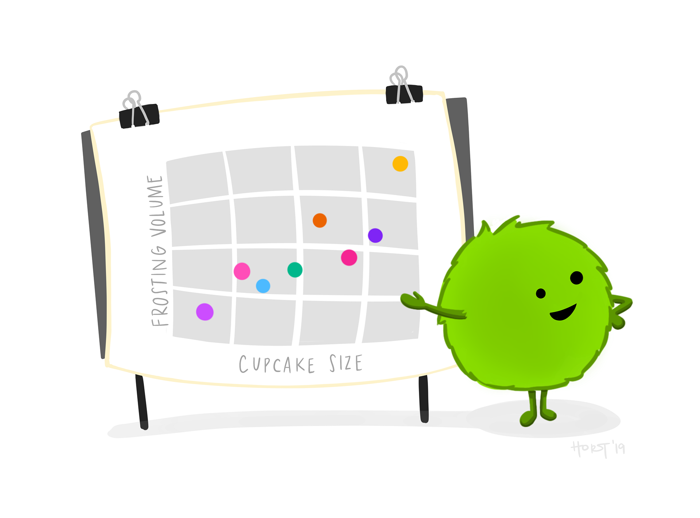
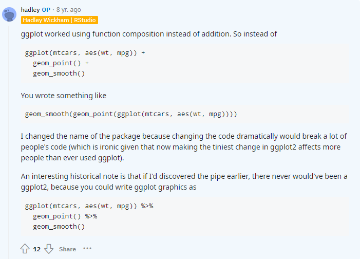
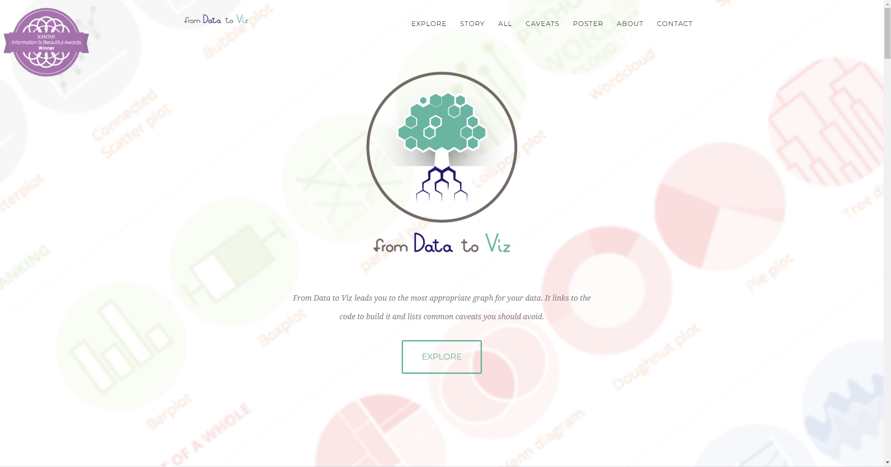
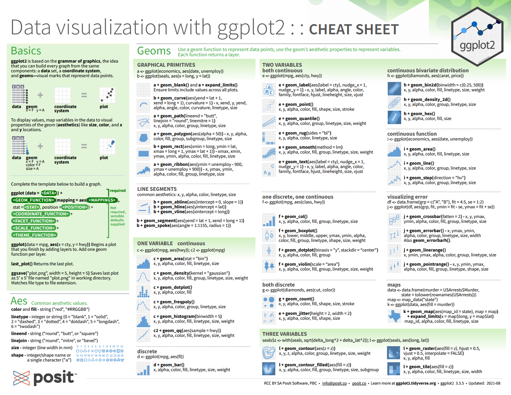
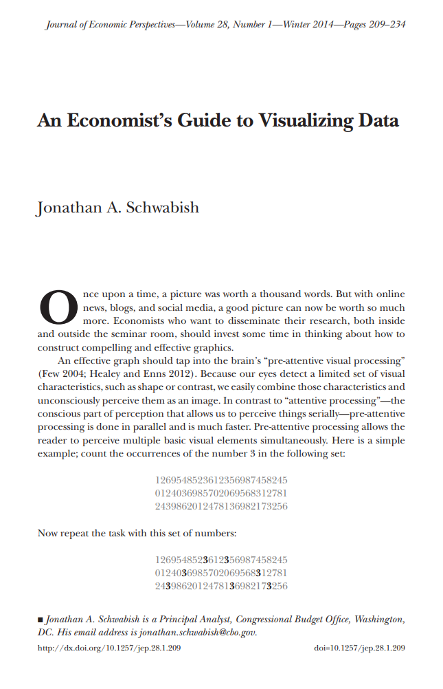

```{r setup, include=FALSE}
options(htmltools.dir.version = FALSE)
knitr::opts_chunk$set(
  fig.width = 9, fig.height = 3.5, fig.retina = 3,
  out.width = "100%",
  cache = FALSE,
  echo = TRUE,
  message = FALSE, 
  warning = FALSE,
  hiline = TRUE
)
```

```{r xaringan-themer, include=FALSE, warning=FALSE}
# xaringanthemer::style_duo_accent(
#   primary_color = "#1381B0",
#   secondary_color = "#FF961C",
#   inverse_header_color = "#FFFFFF"
# )
xaringanthemer::style_duo_accent(
  primary_color = "#005c8b",
  secondary_color = "#0073ae",
  inverse_header_color = "#FFFFFF"
)
```

```{r xaringanExtra, echo=FALSE}
#devtools::install_github("gadenbuie/xaringanExtra")
# xaringanExtra::use_xaringan_extra(c("tile_view", "animate_css", "tachyons"))

xaringanExtra::use_clipboard()
xaringanExtra::use_fit_screen()
xaringanExtra::use_extra_styles(
  hover_code_line = TRUE,         #<<
  mute_unhighlighted_code = TRUE  #<<
)
xaringanExtra::use_share_again()
xaringanExtra::use_scribble()
xaringanExtra::use_tile_view()
xaringanExtra::use_tachyons()
xaringanExtra::use_panelset()
```

.pull-left[
<br>
<br>
## Análise de dados com R

<br>

### Introdução a <br> Linguagem R

<br>
<br>

**[Luísa Gisele Böck](https://luisa.rbind.io/)**&nbsp;&nbsp;    <a href='mailto:luisa.bock@acad.ufsm.br'><i class="far fa-envelope"></i></a> &nbsp;   <a href='https://github.com/lgiselebock'><i class="fab fa-github"></i></a>

__.can-edit[Abril de 2025]__

]

.pull-right[
<br>
<br>
<br>
```{r echo=FALSE, out.width="400px"}

```

.center[Ilustração por [Allison Horst](https://allisonhorst.com/)]
]

---

name: sumario
# Sumário 

<div class="panelset">

<div class="panel">
<div class="panel-name">R e RStudio</div>

- **[R e RStudio](#r-rstudio)**
  
  - [Instalação do R](#instalacao-r)
  - [Instalação do RStudio](#instalacao-rstudio)
  - [O que é o R?](#o-que-e-o-r)
  - [RStudio](#rstudio)
  - [Atalhos](#atalhos)
  - [Help!](#help)
  - [Cheat Sheets](#cheat-sheets)
  - [O Ciclo da Ciência de Dados](#ciclo-ciencia-dados)
  - [O Ciclo da Ciência de Dados no R](#ciclo-ciencia-dados-r)
  
</div>

<div class="panel">
<div class="panel-name">Introdução</div>

.pull-left[
- **[Introdução](#introducao)**

  - [R como calculadora](#r-calculadora)
  - [Funções matemáticas](#funcoes-matematicas)
  - [Objetos](#objetos)
  - [Operadores Relacionais](#operadores-relacionais)
  - [Operadores Lógicos](#operadores-logicos)
  - [Pertence](#pertence)
  - [Tipos Básicos de dados](#tipos-basicos-dados)
  - [Números](#numeros)
  - [Lógicos](#logicos)
  - [Textos](#textos)
]

.pull-right[
- **[Introdução](#introducao)**

  - [Fatores](#fatores)
  - [NA](#NA)
  - [Conversão de classes](#conversao-classes)
  - [Tipos de objetos](#tipos-objetos)
  - [Vetores](#vetores)
  - [Matrizes](#matrizes)
  - [Listas](#listas)
  - [Data Frame](#data-frame)
  - [Funções](#funcoes)
  - [Pacotes](#pacotes)
  - [Para saber mais!](#para-saber-mais-introducao)
]

</div>

<div class="panel">
<div class="panel-name">Importação</div>
 
- **[Projetos](#projetos)**

  - [Pacote `tidyverse`](#pacote-tidyverse)  

- **[Importação de dados](#importacao)**

  - [Caminhos](#caminhos)
  - [Arquivos `.RData` e `.Rhistory`](#rdata-rhistory)
  - [Tibbles](#tibbles)
  - [Cheat Sheets](#cheat-sheets-readr)
  - [Importação de arquivos](#importacao-arquivos)
  - [Exportação de arquivos](#exportacao-arquivos)
  - [Importação e exportação de arquivos](#importacao-exportacao-arquivos-rds)
  - [Visualização de um objeto](#visualizacao-objeto)
  - [BASE DOS DADOS](#base-dos-dados)
  - [BASE DOS DADOS — SQL](#base-dos-dados-sql)

</div>

<div class="panel">
<div class="panel-name">Manipulação</div>

.pull-left[
- **[Manipulação de dados](#manipulacao)**

  - [Pipe: `%>%` ou `|>`](#pipe)
  - [Pacote `dplyr`](#pacote-dplyr)
  - [Cheat Sheets](#cheat-sheets-dplyr)
  - [Selecionando Colunas: `select()`](#dplyr-select)
  - [Ordenando linhas: `arrange()`](#dplyr-arrange)
  - [Aplicando mais de uma função](#mais-de-uma-funcao)
  - [Filtrando linhas: `filter()`](#dplyr-filter)
  - [Criando novas colunas: `mutate()`](#dplyr-mutate)
  - [Sumarizando colunas: `summarise()`](#dplyr-summarise)
  - [Sumarizando colunas agrupadas: `group_by()`](#dplyr-group-by)
  - [Ordenando colunas:  `relocate()`](#dplyr-relocate)
  - [Renomeando colunas: `rename()`](#dplyr-rename)
  - [Selecionando linhas: `slice_head()`](#dplyr-slice-head)
  - [Selecionando linhas: `slice_tail()`](#dplyr-slice-tail)
]  

.pull-right[ 
- **[Manipulação de dados](#manipulacao)**

  - [Selecionando linhas: `slice_max()`](#dplyr-slice-max)
  - [Selecionando linhas: `slice_min()`](#dplyr-slice-min)
  - [Selecionando linhas: `slice_sample()`](#dplyr-slice-sample)
  - [Limpando a tabela: `distinct()`](#dplyr-distinct)
  - [Contando valores: `count()`](#dplyr-count)
  - [Combinando dados: `bind_rows()`](#dplyr-bind-rows)
  - [Combinando dados: `bind_cols()`](#dplyr-bind-cols)
  - [Unindo bases: `*_join()`](#dplyr-join)
  - [Pacote `tidyr`](#pacote-tidyr)
  - [Cheat Sheets](#cheat-sheets-tidyr)
  - [União de colunas: `unite()`](#tidyr-unite)
  - [Separação de colunas: `separate()`](#tidyr-separate)
  - [Remove NAs: `drop_na()`](#tidyr-drop-na)
  - [Pivotar os dados: `pivot_*()`](#tidyr-pivot)
  - [Larga para longa: `pivot_longer()`](#tidyr-pivot-longer)
  - [Longa para larga: `pivot_wider()`](#tidyr-pivot-wider)
]

</div>

<div class="panel">
<div class="panel-name">Visualização</div>

.pull-left[
- **[Visualização de dados](#visualizacao)**

  - [Para que servem as visualizações?](#para-que-servem-visualizacoes)
  - [Gramática de gráficos _em camadas_](#gramatica-graficos-camadas)
  - [Construindo um gráfico em Camadas](#construindo-grafico-camadas)
  - [Curiosidade: por que o `+`?](#curiosidade-pq-mais)
  - [Qual gráfico escolher?](#qual-grafico-escolher)
  - [Cheat Sheets](#cheat-sheets-ggplot2)
  - [Um gráfico de pontos (dispersão)](#grafico-pontos)
  - [Gráfico de linhas](#grafico-linhas)
  - [Gráfico de barras](#grafico-barras)
]

.pull-right[
- **[Visualização de dados](#visualizacao)**

  - [Histogramas](#histogramas)
  - [Boxplot](#boxplot)
  - [Títulos, _labels_ e escalas](#titulos-labels-escalas)
  - [Cores](#cores)
  - [Trocando os textos da legenda](#trocando-textos-legenda)
  - [Temas](#temas)
  - [Mapas](#mapas)
  - [Para saber mais!](#para-saber-mais-visualizacao)
]

</div>

<div class="panel">
<div class="panel-name">Regressão Linear</div>

- **[Regressão Linear](#regressao)**

  - [Dados Educacionais](#dados-educacionais)
    - [Importando as bases](#dados-educacionais-importando-bases)
    - [Padronizando as bases de dados](#dados-educacionais-padronizando-bases)
    - [Juntando as bases de dados: Ensino Fundamental](#dados-educacionais-juntando-bases-fundamental)
    - [Análise Descritivas: Ensino Fundamental](#dados-educacionais-analises-descritivas-fundamental)
    - [Regressão Linear: Ensino Fundamental](#dados-educacionais-regressao-linear-fundamental)
    - [Juntando as bases de dados: Ensino Médio](#dados-educacionais-juntando-bases-medio)
    - [Análise Descritivas: Ensino Médio](#dados-educacionais-analises-descritivas-medio)
    - [Regressão Linear: Ensino Médio](#dados-educacionais-regressao-linear-medio)
    - [BASE DOS DADOS](#base-dos-dados-regressao)
  - [Atlas do Desenvolvimento Humano](#atlas-desenvolvimento-humano)
    - [Atlas do Desenvolvimento Humano — importando a base de dados](#atlas-desenvolvimento-humano-importando-base)
  - [Mapas](#mapas-regressao)
  - [Pacote `{wooldridge}`](#wooldridge)
  - [Para saber mais!](#para-saber-mais-regressao)

</div>
</div>

---

class: inverse center middle
name: r-rstudio

# R e RStudio 

<div class="link-sumario">
  <a href="#sumario" title="Ir para o sumário">Sumário</a>
</div>

---

name: instalacao-r

<div class="faixa-lateral faixa-r-rstudio">
  <span>R e RStudio</span>
</div>

## Instalação do R 

.pull-left[
<br>
<br>
<br>
<br>
<br>
- [Download](https://cran.r-project.org/)
- Use a versão mais recente `r emo::ji("wink")` 
]
.pull-right[
<br>
<br>
<br>
```{r, fig.align='center', out.width='60%', echo=FALSE}
knitr::include_graphics("img/01-r-logo.svg")
```
]

<div class="link-sumario">
  <a href="#sumario" title="Ir para o sumário">Sumário</a>
</div>

---

<div class="faixa-lateral faixa-r-rstudio">
  <span>R e RStudio</span>
</div>

## Instalação do R

```{r, fig.align='center', out.width="80%", echo=FALSE}
knitr::include_graphics("img/02-r-install.png")
```

<div class="link-sumario">
  <a href="#sumario" title="Ir para o sumário">Sumário</a>
</div>

---

name: instalacao-rstudio

<div class="faixa-lateral faixa-r-rstudio">
  <span>R e RStudio</span>
</div>

## Instalação do RStudio

.pull-left[
<br>
<br>
<br>
<br>
<br>
- [Download](https://posit.co/download/rstudio-desktop/)
- Use a versão mais recente `r emo::ji("wink")` 
]
.pull-right[
<br>
<br>
<br>
<br>
<br>
```{r, fig.align='center', out.width="70%", echo=FALSE}
knitr::include_graphics("img/03-rstudio.png")
```
]

<div class="link-sumario">
  <a href="#sumario" title="Ir para o sumário">Sumário</a>
</div>

---

<div class="faixa-lateral faixa-r-rstudio">
  <span>R e RStudio</span>
</div>

## Instalação do RStudio

```{r, fig.align='center', out.width="80%", echo=FALSE}
knitr::include_graphics("img/04-rstudio-install.png")
```

<div class="link-sumario">
  <a href="#sumario" title="Ir para o sumário">Sumário</a>
</div>

---

name: o-que-e-o-r

<div class="faixa-lateral faixa-r-rstudio">
  <span>R e RStudio</span>
</div>

### O que é o R?

> "R é um ambiente de software livre para computação estatística e gráficos." [R Development Core Team](https://cran.r-project.org/)

  - **Por que usar o R?**
  
    - É uma linguagem de programação que possui muitas ferramentar para a análise de dados;
    
    - É em código aberto e gratuito (*open source*);
    
    - Possui uma comunidade ativa de pessoas desenvolvedoras;
    
    - É flexível, permite desenvolver funções e pacotes para facilitar o trabalho;
    
    - Está disponível gratuitamente em diferentes plataformas: Linux, MacOS e Windows;
    
    - Mantido pela [R Development Core Team](https://cran.r-project.org/).

<div class="link-sumario">
  <a href="#sumario" title="Ir para o sumário">Sumário</a>
</div>

---

name: rstudio

<div class="faixa-lateral faixa-r-rstudio">
  <span>R e RStudio</span>
</div>

### RStudio

**RStudio** é uma IDE (*Integrated Development Environment*) da Linguagem R, isto é, um ambiente de desenvolvimento utilizado para editar e executar códigos em R. Ela é mantida pela [Posit](https://posit.co).

```{r, fig.align='center', out.width="80%", echo=FALSE}
knitr::include_graphics("img/05-rstudio.png")
```

<div class="link-sumario">
  <a href="#sumario" title="Ir para o sumário">Sumário</a>
</div>

---

<div class="faixa-lateral faixa-r-rstudio">
  <span>R e RStudio</span>
</div>

### RStudio

**Editor/Scripts:** onde os códigos são escritos. O **RStudio** destaca algumas palavras e símbolos para facilitar a leitura do código.

```{r, fig.align='center', out.width="700px", echo=FALSE}
knitr::include_graphics("img/06-rstudio-haydee.jpg")
```

<div class="link-sumario">
  <a href="#sumario" title="Ir para o sumário">Sumário</a>
</div>

---

<div class="faixa-lateral faixa-r-rstudio">
  <span>R e RStudio</span>
</div>

### RStudio

**Console:** onde os códigos são executados e os resultados são exibidos. **O R vive aqui!**

```{r, fig.align='center', out.width="700px", echo=FALSE}
knitr::include_graphics("img/07-rstudio-haydee.jpg")
```

<div class="link-sumario">
  <a href="#sumario" title="Ir para o sumário">Sumário</a>
</div>

---

<div class="faixa-lateral faixa-r-rstudio">
  <span>R e RStudio</span>
</div>

### RStudio

**Environment:** painel com todos os objetos criados na sessão.

```{r, fig.align='center', out.width="700px", echo=FALSE}
knitr::include_graphics("img/08-rstudio-haydee.jpg")
```

<div class="link-sumario">
  <a href="#sumario" title="Ir para o sumário">Sumário</a>
</div>

---

<div class="faixa-lateral faixa-r-rstudio">
  <span>R e RStudio</span>
</div>

### RStudio

**History:** painel com um histórico dos comandos rodados.

```{r, fig.align='center', out.width="700px", echo=FALSE}
knitr::include_graphics("img/09-rstudio-haydee.jpg")
```

<div class="link-sumario">
  <a href="#sumario" title="Ir para o sumário">Sumário</a>
</div>

---

<div class="faixa-lateral faixa-r-rstudio">
  <span>R e RStudio</span>
</div>

### RStudio

**Files:** mostra os arquivos no diretório de trabalho. É possível navegar entre os diretórios.

```{r, fig.align='center', out.width="700px", echo=FALSE}
knitr::include_graphics("img/10-rstudio-haydee.jpg")
```

<div class="link-sumario">
  <a href="#sumario" title="Ir para o sumário">Sumário</a>
</div>

---

<div class="faixa-lateral faixa-r-rstudio">
  <span>R e RStudio</span>
</div>

### RStudio

**Plots:** painel onde os gráficos serão apresentados.

```{r, fig.align='center', out.width="700px", echo=FALSE}
knitr::include_graphics("img/11-rstudio-haydee.jpg")
```

<div class="link-sumario">
  <a href="#sumario" title="Ir para o sumário">Sumário</a>
</div>

---

<div class="faixa-lateral faixa-r-rstudio">
  <span>R e RStudio</span>
</div>

### RStudio

**Packages:** apresenta todos os pacotes instalados e carregados.

```{r, fig.align='center', out.width="700px", echo=FALSE}
knitr::include_graphics("img/12-rstudio-haydee.jpg")
```

<div class="link-sumario">
  <a href="#sumario" title="Ir para o sumário">Sumário</a>
</div>

---

<div class="faixa-lateral faixa-r-rstudio">
  <span>R e RStudio</span>
</div>

### RStudio

**Help:** janela onde a documentação das funções serão apresentadas.

```{r, fig.align='center', out.width="700px", echo=FALSE}

```

<div class="link-sumario">
  <a href="#sumario" title="Ir para o sumário">Sumário</a>
</div>

---

name: atalhos

<div class="faixa-lateral faixa-r-rstudio">
  <span>R e RStudio</span>
</div>

### Atalhos

Conhecer os atalhos do teclado ajuda bastante durante a programação no **RStudio**.

- **CTRL + ENTER:** avalia/roda a linha selecionada no script;

- **ALT + –:** cria um sinal de atribuição (`<-`);

- **CTRL + SHIFT + M:** adiciona o operador pipe (`%>%` ou `|>`);

- **CTRL + SHIFT + C:** comenta a(s) linha(s) selecionada(s);

- **CTRL + SHIFT + D:** duplica a(s) linha(s) selecionada(s);

- **CTRL + 1:** altera o cursos para o script;

- **CTRL + 2:** altera o cursos para o console;

- **ALT + SHIFT + K:** mostra uma janela com todos os atalhos disponíveis.

<br>

No MacOS, substitua **CTRL** por **CMD** e **ALT** por **OPT**.

<div class="link-sumario">
  <a href="#sumario" title="Ir para o sumário">Sumário</a>
</div>

---

name: help

<div class="faixa-lateral faixa-r-rstudio">
  <span>R e RStudio</span>
</div>

### Help! 

Ficou com dúvida sobre determinado pacote ou função?

  - Peça ajuda: **help**(nome_do_pacote) ou **?**nome_do_pacote;
  
  - Peça ajuda: **help**(nome_da_funcaoo) ou **?**nome_da_funcao;
  
<br>
  
```{r, eval=FALSE}
help(sum)
?sum
```

<br>

  - Se a dúvida persistir, procure no [Google](https://www.google.com/) ou no [Stack Overflow](https://stackoverflow.com/).
  
  - E se ainda estiver com dúvidas, pergunte para a comunidade:
  
    - há diversos grupos de Telegram, Twitter, Discourse e em outras redes sociais.

<div class="link-sumario">
  <a href="#sumario" title="Ir para o sumário">Sumário</a>
</div>

---

name: cheat-sheets

<div class="faixa-lateral faixa-r-rstudio">
  <span>R e RStudio</span>
</div>

### [Cheat Sheets](https://rstudio.com/resources/cheatsheets/)

O **RStudio** disponibiliza algumas 'folhas de cola', as **Cheat Sheets**. Elas trazem um resumo de como utilizar diversos pacotes e até o próprio RStudio. Para acessá-las, basta clicar no menu `Help` e então em `Cheat Sheets`, ou através do site da [**Posit**](https://posit.co/resources/cheatsheets/).

[](https://rstudio.github.io/cheatsheets/rstudio-ide.pdf)

<div class="link-sumario">
  <a href="#sumario" title="Ir para o sumário">Sumário</a>
</div>

---

name: ciclo-ciencia-dados

<div class="faixa-lateral faixa-r-rstudio">
  <span>R e RStudio</span>
</div>

### O Ciclo da Ciência de Dados

```{r, fig.align='center', out.width="700px", echo=FALSE}
knitr::include_graphics("img/15-ciclo-ciencia-de-dados.png")
```

<div class="link-sumario">
  <a href="#sumario" title="Ir para o sumário">Sumário</a>
</div>

---

name: ciclo-ciencia-dados-r

<div class="faixa-lateral faixa-r-rstudio">
  <span>R e RStudio</span>
</div>

### O Ciclo da Ciência de Dados no R

```{r, fig.align='center', out.width="700px", echo=FALSE}
knitr::include_graphics("img/16-ciclo-ciencia-de-dados-no-r.png")
```

<div class="link-sumario">
  <a href="#sumario" title="Ir para o sumário">Sumário</a>
</div>

---

class: inverse center middle
name: introducao

# Introdução

.center[(Acompanhe no arquivo `01-introducao.R`)]

<div class="link-sumario">
  <a href="#sumario" title="Ir para o sumário">Sumário</a>
</div>

---

name: r-calculadora

<div class="faixa-lateral faixa-introducao">
  <span>Introdução</span>
</div>

### R como calculadora

O **R** permite realizar muitas operações matemáticas!

```{r}
2 + 5 # adição

9 - 4 # subtração

5 * 2 # multiplicação

7 / 5 # divisão
```

- **CTRL + ENTER (ou CMD + ENTER):** executa a linha selecionada no script

<div class="link-sumario">
  <a href="#sumario" title="Ir para o sumário">Sumário</a>
</div>

---

<div class="faixa-lateral faixa-introducao">
  <span>Introdução</span>
</div>

### R como calculadora

```{r}
9 %% 4 # resto da divisão de 9 por 4

7 %/% 4 # parte inteira da divisão de 7 por 4

8 ^ 2 # potenciação

sqrt(1024) # radiciação
```

A ordem matemática das operações também vale do R.

<div class="link-sumario">
  <a href="#sumario" title="Ir para o sumário">Sumário</a>
</div>

---

name: funcoes-matematicas

<div class="faixa-lateral faixa-introducao">
  <span>Introdução</span>
</div>

### Funções matemáticas

```{r}
sin(1) # funções trigonométricas

log(1) # logaritmo natural (base e)

log10(10) # logaritmo na base 10

log(10, base = 10) # logaritmo na base 10

exp(0.5) # exponencial e^(1/2)
```

<div class="link-sumario">
  <a href="#sumario" title="Ir para o sumário">Sumário</a>
</div>

---

name: objetos

<div class="faixa-lateral faixa-introducao">
  <span>Introdução</span>
</div>

### Objetos

O **R** permite armazenar (salvar) valores dentro de um objeto.

Um **objeto** é um nome que guarda um valor, uma função ou uma base de dados.

- Para atribuir um valor a um objeto no R, utilizamos o operador `<-`.

.center[`nome_do_objeto <- valor`]

- Atalho: **ALT** + **–**: cria o `<-` sinal de atribuição.

<div class="link-sumario">
  <a href="#sumario" title="Ir para o sumário">Sumário</a>
</div>

---

<div class="faixa-lateral faixa-introducao">
  <span>Introdução</span>
</div>

#### Exemplo:

```{r}
nome <- "Fernando Oliveira Costa"
nome

idade <- 40
idade

cargo_ou_funcao <- "Gerente de Projetos"
cargo_ou_funcao

salario <- 12000.00
salario
```

<div class="link-sumario">
  <a href="#sumario" title="Ir para o sumário">Sumário</a>
</div>

---

<div class="faixa-lateral faixa-introducao">
  <span>Introdução</span>
</div>

### Nomes dos Objetos

Existem algumas regras para dar nomes aos objetos:

- os nomes devem começar com uma letra. E podem conter letras, números, `_` e `.`. Não usar acentuações e/ou espaços! O autor do livro [R for Data Science](https://r4ds.hadley.nz) recomenda usar **snake_case**, ou seja, palavras escritas em minúsculo separadas por underline (`_`).

- o R é **case sensitive**, isto é, faz a diferenciação entre as letras minúsculas e maiúsculas. Portanto, um objeto chamado `teste` é diferente de outro objeto chamado `Teste`.

```{r}
a <- 2
a

A <- 4
A
```

<div class="link-sumario">
  <a href="#sumario" title="Ir para o sumário">Sumário</a>
</div>

---

name: operadores-relacionais

<div class="faixa-lateral faixa-introducao">
  <span>Introdução</span>
</div>

### Operadores Relacionais

- Igual a: **==**

- Diferente de: **!=**

- Maior que: **>**

- Maior ou igual a: **>=**

- Menor que: **<**

- Menor ou igual a: **<=**

<div class="link-sumario">
  <a href="#sumario" title="Ir para o sumário">Sumário</a>
</div>

---

<div class="faixa-lateral faixa-introducao">
  <span>Introdução</span>
</div>

### Operadores Relacionais

- Igual a: **==**

```{r}
TRUE == TRUE

TRUE == FALSE
```

- Diferente de: **!=**

```{r}
TRUE != TRUE

TRUE != FALSE
```

<div class="link-sumario">
  <a href="#sumario" title="Ir para o sumário">Sumário</a>
</div>

---

<div class="faixa-lateral faixa-introducao">
  <span>Introdução</span>
</div>

### Operadores Relacionais

- Maior que: **>**

```{r}
15 > 10

10 > 10
```

- Menor que: **<**

```{r}
3 < 5

10 < 5
```

<div class="link-sumario">
  <a href="#sumario" title="Ir para o sumário">Sumário</a>
</div>

---

<div class="faixa-lateral faixa-introducao">
  <span>Introdução</span>
</div>

### Operadores Relacionais

- Maior ou igual a: **>=**

```{r}
15 >= 10

15 >= 15
```

- Menor ou igual a: **<=**

```{r}
10 <= 10

10 <= 8
```

<div class="link-sumario">
  <a href="#sumario" title="Ir para o sumário">Sumário</a>
</div>

---

name: operadores-logicos

<div class="faixa-lateral faixa-introducao">
  <span>Introdução</span>
</div>

### Operadores Lógicos

- AND - E: **&**

Será verdadeiro (`TRUE`) se as duas condições forem verdadeiras

```{r}
x <- 15

  x > 10 & x <= 20
  
y <- 7

  y > 10 & y <= 15
```

<div class="link-sumario">
  <a href="#sumario" title="Ir para o sumário">Sumário</a>
</div>

---

<div class="faixa-lateral faixa-introducao">
  <span>Introdução</span>
</div>

### Operadores Lógicos

- OR - OU: **|**

Será verdadeiro (`TRUE`) se uma das duas condições for verdadeira

```{r}
x <- 5

  x >= 10 | x <= 15
  
y <- 2

  y >= 5 | y == 0
```

<div class="link-sumario">
  <a href="#sumario" title="Ir para o sumário">Sumário</a>
</div>

---

<div class="faixa-lateral faixa-introducao">
  <span>Introdução</span>
</div>

### Operadores Lógicos

- NOT - NEGAÇÃO: **!**

```{r}
!TRUE

!FALSE

x <- c(TRUE, FALSE, TRUE, FALSE)

  !x

y <- 8

  (!y < 5)
```

<div class="link-sumario">
  <a href="#sumario" title="Ir para o sumário">Sumário</a>
</div>

---

name: pertence

<div class="faixa-lateral faixa-introducao">
  <span>Introdução</span>
</div>

### Pertence

É possível verificar se um valor está inserido dentro de um conjunto de valores (vetor).

É representado pelo operador **%in%**.

```{r}
3 %in% c(1, 2, 3, 4, 5)

3 %in% c(4, 5, 6)

"a" %in% c("a", "b")

"a" %in% c("c", "d", "e")
```

<div class="link-sumario">
  <a href="#sumario" title="Ir para o sumário">Sumário</a>
</div>

---

name: tipos-basicos-dados

<div class="faixa-lateral faixa-introducao">
  <span>Introdução</span>
</div>

### Tipos Básicos de dados

São os tipos de dados que podem ser representados na Linguagem R. É neles que são guardadas as informações.

- **Integer:** números inteiros

- **Double/Numeric:** números racionais

- **Logical:** tipos lógicos (`TRUE` ou `FALSE`)

- **Character:** texto (sempre entre aspas)

- **Factor:** dados categóricos

<br>

A função `class()` retorna o tipo de dado de um objeto.

<div class="link-sumario">
  <a href="#sumario" title="Ir para o sumário">Sumário</a>
</div>

---

name: numeros

<div class="faixa-lateral faixa-introducao">
  <span>Introdução</span>
</div>

### Números

Um número inteiro seguido de `L` será considerado do tipo **integer**:

```{r}
class(5L)
```

<br>

Números racionais serão considerados do tipo **double/numeric**:

```{r}
class(5)

class(5.1)
```

<div class="link-sumario">
  <a href="#sumario" title="Ir para o sumário">Sumário</a>
</div>

---

name: logicos

<div class="faixa-lateral faixa-introducao">
  <span>Introdução</span>
</div>

### Lógicos

Verdadeiro (`TRUE`) e Falso (`FALSE`) 

```{r}
class(TRUE)

class(FALSE)
```

<br>

O R entende o `TRUE` sendo igual a 1 (um) e o `FALSE` sendo igual a 0 (zero).

Isso significa que é possível realizar operações matemáticas com ele (por exemplo, somar):

```{r}
TRUE + FALSE + FALSE + TRUE + TRUE + TRUE + FALSE
```

<div class="link-sumario">
  <a href="#sumario" title="Ir para o sumário">Sumário</a>
</div>

---

name: textos

<div class="faixa-lateral faixa-introducao">
  <span>Introdução</span>
</div>

### Textos

**Qualquer** código entre aspas (`""`) será interpretado como texto **character**:

```{r}
class("TEXTO")

ensino <- c("Médio", "Superior", "Fundamental", "Fundamental", "Médio")

class(ensino)

class("3")
```

<div class="link-sumario">
  <a href="#sumario" title="Ir para o sumário">Sumário</a>
</div>

---

name: fatores

<div class="faixa-lateral faixa-introducao">
  <span>Introdução</span>
</div>

### Fatores

Os fatores (ou factors) são usados para representar categorias.

```{r}
# Criando um factor

ensino_categorias <- factor(c("Médio", "Superior", "Fundamental", "Fundamental", "Médio"))

ensino_categorias

class(ensino_categorias)
```

<br>

A função `as.factor()` cria um objeto do tipo `factor` ou converte um objeto já existente.

Na linha `levels` aparecem os rótupos do fator.

<div class="link-sumario">
  <a href="#sumario" title="Ir para o sumário">Sumário</a>
</div>

---

name: NA

<div class="faixa-lateral faixa-introducao">
  <span>Introdução</span>
</div>

### NA

**NA** representa um valor desconhecido ou ausente. As operações envolvendo um valor desconhecido também resultarão em valores desconhecidos (`NA`).

```{r}
NA > 10

NA + 10

NA / 5

10 == NA
```

<div class="link-sumario">
  <a href="#sumario" title="Ir para o sumário">Sumário</a>
</div>

---

<div class="faixa-lateral faixa-introducao">
  <span>Introdução</span>
</div>

### NA

```{r}
NA == NA
```

<br>
<br>

`is.na()` é a função que verifica se um objeto é `NA`.

```{r}
vetor_numerico <- c(NA, 1, 2, 3, 4, 5, NA)

is.na(vetor_numerico)

!is.na(vetor_numerico)
```

<div class="link-sumario">
  <a href="#sumario" title="Ir para o sumário">Sumário</a>
</div>

---

<div class="faixa-lateral faixa-introducao">
  <span>Introdução</span>
</div>

### na.rm = TRUE

Quando um vetor contém valores ausentes (`NA`), muitas funções não conseguem realizar os cálculos corretamente e retornam `NA` como resultado. Na maioria dos casos, o que se deseja é calcular o resultado ignorando os valores ausentes. Para isso, utiliza-se o argumento `na.rm = TRUE`, que instrui a função a remover os `NAs` antes de calcular.

```{r}
sum(vetor_numerico)

sum(vetor_numerico, na.rm = TRUE)

mean(vetor_numerico)

mean(vetor_numerico, na.rm = TRUE)
```

<div class="link-sumario">
  <a href="#sumario" title="Ir para o sumário">Sumário</a>
</div>

---

name: conversao-classes

<div class="faixa-lateral faixa-introducao">
  <span>Introdução</span>
</div>

### Conversão de classes

```{r}
vetor_logical <- c(TRUE, TRUE, FALSE, TRUE, FALSE)

as.integer(vetor_logical) # converte para número inteiro

as.numeric(vetor_logical) # converte para número racional

as.character(vetor_logical) # converte para texto

as.factor(vetor_logical) # converte para fator
```

<div class="link-sumario">
  <a href="#sumario" title="Ir para o sumário">Sumário</a>
</div>

---

<div class="faixa-lateral faixa-introducao">
  <span>Introdução</span>
</div>

### Conversão de classes

```{r}
frutas <- c("amora", "banana", "melancia")

as.integer(frutas)

as.numeric(frutas)

as.character(frutas)

as.factor(frutas)
```

<div class="link-sumario">
  <a href="#sumario" title="Ir para o sumário">Sumário</a>
</div>

---

name: tipos-objetos

<div class="faixa-lateral faixa-introducao">
  <span>Introdução</span>
</div>

### Tipos de Objetos

No **R**, os quatro principais objetos são:

- Vetor;

- Matriz;

- Lista;

- Data Frame.

<div class="link-sumario">
  <a href="#sumario" title="Ir para o sumário">Sumário</a>
</div>

---

name: vetores

<div class="faixa-lateral faixa-introducao">
  <span>Introdução</span>
</div>

### Vetores

Armazenam elementos de uma **mesma classe** em apenas **uma dimensão**.

Para criá-los, basta passar os valores, separados por vírgulas, para a função `c()`.

<br>

```{r}
primeiro_semestre <- c("Janeiro", "Fevereiro", "Março", "Abril", "Maio", "Junho")

primeiro_semestre

# retorna o comprimento do vetor — quantos elementos ele tem?

length(primeiro_semestre)
```

<div class="link-sumario">
  <a href="#sumario" title="Ir para o sumário">Sumário</a>
</div>

---

<div class="faixa-lateral faixa-introducao">
  <span>Introdução</span>
</div>

### Vetores

Para criar um vetor com uma sequência de números, basta utilizar o operador **:**

```{r}
# vetor de 1 a 10

1:10

# vetor de 10 a 1

10:1

# betor de -5 a 5

-5:5
```

<div class="link-sumario">
  <a href="#sumario" title="Ir para o sumário">Sumário</a>
</div>

---

<div class="faixa-lateral faixa-introducao">
  <span>Introdução</span>
</div>

### Vetores

Por serem conjuntos indexados, cada valor dentro de um vetor tem uma posição. Essa posição é dada pela ordem em que os elementos foram dispostos no momento em que o vetor é criado. Dessa forma, é possível acessar individualmente cada valor de um vetor.

Para isso, basta colocar o índice do valor que se deseja acessar dentro de **colchetes** `[]`:

```{r}
# primeiro elemento do vetor

primeiro_semestre[1]

# primeiro e segundo elemento do vetor

primeiro_semestre[1:2]
```

<div class="link-sumario">
  <a href="#sumario" title="Ir para o sumário">Sumário</a>
</div>

---

<div class="faixa-lateral faixa-introducao">
  <span>Introdução</span>
</div>

### Vetores

```{r}
# remove o primeiro elemento do vetor

primeiro_semestre[-1]

# seleciona o elemento seis até o quatro (e muda a ordem dos elementos)

primeiro_semestre[6:4]
```

É possível colocar um conjunto de índices dentro dos colchetes para pegar os valores contidos nessas posições:

```{r}
# seleciona o primeiro, o terceiro e o quinto elemento do vetor

primeiro_semestre[c(1, 3, 5)]
```

Essas operações são chamadas de **subsetting**, pois são acessados os subconjuntos de valores de um vetor.

<div class="link-sumario">
  <a href="#sumario" title="Ir para o sumário">Sumário</a>
</div>

---

<div class="faixa-lateral faixa-introducao">
  <span>Introdução</span>
</div>

### Vetores

**Classe do Vetor:**

Um vetor só pode guardar um tipo de objeto e ele terá sempre a mesma classe dos objetos que guarda.

Para saber a classe de um vetor, basta usar a função `class(nome_do_vetor)`.

<br>

```{r}
primeiro_semestre <- c("Janeiro", "Fevereiro", "Março", "Abril", "Maio", "Junho")

class(primeiro_semestre)

anos_bissextos <- c(2000, 2004, 2008, 2012, 2016, 2020, 2024)

class(anos_bissextos)
```

<div class="link-sumario">
  <a href="#sumario" title="Ir para o sumário">Sumário</a>
</div>

---

<div class="faixa-lateral faixa-introducao">
  <span>Introdução</span>
</div>

### Vetores

**Coerção:**

Ao tentar misturar duas classes de elementos dentro de um vetor, o **R** vai apresentar o comportamento conhecido como **coerção**.

```{r}
segundo_semestre <- c(7, 8, 9, 10, 11, "Dezembro")

segundo_semestre

class(segundo_semestre)
```

Todos os elementos do vetor se transformaram em **texto**. Como um vetor só pode ter uma classe de objeto dentro dele, classes mais fracas serão sempre reprimidas pelas classes mais fortes.

.center[`character > numeric > integer > logical`]

<div class="link-sumario">
  <a href="#sumario" title="Ir para o sumário">Sumário</a>
</div>

---

<div class="faixa-lateral faixa-introducao">
  <span>Introdução</span>
</div>

### Vetores

**Operações com Vetores:**

É possível realizar operações aritméticas com vetores:

```{r}
vetor_numerico <- c(0, 5, 10, 15, 20)

vetor_numerico + 1
```

Ao rodar `vetor_numerico + 1`, o **R** adiciona 1 de cada um dos elementos do vetor. O mesmo acontece com qualquer outra operação aritmética.

```{r}
vetor_numerico * 2 # multiplica todos os elementos do vetor por 2

vetor_numerico - 1 # subtrai todos os elementos do vetor por 1
```

<div class="link-sumario">
  <a href="#sumario" title="Ir para o sumário">Sumário</a>
</div>

---

<div class="faixa-lateral faixa-introducao">
  <span>Introdução</span>
</div>

### Vetores

**Vetorização:**

Também é possível fazer operações que envolvem mais de um vetor:

```{r}
vetor1 <- c(1, 2, 3)

vetor2 <- c(10, 20, 30)

vetor1 + vetor2
```

<br>

O **R** vai alinhar os dois vetores e somar os elementos que estão na mesma posição.

<div class="link-sumario">
  <a href="#sumario" title="Ir para o sumário">Sumário</a>
</div>

---

<div class="faixa-lateral faixa-introducao">
  <span>Introdução</span>
</div>

### Vetores

**Reciclagem:**

Ocorre quando os dois vetores não possuem o mesmo tamanho:

```{r}
vetor1 <- c(1, 2)

vetor2 <- c(10, 20, 30, 40)

vetor1 + vetor2
```

<br>

O **R** alinhou os dois vetores e, como eles não possuem o mesmo tamanho, os elementos do `vetor1` foram repetidos para ficar do mesmo tamanho do `vetor2`. É como se o primeiro vetor fosse `c(1, 2, 1, 2)`.

<div class="link-sumario">
  <a href="#sumario" title="Ir para o sumário">Sumário</a>
</div>

---

<div class="faixa-lateral faixa-introducao">
  <span>Introdução</span>
</div>

### Vetores 

**Reciclagem:**

Um caso interessante ocorre quando o comprimento dos vetores não são múltiplos um do outro:

```{r warning=TRUE, message=TRUE}
vetor1 <- c(1, 2, 3)

vetor2 <- c(10, 20, 30, 40, 50)

vetor1 + vetor2
```

O **R** realizou a operação, repetindo cada valor do primeiro vetor até que os dois tivessem o mesmo tamanho. Na realidade, a operação realizada foi `c(1, 2, 3, 1, 2) + c(10, 20, 30, 40, 50)`.

Como essa operação não é intuitiva, o **R** devolveu um aviso dizendo que o comprimento do primeiro vetor não é múltiplo do comprimento do segundo vetor.

<div class="link-sumario">
  <a href="#sumario" title="Ir para o sumário">Sumário</a>
</div>

---

<div class="faixa-lateral faixa-introducao">
  <span>Introdução</span>
</div>

### Vetores

**Filtro:**

```{r}
numeros <- c(-3, -1, 3, 5, 7, 10, 15)
numeros > 3
```

Na primeira operação, o **R** fez uso da **Reciclagem**. Ele transformou o valor 3 em um vetor `c(3, 3, 3, 3, 3, 3, 3)` e testou (comparou) se `c(-3, -1, 3, 5, 7, 10, 15) > c(3, 3, 3, 3, 3, 3, 3)`.

```{r}
numeros[numeros > 3]
```

A segunda operação retornou as posições que receberam `TRUE` e não retornou os valores que receberam `FALSE`. Portanto, a segunda operação é equivalente a:

```{r}
numeros[c(FALSE, FALSE, FALSE, TRUE, TRUE, TRUE, TRUE)]
```

<div class="link-sumario">
  <a href="#sumario" title="Ir para o sumário">Sumário</a>
</div>

---

name: matrizes

<div class="faixa-lateral faixa-introducao">
  <span>Introdução</span>
</div>

### Matrizes

São estruturas que correspondem às matrizes matemáticas, conjuntos bidimensionais contendo elementos dispostos em linhas e colunas. Assim como os vetores, todos os seus elementos são do mesmo tipo. São criadas utilizando a função `matrix()`:

```{r}
matriz1 <- matrix(c(1:12), nrow = 3, ncol = 4)

matriz1

class(matriz1)

dim(matriz1)
```

<div class="link-sumario">
  <a href="#sumario" title="Ir para o sumário">Sumário</a>
</div>

---

<div class="faixa-lateral faixa-introducao">
  <span>Introdução</span>
</div>

### Matrizes

É possível alterar a ordem de preenchimento da matriz (linhas ao invés de colunas)

```{r}
matriz2 <- matrix(c(1:12), nrow = 3, ncol = 4, byrow = TRUE)

matriz2

class(matriz2)

dim(matriz2)
```

<div class="link-sumario">
  <a href="#sumario" title="Ir para o sumário">Sumário</a>
</div>

---

<div class="faixa-lateral faixa-introducao">
  <span>Introdução</span>
</div>

### Matrizes

Também é possível adicionar colunas com `cbind()` e linhas com `rbind()`

```{r}
cbind(matriz1, rep(99, 3))

rbind(matriz1, rep(99, 4))
```

<div class="link-sumario">
  <a href="#sumario" title="Ir para o sumário">Sumário</a>
</div>

---

<div class="faixa-lateral faixa-introducao">
  <span>Introdução</span>
</div>

### Matrizes

**Operações com Matrizes:**

```{r}
# multiplica cada elemento da matriz por 2 (multiplicação escalar)

matriz1 * 2 

# retorna o resto da divisão de cada elemento da matriz1 pelo correspondente em matriz2

matriz1 %% matriz2 
```

<div class="link-sumario">
  <a href="#sumario" title="Ir para o sumário">Sumário</a>
</div>

---

name: listas

<div class="faixa-lateral faixa-introducao">
  <span>Introdução</span>
</div>

### Listas

São um tipo especial de vetor que podem conter uma **coleção de diferentes classes**. Possuem uma **estrutura unidimensional**, contando apenas o número de elementos integrantes. São criados usando a função `list()`

```{r}
lista <- list(a = 1:10, b = c("T1", "T2", "T3", "T4"), TRUE, 2 + 2)

lista
```

- Os dois primeiros elementos têm nomes (`$a` e `$b`), enquanto os dois últimos são acessados por índices (`[[3]]` e `[[4]]`) pois não foram nomeados.

<div class="link-sumario">
  <a href="#sumario" title="Ir para o sumário">Sumário</a>
</div>

---

<div class="faixa-lateral faixa-introducao">
  <span>Introdução</span>
</div>

### Listas

```{r}
class(lista)
```

- A estrutura é realmente uma **lista**.

```{r}
dim(lista)
```

- O resultado **NULL** é esperado pois as listas no R não têm "dimensões" como vetores ou matrizes. Elas são estruturas mais gerais.

```{r}
length(lista)
```

- A lista apresenta 4 elementos, mesmo que alguns deles contenham vetores maiores por dentro.

<div class="link-sumario">
  <a href="#sumario" title="Ir para o sumário">Sumário</a>
</div>

---

name:data-frame

<div class="faixa-lateral faixa-introducao">
  <span>Introdução</span>
</div>

## Data Frame

São tabelas **bidimensionais** (linhas e colunas), em que cada coluna pode ser de uma classe diferente. São criados com a função `data.frame()`:

```{r, echo=FALSE}
mtcars |> 
  head(n = 10) |> 
  knitr::kable()
```

<div class="link-sumario">
  <a href="#sumario" title="Ir para o sumário">Sumário</a>
</div>

---

<div class="faixa-lateral faixa-introducao">
  <span>Introdução</span>
</div>

### Data Frame

```{r}
# retorna a classe
class(mtcars)

# retorna o número de colunas
ncol(mtcars)

# retorna o número de linhas
nrow(mtcars)

# retorna a dimensão do dataframe — o número de linhas e de colunas
dim(mtcars)
```

<div class="link-sumario">
  <a href="#sumario" title="Ir para o sumário">Sumário</a>
</div>

---

<div class="faixa-lateral faixa-introducao">
  <span>Introdução</span>
</div>

### Data Frame

```{r}
# retorna a estrutura interna do objeto mtcars, como: tipo do objeto, 
# número de observações (linhas) e variáveis (colunas), nome de cada variável, 
# tipo (classe) de cada variável e os primeiros valores de cada variável

str(mtcars)
```

<div class="link-sumario">
  <a href="#sumario" title="Ir para o sumário">Sumário</a>
</div>

---

<div class="faixa-lateral faixa-introducao">
  <span>Introdução</span>
</div>

### Data Frame

```{r}
# retorna as seis primeiras linhas de uma tabela
head(mtcars)

# retorna as seis últimas linhas de uma tabela
tail(mtcars)
```

<div class="link-sumario">
  <a href="#sumario" title="Ir para o sumário">Sumário</a>
</div>

---

<div class="faixa-lateral faixa-introducao">
  <span>Introdução</span>
</div>

### Data Frame

**Selecionando as Colunas:**

Para selecionar as colunas de um dataframe, utilizamos o operador `$`:

.bg-lightest-blue.b-dark-blue.bw2.br3.ph4.mt2.-m[
📌 &nbsp;&nbsp;&nbsp;&nbsp; **Dica:** após escrever o `nome_do_dataframe$`, pressione a tecla `TAB` para ver as colunas disponíveis.
]

```{r}
mtcars$cyl

mtcars$gear

mtcars$mpg
```

<div class="link-sumario">
  <a href="#sumario" title="Ir para o sumário">Sumário</a>
</div>

---

<div class="faixa-lateral faixa-introducao">
  <span>Introdução</span>
</div>

### Data Frame

**Subsetting:**

Seleciona **elemento(s)** de um `data.frame` usando colchetes `[]`:&nbsp;&nbsp;&nbsp;&nbsp;`data_frame[linha, coluna]`

```{r}
# retorna o elemento presente na segunda linha da terceira coluna
mtcars[2, 3]

# retorna todas as linhas da coluna 1
mtcars[, 1]

# retorna todas as colunas da linha 1
mtcars[1, ]
```

<div class="link-sumario">
  <a href="#sumario" title="Ir para o sumário">Sumário</a>
</div>

---

<div class="faixa-lateral faixa-introducao">
  <span>Introdução</span>
</div>

### Data Frame

**Subsetting:** 

Seleção de **múltiplas colunas** de um `data.frame`:&nbsp;&nbsp;&nbsp;&nbsp;`data_frame[, c(coluna1, coluna2, ..., colunaN)]`

Há duas formas de fazer isso:

.pull-left[
```{r}
mtcars[, c(1, 2, 4)]
```
]

.pull-right[
```{r}
mtcars[, c("mpg", "cyl", "hp")]
```
]

<div class="link-sumario">
  <a href="#sumario" title="Ir para o sumário">Sumário</a>
</div>

---

<div class="faixa-lateral faixa-introducao">
  <span>Introdução</span>
</div>

### Data Frame

**Filtrando colunas:**

.panelset[

.panel[.panel-name[Exemplo 1]
```{r}
# seleciona apenas as linhas onde a coluna mpg é exatamente igual a é maior que 20

mtcars[mtcars$mpg > 20, ]
```
]

.panel[.panel-name[Exemplo 2]
```{r}
# seleciona apenas as linhas onde a coluna cyl 'é exatamente igual a 4

mtcars[mtcars$cyl == 4, ]
```
]

.panel[.panel-name[Exemplo 3]
```{r}
# seleciona apenas as linhas onde a coluna hp é menor que 100

mtcars[mtcars$hp < 100, ]
```
]

]

<div class="link-sumario">
  <a href="#sumario" title="Ir para o sumário">Sumário</a>
</div>

---

<div class="faixa-lateral faixa-introducao">
  <span>Introdução</span>
</div>

### Data Frame

É possível aplicar funções diretamente nas colunas de um `data.frame`:

```{r}
# valor mínimo da coluna mpg
min(mtcars$mpg)

# valor máximo da coluna mpg
max(mtcars$mpg)

# valor médio da coluna mpg
mean(mtcars$mpg)

# valor da mediana da coluna mpg
median(mtcars$mpg)
```

<div class="link-sumario">
  <a href="#sumario" title="Ir para o sumário">Sumário</a>
</div>

---

name: funcoes

<div class="faixa-lateral faixa-introducao">
  <span>Introdução</span>
</div>

### Funções

Enquanto os objetos são nomes que armazenam valores, as **funções** são nomes que armazenam um **conjunto de instruções** em R. Sempre que uma função é executada, o código que ela contém roda automaticamente, e um resultado é devolvido.

As funções permitem **automatizar tarefas** e **evitar repetição de código**, de forma muito mais eficiente do que copiar e colar.

Na prática, as funções são tão comuns e intuitivas que você provavelmente já usou várias delas sem perceber. Aqui vão alguns exemplos que aparecem em seções anteriores:

- `c()` — cria vetores;

- `class()` — mostra a classe de um objeto;

- `dim()` — retorna as dimensões de um `data.frame` ou de uma `matriz`;

- `mean()` — calcula a média de um vetor;

- `max()` — retorna o valor máximo de um vetor.

<div class="link-sumario">
  <a href="#sumario" title="Ir para o sumário">Sumário</a>
</div>

---

<div class="faixa-lateral faixa-introducao">
  <span>Introdução</span>
</div>

### Funções

**Estrutura de uma Função:**

Uma função é composta por três partes principais:

- **Nome:** é como ela será identificada e chamada no ambiente R;

- **Argumentos:** são os valores (parâmetros) que a função recebe para funcionar;

- **Corpo:** o conjunto de instruções que será executado.

<br>

```{r, eval=FALSE, include=TRUE}
# estrutura para criar uma função
nome_da_funcao <- function(argumentos) {
  corpo da função
}

# para usar a função
nome_da_funcao(argumentos = ...)
```

<div class="link-sumario">
  <a href="#sumario" title="Ir para o sumário">Sumário</a>
</div>

---

<div class="faixa-lateral faixa-introducao">
  <span>Introdução</span>
</div>

### Funções

**Argumentos:**

Diferente dos objetos, as funções podem **receber argumentos** — valores colocados entre parênteses e que são usados internamente pela função para executar suas tarefas.

Por exemplo, a função `c()` precisa saber **quais valores formarão o vetor** que ela irá criar:

<br>

```{r}
c(1, 5, 10)
```

<br>

Nesse caso, os valores `1`, `5` e `10` são os **argumentos** passados para a função `c()`.

.bg-lightest-blue.b-dark-blue.bw2.br3.ph4.mt2.-m[
📌 &nbsp;&nbsp;&nbsp;&nbsp; **Dica:** os argumentos de uma função são sempre **separados por vírgulas**.
]

<div class="link-sumario">
  <a href="#sumario" title="Ir para o sumário">Sumário</a>
</div>

---

<div class="faixa-lateral faixa-introducao">
  <span>Introdução</span>
</div>

### Funções

**Argumentos:**

Cada função em R pode funcionar de forma diferente, mesmo quando realiza tarefas semelhantes. 

Por exemplo, a função `sum()` soma os valores passados como argumentos:

```{r}
sum(1, 3)
```

Também é possível passar um **vetor como argumento**, e o resultado será o mesmo:

```{r}
sum(c(1, 3))
```

Ou seja, a função `sum()` sabe lidar tanto com **valores separados** quanto com **vetores** como entrada.

<div class="link-sumario">
  <a href="#sumario" title="Ir para o sumário">Sumário</a>
</div>

---

<div class="faixa-lateral faixa-introducao">
  <span>Introdução</span>
</div>

### Funções

**Argumentos:**

Algumas funções exigem que os valores sejam passados de forma específica.

A função `mean()`, por exemplo, **espera um vetor como argumento** para calcular a média corretamente.

Veja a diferença:

```{r}
# só considera o primeiro número
mean(1, 3)

# considera os dois valores dentro de um vetor
mean(c(1, 3))
```

Ou seja, ao contrário de `sum()`, que aceita múltiplos argumentos separados, a `mean()` precisa receber **um único vetor** como entrada.

<div class="link-sumario">
  <a href="#sumario" title="Ir para o sumário">Sumário</a>
</div>

---

<div class="faixa-lateral faixa-introducao">
  <span>Introdução</span>
</div>

### Funções

**Argumentos:** 

Os argumentos de uma função também têm **nomes**, que podem (ou não) ser usados na hora de chamar a função.

Por exemplo, a função `seq()` possui (entre outros) os argumentos `from`, `to` e `by`:

```{r}
seq(from = 4, to = 10, by = 2)
```

Essa chamada cria uma **sequência numérica** que começa em `4` (`from`), vai até `10` (`to`), aumentando de `2` em `2` (`by`).

Também é possúvel usar a função **sem nomear os argumentos**, desde que os valores estejam na **ordem correta**:

```{r}
seq(4, 10, 2)
```

Ou seja, usar os nomes dos argumentos torna o código **mais legível** — mas não é obrigatório, se a ordem for respeitada.

<div class="link-sumario">
  <a href="#sumario" title="Ir para o sumário">Sumário</a>
</div>

---

<div class="faixa-lateral faixa-introducao">
  <span>Introdução</span>
</div>

### Funções

**Argumentos:** 

Quando é **especificado o nome dos argumentos**, a ordem deles **não importa**:

```{r}
seq(by = 2, to = 10, from = 4)
```

Mas, se **não usar os nomes dos argumentos**, a **ordem importa**, por o R vai associar os valores na sequência padrão (`from`, `to`, `by`):

```{r}
seq(2, 10, 4)
```

Ou seja:

- `r emo::ji("white_check_mark")` &nbsp;&nbsp; **com nomes:** a ordem pode ser trocada;


- `r emo::ji("x")` &nbsp;&nbsp; **sem nomes:** a ordem correta deve ser seguida para obter o resultado esperado.

<div class="link-sumario">
  <a href="#sumario" title="Ir para o sumário">Sumário</a>
</div>

---

<div class="faixa-lateral faixa-introducao">
  <span>Introdução</span>
</div>

### Funções

**Algumas Funções importantes do R base:**

<br>

| **Função**   |       **O que retorna?**      | **Função**   | **O que retorna?** |
|:-------------|:-----------------------------:|:------------:|:------------------:|
|   `head()`   |       6 primeiras linhas      |    `sum()`   |        soma        |
|   `tail()`   |        6 últimas linhas       |   `mean()`   |        média       |
|    `dim()`   |   número de linhas e colunas  |  `median()`  |       mediana      |
|   `names()`  | nomes das colunas (variáveis) |    `var()`   |      variância     |
|    `str()`   |    estrutura do data frame    |    `sd()`    |    desvio-padrão   |
|   `cbind()`  |      acopla duas tabelas      |    `max()`   |    valor máximo    |
|   `rbind()`  |      empilha duas tabelas     |    `min()`   |    valor mínimo    |
|   `class()`  |        classe do objeto       |   `round()`  |  valor arredondado |

<div class="link-sumario">
  <a href="#sumario" title="Ir para o sumário">Sumário</a>
</div>

---

name: pacotes

<div class="faixa-lateral faixa-introducao">
  <span>Introdução</span>
</div>

### Pacotes

Pacotes são **coleções de funções, dados e documentação** que estendem as funcionalidades do R base.

Para usá-los, é preciso primeiro **instalar** e depois **carregar** o pacote.

Um dos pacotes mais populares e poderosos do R é o `tidyverse`, que reúne diversas ferramentas para ciências de dados.

```{r, fig.align='center', echo=FALSE, out.width='400px', dpi=300}
knitr::include_graphics("img/17-icon-packages.jpg")
```

<div class="link-sumario">
  <a href="#sumario" title="Ir para o sumário">Sumário</a>
</div>

---

<div class="faixa-lateral faixa-introducao">
  <span>Introdução</span>
</div>

### Pacotes

**Instalação dos Pacotes:**

<br>

- Via CRAN (*Comprehensive R Archive Network*):

`install.packages("nome_do_pacote")`

```{r, include=TRUE, eval=FALSE}
install.packages("tidyverse")
```

<br><br>

- Via GitHub:

`devtools::install_github("nome-do-repositorio/nome_do_pacote")`

```{r, include=TRUE, eval=FALSE}
devtools::install_github("tidyverse/dplyr")
```

<div class="link-sumario">
  <a href="#sumario" title="Ir para o sumário">Sumário</a>
</div>

---

<div class="faixa-lateral faixa-introducao">
  <span>Introdução</span>
</div>

### Pacotes

`library(nome_do_pacote)`

```{r, include=TRUE, eval=FALSE}
library(tidyverse)
```

Também há outra opção: `nome_do_pacote::nome_da_funcao()`.

```{r, include=TRUE, eval=FALSE}
dplyr::glimpse()
```

<br>

----

<br>

**Dicas sobre os Pacotes:**

1. Só é necessário **instalar** um pacote **uma vez**, mas é necessário **carregá-lo sempre que iniciar uma nova sessão**.

2. Para **instalar** um pactore, use aspas: &nbsp;&nbsp; `install.packages("nome_do_pacote")`.

3. Para **carregar** um pacote, não use aspas: &nbsp;&nbsp; `library(nome_do_pacote)`.

<div class="link-sumario">
  <a href="#sumario" title="Ir para o sumário">Sumário</a>
</div>

---

name: para-saber-mais-introducao

<div class="faixa-lateral faixa-introducao">
  <span>Introdução</span>
</div>

## Para saber mais!

.panelset[

.panel[.panel-name[Em Português]
.pull-left[
- [Material da Curso-R](https://livro.curso-r.com/)

<a href="http://material.curso-r.com/">
```{r echo=FALSE, out.width="45%", fig.align='center'}

```
</a>
]

.pull-right[
- [R para Ciência de Dados (2ª edição)](https://pt.r4ds.hadley.nz)

<a href="https://pt.r4ds.hadley.nz">
```{r echo=FALSE, out.width="55%", fig.align='center'}
knitr::include_graphics("img/19-r4ds.jpg")
```
</a>
]
]

]

<div class="link-sumario">
  <a href="#sumario" title="Ir para o sumário">Sumário</a>
</div>

---

class: inverse center middle
name: projetos

# Projetos 

<div class="link-sumario">
  <a href="#sumario" title="Ir para o sumário">Sumário</a>
</div>

---

## Projetos

<div class="faixa-lateral faixa-projetos">
  <span>Projetos</span>
</div>

Um Projeto é uma pasta no computador que reúne todos os arquivos necessários para realizar uma análise de dados.

A principal razão para a utilização dos Projetos é a **organização**. Com eles, é muito mais fácil importar bases de dados para dentro do `R`, criar análises reprodutíveis e compartilhar o trabalho com outras pessoas.

<br>

<div style="text-align: center;">
  <strong style="font-size: 150%;">Habitue-se, desde cedo, a criar um projeto para cada nova análise.</strong>
</div>

<br>

Para **criar um projeto**, clique em `New Project` no menu `File`. Na janela que se abrir, escolha `New Directory` para criar o projeto em uma nova pasta, ou `Existing Directory` para usar uma pasta que já existe.

Ao criar um projeto, o `RStudio` cria um arquivo `nome-do-projeto.Rproj` na pasta escolhida. Esse arquivo guarda as configurações do projeto e pode ser usado para abrir o `RStudio` diretamente nele.

.footnote[Com o `Git` instalado, pode usar projetos para conectar com repositórios remotos e versionar o código ([GitHub](https://github.com], por exemplo). Para isso, basta clicar em `Version Control`. Para maiores informações, acesse o [Zen do R](https://blog.curso-r.com/posts/2019-07-23-zen-do-r-4/) e o <i>workshop</i> [Introdução a utilização do Git e Github no RStudio](https://www.youtube.com/watch?v=uQL6NOSd9cc) da [Beatriz Milz](https://twitter.com/BeaMilz).]


<div class="link-sumario">
  <a href="#sumario" title="Ir para o sumário">Sumário</a>
</div>

---

<div class="faixa-lateral faixa-projetos">
  <span>Projetos</span>
</div>

### Projetos

**Criando um novo Projeto:**

```{r, echo=FALSE, out.width="80%", fig.align='center'}
knitr::include_graphics("img/20-criar-projeto.gif")
```

<div class="link-sumario">
  <a href="#sumario" title="Ir para o sumário">Sumário</a>
</div>

---

<div class="faixa-lateral faixa-projetos">
  <span>Projetos</span>
</div>

### Projetos

**RStudio com um Projeto aberto:**

```{r, echo=FALSE, out.width="70%", fig.align='center'}
knitr::include_graphics("img/21-exemplo-projeto-aberto.png")
```

<div class="link-sumario">
  <a href="#sumario" title="Ir para o sumário">Sumário</a>
</div>

---

<div class="faixa-lateral faixa-projetos">
  <span>Projetos</span>
</div>

### Projetos

**Navegando entre os Projetos:**

```{r, echo=FALSE, out.width="70%", fig.align='center'}
knitr::include_graphics("img/22-exemplo-lista-projetos.png")
```

<div class="link-sumario">
  <a href="#sumario" title="Ir para o sumário">Sumário</a>
</div>

---

name: pacote-tidyverse
### Pacote: `tidyverse`

É uma coleção de pacotes de `R` desenvolvidos para a Ciência de Dados. 

Os pacotes do `tidyverse` compartilham uma mesma filosofia de desenvolvimento, sintaxe e estruturas de dados. 

Embora o `tidyverse` instale diversos outros pacotes, apenas esses são carrregados: 

<br>


|     **Pacote**    |                      **Função**                      |
|:-----------------:|:----------------------------------------------------:|
|      `tibble`     |               _data frames_ repaginados              |
|      `readr`      | leitura e importação de dados (e.g. `.csv` e `.txt`) |
| `tidyr` e `dplyr` |           arrumação e manipulação de dados           |
|     `stringr`     |                  trabalha com textos                 |
|     `forcats`     |                 trabalha com fatores                 |
|      `purrr`      |                 programação funcional                |
|     `ggplot2`     |           visualização de dados (gráficos)           |

<div class="link-sumario">
  <a href="#sumario" title="Ir para o sumário">Sumário</a>
</div>

---

class: inverse center middle
name: importacao

# Importação de dados

.center[(Acompanhe no arquivo `02-importacao.R`)]

<div class="link-sumario">
  <a href="#sumario" title="Ir para o sumário">Sumário</a>
</div>

---

name: caminhos

<div class="faixa-lateral faixa-importacao">
  <span>Importação de dados</span>
</div>

### Caminhos

É importante na tarefa de **importação de dados** saber onde está o arquivo que se quer importar. Toda função de importação vai exigir um **caminho** (uma _string_) que representa o endereço do arquivo no computador.

<br>

----

**Diretório de trabalho (_working directory_):**

É a pasta em que o **R** vai procurar os arquivos na hora de ler as informações ou gravar os arquivos na hora de salvar os objetos.

Se está dentro de um Projeto, o diretório de trabalho será, por padrão, a pasta raiz do Projeto (é a pasta que contém o arquivo `.Rproj`).

Se não estiver usando um Projeto ou não souber qual é o diretório de trabalho, é possível descobri-lo usando a função `getwd()`. Ela vai devolver uma _string_ com o caminho do diretório de trabalho.

A função `setwd()` pode ser utilizada para mudar o diretório de trabalho. Como argumento, ela recebe o caminho para o novo diretório.

<div class="link-sumario">
  <a href="#sumario" title="Ir para o sumário">Sumário</a>
</div>

---

<div class="faixa-lateral faixa-importacao">
  <span>Importação de dados</span>
</div>

### Caminhos

**Caminhos absolutos:**

São aqueles que têm início na pasta raiz do computador/usuário. Por exemplo: `/Users/luisagisele/Repositorio/minicurso-r`.

**Caminhos absolutos** são uma **má prática**. Se você trocar de computador ou passar o _script_ para outra pessoa, o código não vai funcionar. Isso ocorre porque o caminho absoluto de um arquivo, muito provavelmente, será diferente entre os computadores.

<br>

----

**Caminhos relativos:**

São aqueles que têm início no diretório de trabalho da sessão. Usando o exemplo de caminho absoluto acima, o caminho relativo é: `minicurso-r`.

O uso de **caminhos relativos** dentro de um projeto é considerado uma **boa prática**, pois quando a pasta do projeto for compartilhado com alguém, todos os caminhos existentes no código continuarão funcionando em qualquer computador.

<div class="link-sumario">
  <a href="#sumario" title="Ir para o sumário">Sumário</a>
</div>

---

name: rdata-rhistory

<div class="faixa-lateral faixa-importacao">
  <span>Importação de dados</span>
</div>

## Arquivos `.RData` e `.Rhistory`

Por padrão, o **RStudio** salva automaticamente o que você faz na sessão. Isso inclui:

  - Todos os **objetos criados** (variáveis, listas, data.frames, etc);
  - Todos os **comandos executados**.
  
<br>
  
Essas informações são armazenadas em **dois arquivos ocultos**:

  - **`.RData`**: guarda os **objetos** da sessão;
  - **`.Rhistory`**: guarda o **histórico de comandos**.

<br>

Ao reabrir o RStudio, o conteúdo desses arquivos é **carregado automaticamente** no ambiente de trabalho, como se você nunca tivesse fechado o programa ou saído do projeto.

<div class="link-sumario">
  <a href="#sumario" title="Ir para o sumário">Sumário</a>
</div>

---

<div class="faixa-lateral faixa-importacao">
  <span>Importação de dados</span>
</div>

## Por que evitar usar `.RData` e `.Rhistory`?

- **Reduz a reprodutibilidade**: se tudo está salvo automaticamente, você pode deixar de escrever _scripts_ limpos, completos e reprodutíveis.

- **Dificulta experimentos controlados**: o histórico pode conter comandos não organizados, tornando difícil enterder o que foi feito e por que foi feito.

- **Risco de sobrescrever dados importantes**: se um objeto for substituído e o código original não estiver salvo, você pode **perdê-lo para sempre**.

- **Dificulta o compartilhamento**: sem um _script_ bem escrito, outras pessoas **não conseguem reproduzir** sua análise.

- O **`.RData`** pode se tornar um arquivo **gigantesco e pesado**, pois armazena todas as bases e objetos da sessão — inclusive aqueles que não são mais necessários.

<br>

<div style="text-align: center;">
  <strong style="font-size: 150%;">Melhor prática: escreva scripts bem comentados e evite depender do que está salvo na memória!</strong>
</div>

<div class="link-sumario">
  <a href="#sumario" title="Ir para o sumário">Sumário</a>
</div>

---

name: tibbles

<div class="faixa-lateral faixa-importacao">
  <span>Importação de dados</span>
</div>

## Tibbles

São uma evolução da classe `data.frame`.

As funções do **`tidyverse`** para importação, arrumação e manipulação de bases devolvem sempre `tibbles` em vez de `data.frames`.

Embora existam outras diferenças entre as classes, a mais importante é a forma como a tabela é mostrada no _console_.

Quanto a isso, as diferenças são:

- `tibbles` mostram o número de linhas, o número de colunas e a classe das variáveis;

- `tibbles` mostram apenas as 10 primeiras linhas;

- `tibbles` mostram o número de colunas que couber na tela do _console_.

- `tibbles` não nomeiam linhas (`row.names`).

<div class="link-sumario">
  <a href="#sumario" title="Ir para o sumário">Sumário</a>
</div>

---

<div class="faixa-lateral faixa-importacao">
  <span>Importação de dados</span>
</div>

### Tibbles

**Exemplo: base `mtcars` como `data.frame`**

```{r, echo=FALSE}
head(mtcars, n = 15)
```

<div class="link-sumario">
  <a href="#sumario" title="Ir para o sumário">Sumário</a>
</div>

---

<div class="faixa-lateral faixa-importacao">
  <span>Importação de dados</span>
</div>

### Tibbles

**Exemplo: base `mtcars` como `tibble`**

```{r}
tibble::as_tibble(mtcars)
```

**Perceba que a coluna com os nomes dos modelos dos veículos desaparece na `tibble`.** Isso acontece porque, no `data.frame`, esses nomes fazem parte dos **nomes das linhas (`row.names`)**, e não de uma coluna propriamente dita. Já nas `tibbles`, os nomes das linhas **não são exibidos nem armazenados da mesma forma**, o que pode dar a impressão de que a "coluna" foi excluída.

<div class="link-sumario">
  <a href="#sumario" title="Ir para o sumário">Sumário</a>
</div>

---

<div class="faixa-lateral faixa-importacao">
  <span>Importação de dados</span>
</div>

### Tibbles

**Exemplo: base `mtcars` como `tibble`**

Uma maneira de **preservar os nomes dos modelos dos veículos** como coluna ao converter um `data.frame` em `tibble` é utilizar o argumento `rownames = "nome_da_coluna"` dentro da função `as_tibble()`. Assim, a nova `tibble` terá **12 colunas** — uma a mais que a anterior, pois agora os nomes dos modelos passam a fazer da base como uma variável explícita.

```{r}
tibble::as_tibble(mtcars, rownames = "cars")
```

<div class="link-sumario">
  <a href="#sumario" title="Ir para o sumário">Sumário</a>
</div>

---

name: cheat-sheets-readr

<div class="faixa-lateral faixa-importacao">
  <span>Importação de dados</span>
</div>

### [Cheat Sheets](https://posit.co/resources/cheatsheets/) 

[](https://rstudio.github.io/cheatsheets/data-import.pdf)

<div class="link-sumario">
  <a href="#sumario" title="Ir para o sumário">Sumário</a>
</div>

---

name: importacao-arquivos

<div class="faixa-lateral faixa-importacao">
  <span>Importação de dados</span>
</div>

### Importação de arquivos

- Pacote [`readr`](https://readr.tidyverse.org): utilizados para ler arquivos de texto

  - `read_csv()`: lê arquivos `.csv` (valores separados por vírgula)
  
  - `read_csv2()`: lê arquivos `.csv` (valores separados por ponto e vírgula)
  
  - `read_delim()`: lê arquivos `.txt` (valores separados por tabulação)
  
  - `read_rds()`: lê arquivos `.rds` (formato nativo do R)

- Pacote [`readxl`](https://readxl.tidyverse.org): utilizado para ler arquivos do Excel

  - `read_excel()`: lê arquivos `.xls` e `.xlsx`
  
- Pacote [`haven`](https://haven.tidyverse.org): utilizado para ler arquivos do SPSS, Stata e SAS

  - `read_sas()`: lê arquivos `.sas7bdat`
  
  - `read_spss()`: lê arquivos `.sav`
  
  - `read_dta()`: lê arquivos `.dta`
  
  - `read_stata()`: lê arquivos `.dta`

<div class="link-sumario">
  <a href="#sumario" title="Ir para o sumário">Sumário</a>
</div>

---

<div class="faixa-lateral faixa-importacao">
  <span>Importação de dados</span>
</div>

### Importação de arquivos

Para ler arquivos de texto (`.csv` ou `.txt`), são utilizadas funções do pacote [`readr`](https://readr.tidyverse.org).

Como exemplo, vamos utilizar a base dos Pinguins, originalmente disponibilizado no pacote [`palmerpenguins`](https://allisonhorst.github.io/palmerpenguins/), que contém dados sobre pinguins da Antártica. 

Essa base também pode ser encontrado traduzido para o português no pacote [`dados`](https://cienciadedatos.github.io/dados/).

Vamos importar essa base para o **R** lendo o arquivo `pinguins.csv` que está dentro da para `dados`. Para isso, utilizamos a função `read_csv()` do pacote `readr`. 

Se o arquivo estiver bem formatado, a função só precisará do caminho até o arquivo para funcionar.

```{r}
library(readr) # carrega o pacote responsável pela importação

pinguins_csv <- read_csv("dados/pinguins.csv")
```

<div class="link-sumario">
  <a href="#sumario" title="Ir para o sumário">Sumário</a>
</div>

---

<div class="faixa-lateral faixa-importacao">
  <span>Importação de dados</span>
</div>

### Importação de arquivos

O objeto resultante será um `tibble`:

```{r}
pinguins_csv
```

<div class="link-sumario">
  <a href="#sumario" title="Ir para o sumário">Sumário</a>
</div>

---

<div class="faixa-lateral faixa-importacao">
  <span>Importação de dados</span>
</div>

### Importação de arquivos

Em alguns países, como o Brasil, as vírgulas são utilizadas para separar as casas decimais dos números, inviabilizando os arquivos `.csv`.

Nesse caso, os arquivos são separados por ponto-e-vírgula (;). Para ler essas bases no **R**, basta usar a função `read_csv2()` do pacote [`readr`](https://readr.tidyverse.org).

```{r}
library(readr) # carrega o pacote responsável pela importação

pinguins_csv2 <- read_csv2("dados/pinguins2.csv")
```

<br>

----

Arquivos `.txt` podem ser lidos com a função `read_delim()`. Nesse caso, além do caminho até o arquivo, é preciso indicar qual é o caractere utilizado para separar as colunas da base.

Um arquivo separado por tabulação, por exemplo, pode ser lido utilizando o argumento `delim = "\t"`. O código `\t` é uma forma textual de representar a tecla `TAB`.

```{r}
library(readr) # carrega o pacote responsável pela importação

pinguins_txt <- read_delim("dados/pinguins.txt", delim = "\t")
```

<div class="link-sumario">
  <a href="#sumario" title="Ir para o sumário">Sumário</a>
</div>

---

<div class="faixa-lateral faixa-importacao">
  <span>Importação de dados</span>
</div>

### Importação de arquivos

**Arquivos direto da Internet:** 

É possível importar dados diretamente da internet. Para isso, basta colocar o _link_ do arquivo/tabela entre aspas no caminho do arquivo.

```{r eval = FALSE, include = TRUE}
titanic <- read_csv(
  "https://raw.githubusercontent.com/beatrizmilz/2020-R-Ladies-SP-Basico/master/docs/data/titanic.csv"
)
```

<br>

----

**Arquivos Excel:** 

Para ler planilhas do Excel (arquivos `.xlsx` ou `.xls`) utilizamos a função `read_excel()` do pacote [`readxl`](https://readxl.tidyverse.org). 

Como esse pacote não faz parte do `tidyverse`, é necessário instalá-lo separadamente. 

```{r eval = FALSE, include = TRUE}
library(readxl) # carrega o pacote

readxl::pinguins_xlsx <- read_excel("dados/pinguins.xlsx")
```

<div class="link-sumario">
  <a href="#sumario" title="Ir para o sumário">Sumário</a>
</div>

---

<div class="faixa-lateral faixa-importacao">
  <span>Importação de dados</span>
</div>

### Importação de arquivos

**Arquivos Excel: argumentos úteis**

Planilhas do Excel são facilmente editáveis — e por isso, é comum recebermos bases de dados **desconfiguradas**, ou seja, em um formato que o **R** não consegue importar diretamente.

Para evitar ter que arrumar "na mão", correndo o risco de cometer erros ou alterar dados sem querer, a função `read_excel()` oferece argumentos que ajudam a importar a base corretamente.

Principais argumentos:

- `sheet =`: indica qual aba da planilha deve ser importada.  _(Padrão: primeira aba)_

- `col_names =`: define se a primeira linha contém os nomes das colunas.  _(Padrão: `TRUE`)_

- `col_types =`: especifica o tipo de dado de cada coluna (ex: `"text"`, `"numeric"` etc).  _(Padrão: `"guess"`)_

- `skip =`: pula um número definido de linhas antes da leitura.  _(Padrão: `0`)_

- `n_max =`: define quantas linhas devem ser lidas.  _(Padrão: `Inf`)_

- `NA =`: indica quais valores devem ser interpretados como `NA`.  _(Padrão: `""`)_

<div class="link-sumario">
  <a href="#sumario" title="Ir para o sumário">Sumário</a>
</div>

---

name: exportacao-arquivos

<div class="faixa-lateral faixa-importacao">
  <span>Importação de dados</span>
</div>

### Exportação de arquivos

Exportar objetos do **R** significa gravar as bases (ou objetos) em um arquivo no disco rígido (HD) do computador.

De forma geral, para cada função `read_*()` usada na importação, existe uma função correspondente `write_*()` para exportação.

Essas funções são simples: você precisa informar **o objeto que deseja salvar** e o **caminho com o nome do arquivo** (incluindo a extensão!).

```{r eval = FALSE, include = TRUE}
library(readr)  # funções write_csv, write_csv2, write_delim

# CSV com vírgula
write_csv(pinguins, "dados/pinguins.csv")
# CSV com ponto-e-vírgula (mais comum em PT-BR)
write_csv2(pinguins, "dados/pinguins2.csv")

# Arquivo TXT com tabulação
write_delim(pinguins, "dados/pinguins.txt", delim = "\t")
```

Para salvar arquivos em formato **Excel** `.xlsx`, usamos a função `write_xlsx()` do pacote [`writexl`](https://writexl.tidyverse.org), que precisa ser carregado separadamente.

```{r eval = FALSE, include = TRUE}
library(writexl) # carrega o pacote

write_xlsx(pinguins, "dados/pinguins.xlsx")
```

<div class="link-sumario">
  <a href="#sumario" title="Ir para o sumário">Sumário</a>
</div>

---

name: importacao-exportacao-arquivos-rds

<div class="faixa-lateral faixa-importacao">
  <span>Importação de dados</span>
</div>

### Importação e exportação de arquivos

**Extensão `.rds`**

A extensão `.rds` representa uma estrutura binária de arquivo nativa do R.  
Ela pode ser usada para salvar **qualquer objeto** — não apenas data frames ou tibbles — no disco rígido (HD).

Quando aplicada a conjuntos de dados, essa estrutura binária permite **compactação**, gerando arquivos significativamente menores em comparação com formatos como `.csv`.

Para criar e ler arquivos `.rds`, utilizamos as funções `write_rds()` e `read_rds()`, ambas do pacote [`readr`](https://readr.tidyverse.org).

```{r eval = FALSE, include = TRUE}
library(readr)  # pacote necessário

# escrevendo SEM compactação
write_rds(pinguins, "dados/pinguins.rds")

# escrevendo COM compactação
write_rds(pinguins, "dados/pinguins.rds", compress = "gz")

# lendo a base diretamente
read_rds("dados/pinguins.rds")

# importando para um objeto
pinguins_rds <- read_rds("dados/pinguins.rds")
```

<div class="link-sumario">
  <a href="#sumario" title="Ir para o sumário">Sumário</a>
</div>

---

name: visualizacao-objeto

<div class="faixa-lateral faixa-importacao">
  <span>Importação de dados</span>
</div>

### Visualização de um objeto
  
**Para visualizar um objeto em aba separada:**

É possível visualizar os dados (ou parte deles) de forma mais confortável clicando no nome do objeto no painel `Global Environment` (aba `Environment`) do RStudio.

Outra opção é usar a função `View(nome_da_base)` diretamente:

```{r eval = FALSE, include = TRUE}
View(pinguins_csv)
```

Isso abrirá o conteúdo do objeto em uma nova aba, com aparência de planilha.

```{r echo=FALSE, out.width="100%", fig.align='center'}

```

<div class="link-sumario">
  <a href="#sumario" title="Ir para o sumário">Sumário</a>
</div>

---

<div class="faixa-lateral faixa-importacao">
  <span>Importação de dados</span>
</div>

### Visualização de um objeto

**Para visualizar uma base no _Console_:**

É possível "espiar" os dados de uma forma rápida usando a função `glimpse()` do pacote [`dplyr`](https://dplyr.tidyverse.org). 

Essa função mostra: 

- o número de observações (linhas) e variáveis (colunas), 
- os nomes e tipos das colunas, 
- e alguns valores iniciais de cada variável.

```{r}
library(dplyr)  # carrega o pacote necessário

glimpse(pinguins_csv)
```

<div class="link-sumario">
  <a href="#sumario" title="Ir para o sumário">Sumário</a>
</div>

---

name: base-dos-dados

<div class="faixa-lateral faixa-importacao">
  <span>Importação de dados</span>
</div>

### <span style='color:#34a15a'>BASE DOS DADOS</span>

A <span style='color:#34a15a'><b>Base dos Dados</b></span> é uma organização não governamental, sem fins lucrativos e <span style='color:#34a15a'><b>open source</b></span>, que atua para universalizar o acesso a <span style='color:#34a15a'><b>dados públicos de qualidade</b></span>.

Em seu repositório, você encontra <span style='color:#34a15a'><b>dados brasileiros já tratados, limpos e padronizados</b></span>, prontos para serem importados diretamente para o **R** por meio do pacote [`basedosdados`](https://basedosdados.org/blog/como-acessar-dados-publicos-em-r).

Além disso, os responsáveis pela <span style='color:#34a15a'><b>Base dos Dados</b></span> mantêm um repositório com os códigos das análises que publicam em _workshops_, redes sociais, artigos e tutoriais.

[](https://github.com/basedosdados/analises)

<div class="link-sumario">
  <a href="#sumario" title="Ir para o sumário">Sumário</a>
</div>

---

<div class="faixa-lateral faixa-importacao">
  <span>Importação de dados</span>
</div>

### <span style='color:#34a15a'>BASE DOS DADOS</span>

É possível realizar o _download_ de arquivos `.csv` completos diretamente pelo site.

Entretanto, esse tipo de acesso <span style='color:#34a15a'><b>não está disponível para arquivos muito grandes</b></span>.

----

Para esses casos, utiliza-se o <span style='color:#34a15a'><font size='5'><b>BigQuery:</b></font></span>

Um serviço de banco de dados em nuvem da Google, que permite realizar consultar em linguagem `SQL` diretamente do navegador, com:

- <span style='color:#34a15a'><b>Rapidez:</b></span> mesmo _queries_ complexas são processadas em poucos minutos;

- <span style='color:#34a15a'><b>Escalabilidade:</b></span> o BigQuery se ajusta automaticamente, podendo lidar com volumes gigantescos (até <span style='color:#34a15a'><b>exabytes</b></span>, se necessário);

- <span style='color:#34a15a'><b>Economia:</b></span> todo usuário tem direito a <span style='color:#34a15a'><b>1 TB gratuito por mês</b></span> em consultas.

<br>

<div style="text-align: center;">
  <strong style="font-size: 130%; color: #34a15a;">
    O uso do BigQuery é gratuito até 1 TB/mês. Acima disso, há cobrança por volume de dados processados.
  </strong>
</div>

<div class="link-sumario">
  <a href="#sumario" title="Ir para o sumário">Sumário</a>
</div>

---

<div class="faixa-lateral faixa-importacao">
  <span>Importação de dados</span>
</div>

### <span style='color:#34a15a'>BASE DOS DADOS</span>

<span style='color:#34a15a'><b>Como criar um projeto no BigQuery:</b></span>

Para criar um Projeto no _Google Cloud_, basta ter uma conta de e-mail do Google.

Mesmo que você pretenda carregar dados próprios, é necessário criar um Projeto (mesmo vazio) para poder executar _queries_ no _datalake_ público da <span style='color:#34a15a'>Base dos Dados</span>.

1. [Acesse o Google Cloud](https://console.cloud.google.com/projectselector2/home/dashboard). Se for sua primeira vez, aceite os Termos de Serviço.

2. Clique em `Create Project` / `Criar Projeto` e escolha um nome bacana para o projeto.

3. Confirme em `Create` / `Criar`.

Para mais detalhes, consulte a [documentação oficial](https://cloud.google.com/bigquery/docs/sandbox/?hl=pt).

.footnote[
<span style='color:#34a15a'><b>Por que é preciso criar um projeto no Google Cloud?</b></span>
A Google oferece <span style='color:#34a15a'><b>1 TB gratuito por mês</b></span> de uso do BigQuery <span style='color:#34a15a'><b>para cada projeto</b></span>. Você <span style='color:#34a15a'><b>não precisa cadastrar cartão de crédito</b></span> — o BigQuery inicia automaticamente no modo _Sandbox_, que permite usar os recursos <span style='color:#34a15a'><b>sem configurar forma de pagamento</b></span>.
]

<div class="link-sumario">
  <a href="#sumario" title="Ir para o sumário">Sumário</a>
</div>

---

<div class="faixa-lateral faixa-importacao">
  <span>Importação de dados</span>
</div>

### <span style='color:#34a15a'>BASE DOS DADOS</span>

<span style='color:#34a15a'><b>Como criar um projeto no BigQuery</b></span>

<span style='color:#34a15a'><b>Habilitar o projeto no R:</b></span>

```r
install.packages("basedosdados")  # instala o pacote

library(basedosdados)  # carrega o pacote

# identifique o projeto sempre que iniciar uma nova sessão no R
set_billing_id("id-do-projeto")
```

Na primeira vez que acessar o _Google Cloud_ pelo **R**, uma página do Google será aberta solicitando a autorização para vincular sua conta ao pacote [`basedosdados`](https://basedosdados.org/blog/como-acessar-dados-publicos-em-r).

----

No canal da [Base dos Dados](https://www.youtube.com/@BasedosDados) no Youtube, há um _Workshop_ ensinando a acessar os dados públicos em **R**: [acesse aqui](https://www.youtube.com/watch?v=M9ayiseIjvI).

No blog da [Base dos Dados](https://dev.to/basedosdados), há um tutorial de como usar a biblioteca [`basedosdados`](https://basedosdados.org/blog/como-acessar-dados-publicos-em-r) no **R**: [acesse aqui](https://dev.to/basedosdados/como-usar-a-biblioteca-basedosdados-no-r-capitulo-1-46kb).

<div class="link-sumario">
  <a href="#sumario" title="Ir para o sumário">Sumário</a>
</div>

---

<div class="faixa-lateral faixa-importacao">
  <span>Importação de dados</span>
</div>

### <span style='color:#34a15a'>BASE DOS DADOS</span>

<span style='color:#34a15a'><b>Como criar um projeto no BigQuery</b></span>

```{r echo=FALSE, out.width="85%", fig.align='center'}
knitr::include_graphics("img/26-big-query-projeto-r.gif")
```

<div class="link-sumario">
  <a href="#sumario" title="Ir para o sumário">Sumário</a>
</div>

---

<div class="faixa-lateral faixa-importacao">
  <span>Importação de dados</span>
</div>

### <span style='color:#34a15a'>BASE DOS DADOS</span>

<span style='color:#34a15a'><b>Como fixar o projeto da Base dos Dados (BD) no seu BigQuery:</b></span>

```{r echo=FALSE, out.width="80%", fig.align='center'}
knitr::include_graphics("img/27-fixa-bd-no-bigquery.gif")
```

<div class="link-sumario">
  <a href="#sumario" title="Ir para o sumário">Sumário</a>
</div>

---

name: base-dos-dados-sql

<div class="faixa-lateral faixa-importacao">
  <span>Importação de dados</span>
</div>

### <span style='color:#34a15a'>BASE DOS DADOS — SQL</span>

**SQL** (_Structured Query Language_, ou _Linguagem de Consulta Estruturada_) é a linguagem padrão para **consultas em bancos de dados relacionais**.

Ela permite selecionar, filtrar, agrupar e combinar dados de forma declarativa — ou seja, dizendo o que você quer, e não como fazer.

----

<span style='color:#34a15a'><b>Principais cláusulas (palavras-chave):</b></span>

  - **SELECT**: seleciona as colunas desejadas (é o comando principal do SQL)  

  - **FROM**: especifica a tabela de onde os dados serão extraídos  

  - **WHERE**: define condições (filtros) para os dados selecionados  

  - **GROUP BY**: agrupa os dados com base em uma ou mais colunas  

  - **HAVING**: filtra os grupos criados pelo `GROUP BY`  

  - **ORDER BY**: ordena os dados com base em uma ou mais colunas  

  - **DISTINCT**: remove valores duplicados da seleção  

  - **UNION**: combina os resultados de duas consultas SQL em uma só tabela

<div class="link-sumario">
  <a href="#sumario" title="Ir para o sumário">Sumário</a>
</div>

---

<div class="faixa-lateral faixa-importacao">
  <span>Importação de dados</span>
</div>

### <span style='color:#34a15a'>BASE DOS DADOS — SQL</span>

<span style='color:#34a15a'><b>Palavras-chave – Operadores Lógicos:</b></span>

- **AND**: retorna verdadeiro se **todas as condições** forem verdadeiras  

- **OR**: retorna verdadeiro se **pelo menos uma condição** for verdadeira  

- **NOT**: inverte o resultado lógico da condição (retorna o oposto)

----

<span style='color:#34a15a'><b>Palavras-chave – Funções de Agregação:</b></span>

- **AVG**: calcula a média dos valores em um campo  

- **COUNT**: retorna o número de registros selecionados  

- **SUM**: soma os valores de um campo  

- **MAX**: retorna o maior valor em um campo  

- **MIN**: retorna o menor valor em um campo  

- **STDDEV**: calcula o desvio padrão dos valores  

- **VARIANCE**: calcula a variância dos valores

<div class="link-sumario">
  <a href="#sumario" title="Ir para o sumário">Sumário</a>
</div>

---

<div class="faixa-lateral faixa-importacao">
  <span>Importação de dados</span>
</div>

### <span style='color:#34a15a'>BASE DOS DADOS — SQL</span>

<span style='color:#34a15a'><b>Palavras-chave – Operadores relacionais:</b></span>

- **<** (_MENOR_): seleciona registros com valores **menores do que** a condição especificada  

- **>** (_MAIOR_): seleciona registros com valores **maiores do que** a condição especificada  

- **<=** (_MENOR OU IGUAL_): seleciona registros com valores **menores ou iguais a** determinada condição  

- **>=** (_MAIOR OU IGUAL_): seleciona registros com valores **maiores ou iguais a** determinada condição  

- **=** (_IGUAL_): seleciona registros com valores **iguais a** determinada condição  

- **<>** (_DIFERENTE_): seleciona registros com valores **diferentes de** determinada condição

<br>

- **BETWEEN**: seleciona registros com valores **dentro de um intervalo fechado** (inclui os limites)  

- **LIKE**: seleciona registros que **correspondem a um padrão de texto**  

- **IN**: seleciona registros cujo valor **está presente em uma lista definida**

<div class="link-sumario">
  <a href="#sumario" title="Ir para o sumário">Sumário</a>
</div>

---

<div class="faixa-lateral faixa-importacao">
  <span>Importação de dados</span>
</div>

### <span style='color:#34a15a'>BASE DOS DADOS — SQL</span>

<div class="panelset">

<div class="panel">
<div class="panel-name">Ex. Fictício</div>

```{sql eval = FALSE, include = TRUE}
-- consulta sem filtro

SELECT coluna1, coluna2, coluna3,
       coluna4 AS apelido_da_coluna
FROM `tabela`
```

Imagine que a base seja muito grande e você não irá utilizar todos os dados.

É recomendado <span style='color:#34a15a'><b>filtrar</b></span> os dados ainda na consulta, antes de importá-los para o **R**.

```{sql eval = FALSE, include = TRUE}
-- consulta com filtro

SELECT coluna1, coluna2, coluna3,
       coluna4 AS apelido_da_coluna
FROM `tabela`
WHERE coluna1 = valor AND coluna2 = valor
```

</div>

<div class="panel">
<div class="panel-name">Ex. Real (sem filtro)</div>

```{sql eval = FALSE, include = TRUE}
-- Consulta selecionando colunas específicas

SELECT id_municipio, nome_regiao
FROM `basedosdados.br_bd_diretorios_brasil.municipio`
```

<br>

Para selecionar <span style='color:#34a15a'><b>todas as colunas</b></span> de uma tabela, use `*` após o `SELECT`.

``` {sql eval = FALSE, include = TRUE}
-- Consulta selecionando todas as colunas

SELECT *
FROM `basedosdados.br_bd_diretorios_brasil.municipio`
```

</div>

<div class="panel">
<div class="panel-name">Ex. Real (com filtro)</div>

```{sql eval = FALSE, include = TRUE}
-- Média da taxa de aprovação e IDEB por município e ensino

SELECT id_municipio, ano,
       AVG(taxa_aprovacao) AS tx_aprov,
       ensino,
       AVG(ideb) AS ideb
FROM `basedosdados.br_inep_ideb.municipio`
WHERE ano = 2021
GROUP BY id_municipio, ano, ensino
```

</div>

<div class="panel">
<div class="panel-name">Ex. com JOIN</div>

```{sql eval = FALSE, include = TRUE}
-- Junção entre PIB e população por município

SELECT pib.id_municipio, pib.ano,
       pop.id_municipio, pop.populacao
FROM `basedosdados.br_ibge_pib.municipio` AS pib
LEFT JOIN `basedosdados.br_ibge_populacao.municipio` AS pop
ON pib.id_municipio = pop.id_municipio
```

<br>

<span style='color:#34a15a'><b>Palavras-Chave:</b></span>

- **AS:** define um "apelido" para a coluna e/ou para a tabela

- **LEFT JOIN:** une duas tabelas em uma mesma base de dados

- **ON:** define a "chave" que liga as duas tabelas

</div>

</div>

<div class="link-sumario">
  <a href="#sumario" title="Ir para o sumário">Sumário</a>
</div>

---

<div class="faixa-lateral faixa-importacao">
  <span>Importação de dados</span>
</div>

### <span style='color:#34a15a'>BASE DOS DADOS — SQL</span>

```{r echo=FALSE, out.width="90%", fig.align='center'}
knitr::include_graphics("img/28-ex-download-bigquery-r.gif")
```

<div class="link-sumario">
  <a href="#sumario" title="Ir para o sumário">Sumário</a>
</div>

---

<div class="faixa-lateral faixa-importacao">
  <span>Importação de dados</span>
</div>

### <span style='color:#34a15a'>BASE DOS DADOS — SQL</span>

Para que o **R** consiga importar os dados da consulta `SQL`, é necessário utilizar a função `read_sql()` do pacote [`basedosdados`](https://basedosdados.org/blog/como-acessar-dados-publicos-em-r) ao final da _query_.

Existem duas formas de fazer isso:

<span style='color:#34a15a'><b>1. Criando um objeto intermediário com a consulta `SQL` e, depois, o objeto final com os dados:</b></span>

```{r eval=FALSE, include=TRUE}
library(basedosdados) # pacote necessário

obj_intermediario <- "SELECT id_municipio, nome_regiao
FROM `basedosdados.br_bd_diretorios_brasil.municipio`"

base_final <- basedosdados::read_sql(obj_intermediario)
```


<span style='color:#34a15a'><b>2. Utilizando o operador `pipe` (`%>%` ou `|>`) para encadear a consulta diretamente à função `read_sql()`:</b></span>

```{r eval=FALSE, include=TRUE}
library(basedosdados) # pacote necessário

base_final <- "SELECT id_municipio, nome_regiao
FROM `basedosdados.br_bd_diretorios_brasil.municipio`" |> 
  read_sql()
```

<div class="link-sumario">
  <a href="#sumario" title="Ir para o sumário">Sumário</a>
</div>

---

class: inverse center middle
name: manipulacao

# Manipulação de dados

.center[(Acompanhe no arquivo `03-manipulacao.R`)]

<div class="link-sumario">
  <a href="#sumario" title="Ir para o sumário">Sumário</a>
</div>

---

name: pipe

<div class="faixa-lateral faixa-manipulacao">
  <span>Manipulação de dados</span>
</div>

### Pipe: `%>%` ou `|>`

- `CTRL` + `SHIFT` + `M`: cria o `%>%` &nbsp; (ou `|>`).

Pense no operador `pipe` como uma forma de **escrever uma receita de bolo**:

```{r, eval = FALSE, include = TRUE}
esfrie(
  asse(
    coloque(
      bata(
        acrescente(
          recipiente(rep("farinha", 2), "água", 
                     "fermento", "leite", "óleo"), 
          "farinha", até = "macio"), 
        duração = "3min"), 
      lugar = "forma", tipo = "grande", 
      untada = TRUE), duração = "50min"), 
  "geladeira", "20min")
```

Aqui, precisamos ler **de dentro para fora**: o primeiro comando executado é `recipiente()`, mas o primeiro que aparece é `esfrie()` — justamente o último a ser feito. Confuso, né?

Agora veja como a mesma receita é escrita usando o operador `|>`:


.footnote[Para MacOs, use `CMD` + `SHIFT` + `M` para inserir o pipe `|>`.]

<div class="link-sumario">
  <a href="#sumario" title="Ir para o sumário">Sumário</a>
</div>

---

<div class="faixa-lateral faixa-manipulacao">
  <span>Manipulação de dados</span>
</div>

### Pipe: `%>%` ou `|>`

- `CTRL` + `SHIFT` + `M`: cria o `%>%` &nbsp; (ou `|>`).

Veja como a **mesma receita** fica muito mais clara com o uso do `|>`:

```{r, eval = FALSE, include = TRUE}
recipiente(rep("farinha", 2), "água", "fermento", "leite", "óleo") |> 
  acrescente("farinha", até = "macio") |> 
  bata(duração = "3min") |> 
  coloque(lugar = "forma", tipo = "grande", untada = TRUE) |> 
  asse(duração = "50min") |> 
  esfrie("geladeira", "20min")
```

Agora a leitura do código segue **de cima para baixo**, como uma lista de etapas — exatamente como uma receita de verdade!

<div style="text-align: center;">
  <strong style="font-size: 110%;">O operador <code>|></code> passa o resultado da operação à esquerda como primeiro argumento da função à direita. Isso torna o código mais limpo, encadeado e fácil de entender.</strong>
</div>

.footnote[
O `%>%` vem do pacote `{magrittr}` e funciona como o `|>`, mas com algumas diferenças. Ainda é muito usado em pacotes como o `{dplyr}`. Quer saber mais? Dá uma olhada:  [magrittr: Ceci n’est pas un pipe](https://cran.r-project.org/web/packages/magrittr/vignettes/magrittr.html)  [R 4.1: novidades e o pipe nativo `|>`](https://www.jumpingrivers.com/blog/new-features-r410-pipe-anonymous-functions/)
]

<div class="link-sumario">
  <a href="#sumario" title="Ir para o sumário">Sumário</a>
</div>

---

<div class="faixa-lateral faixa-manipulacao">
  <span>Manipulação de dados</span>
</div>

Os exemplos apresentados aqui serão das base abaixo:

```{r}
library(tidyverse)

pinguins <- read_csv("dados/pinguins.csv")
pinguins_raw <- read_csv("dados/pinguins_raw.csv")
```

----

```{r echo=FALSE}
head(pinguins, n = 3)
```

```{r echo=FALSE}
head(pinguins_raw, n = 3)
```

<div class="link-sumario">
  <a href="#sumario" title="Ir para o sumário">Sumário</a>
</div>

---

name: pacote-dplyr

<div class="faixa-lateral faixa-manipulacao">
  <span>Manipulação de dados</span>
</div>

### Pacote &nbsp; `dplyr`

O `{dplyr}` é um dos **pacotes mais importantes** para a **manipulação de dados** no R. Ele oferece funções simples e poderosas para transformar linhas e colunas de uma base de dados.

As principais funções são:

- `filter()`: filtra linhas com base em uma condição

- `select()`: seleciona colunas específicas

- `arrange()`: ordena as linhas com base em uma ou mais colunas

- `mutate()`: cria ou modifica colunas

- `group_by()`: agrupa os dados por uma ou mais variáveis

- `summarise()`: resumo os dados (ex: média, mediana, soma, etc.)

- `left_join()`: junta duas tabelas com base em uma chave comum

Essas funções seguem um padrão simples:

  - Sempre recebem uma `tibble` como primeiro argumento;
  - Sempre retornam uma `tibble` como resultado.

<div class="link-sumario">
  <a href="#sumario" title="Ir para o sumário">Sumário</a>
</div>

---

name: cheat-sheets-dplyr

<div class="faixa-lateral faixa-manipulacao">
  <span>Manipulação de dados</span>
</div>

### [Cheat Sheets](https://posit.co/resources/cheatsheets/) 

[](https://rstudio.github.io/cheatsheets/data-transformation.pdf)

<div class="link-sumario">
  <a href="#sumario" title="Ir para o sumário">Sumário</a>
</div>

---

name: dplyr-select

<div class="faixa-lateral faixa-manipulacao">
  <span>Manipulação de dados</span>
</div>

### Selecionando Colunas:  &nbsp; `select()`

A função `select()` é usada para escolher colunas específicas de uma base de dados.

- O **primeiro argumento** é o nome da base (ex: `pinguins`)

- Os **demais argumentos** são os nomes das colunas que você quer manter

_Não é necessário usar aspas para os nomes das colunas!_

```{r}
select(pinguins, species)
```

<div class="link-sumario">
  <a href="#sumario" title="Ir para o sumário">Sumário</a>
</div>

---

<div class="faixa-lateral faixa-manipulacao">
  <span>Manipulação de dados</span>
</div>

### Selecionando Colunas:  &nbsp; `select()`

Você também pode selecionar **várias colunas ao mesmo tempo**, separando os nomes por vírgulas:

```{r}
select(pinguins, species, sex, body_mass_g)
```

Esse exemplo retorna apenas as colunas `species`, `sex` e `body_mass_g` da base `pinguins`.

<div class="link-sumario">
  <a href="#sumario" title="Ir para o sumário">Sumário</a>
</div>

---

<div class="faixa-lateral faixa-manipulacao">
  <span>Manipulação de dados</span>
</div>

### Selecionando Colunas:  &nbsp; `select()`

O operador `:` é útil para selecionar **colunas consecutivas** — ou seja, de uma coluna até outra, seguindo a ordem da base:

```{r}
select(pinguins, island:body_mass_g)
```

Esse código seleciona todas as colunas de `island` até `body_mass_g`, na ordem em que aparecem na base.

<div class="link-sumario">
  <a href="#sumario" title="Ir para o sumário">Sumário</a>
</div>

---

<div class="faixa-lateral faixa-manipulacao">
  <span>Manipulação de dados</span>
</div>

### Selecionando Colunas:  &nbsp; `select()`

O `{dplyr}` oferece algumas **funções auxiliares** muito úteis para selecionar colunas com base em partes do nome:

- `starts_with("texto")`: seleciona colunas que **começam** com o texto especificado

- `ends_with("texto")`: seleciona colunas que **terminam** com o texto especificado

- `contains("texto")`: seleciona colunas que **contêm** o texto especificado

```{r}
select(pinguins, ends_with("mm"))
```

<div class="link-sumario">
  <a href="#sumario" title="Ir para o sumário">Sumário</a>
</div>

---

<div class="faixa-lateral faixa-manipulacao">
  <span>Manipulação de dados</span>
</div>

### Selecionando Colunas:  &nbsp; `select()`

Você pode **remover colunas** usando o sinal de menos (`—`) antes do nome da coluna:

```{r}
select(pinguins, -year)
```

Esse código retorna todas as colunas da base `pinguins`, exceto a coluna `year`.

<div class="link-sumario">
  <a href="#sumario" title="Ir para o sumário">Sumário</a>
</div>

---

<div class="faixa-lateral faixa-manipulacao">
  <span>Manipulação de dados</span>
</div>

### Selecionando Colunas:  &nbsp; `select()`

Para remover **mais de uma coluna**, basta usar o sinal de menos (`—`) junto com a função `c()`:

```{r}
select(pinguins, -c(year, sex))
```

Esse código retorna todas as colunas da base `pinguins`, exceto as colunas `year` e `sex`.

<div class="link-sumario">
  <a href="#sumario" title="Ir para o sumário">Sumário</a>
</div>

---

name: dplyr-arrange

<div class="faixa-lateral faixa-manipulacao">
  <span>Manipulação de dados</span>
</div>

### Ordenando linhas: &nbsp; `arrange()`

A função `arrange()` serve para **ordenar as linhas** da base de dados.

- O **primeiro argumento** é a base (ex: `pinguins`)

- Os **demais argumentos** são as colunas usadas como critério de ordenação.

Por padrão, a ordenação é feita em ordem **crescente**.

```{r}
arrange(pinguins, body_mass_g)
```

<div class="link-sumario">
  <a href="#sumario" title="Ir para o sumário">Sumário</a>
</div>

---

<div class="faixa-lateral faixa-manipulacao">
  <span>Manipulação de dados</span>
</div>

### Ordenando linhas: &nbsp; `arrange()`

Para ordenar de forma **descrescente**, basta usar a função `desc()` dentro do `arrange()`.

No exemplo abaixo, os pinguins são organizados da **maior para a menor massa corporal**:

```{r}
arrange(pinguins, desc(body_mass_g))
```

<div class="link-sumario">
  <a href="#sumario" title="Ir para o sumário">Sumário</a>
</div>

---

<div class="faixa-lateral faixa-manipulacao">
  <span>Manipulação de dados</span>
</div>

### Ordenando linhas: &nbsp; `arrange()`

Você também pode ordenar por **duas ou mais colunas** ao mesmo tempo.

No exemplo abaixo, as linhas são ordenadas:

- **Primeiro** pelo **comprimento do bico** (`bill_length_mm`), em **ordem descrescente**

- **Depois**, em caso de empate, pela **profundidade do bico** (`bill_depth_mm`), em **ordem crescente**.

```{r}
arrange(pinguins, desc(bill_length_mm), bill_depth_mm)
```

<div class="link-sumario">
  <a href="#sumario" title="Ir para o sumário">Sumário</a>
</div>

---

name: mais-de-uma-funcao

<div class="faixa-lateral faixa-manipulacao">
  <span>Manipulação de dados</span>
</div>

### Aplicando mais de uma função

Em muitos casos, queremos aplicar **várias transformações** em sequência em uma base de dados.

Por exemplo, imagine que você quer uma tabela com a **espécie** dos pinguins e a **massa corporal**, ordenada em ordem crescente:

```{r eval=FALSE}
arrange(select(pinguins, species, body_mass_g), body_mass_g)
```

Esse código funciona, mas fica um pouco difícil de ler — precisamos interpretar **de dentro para fora**.

A solução para tornar esse tipo de operação mais clara é usar o operador **pipe** (`|>`):

```{r eval=FALSE}
pinguins |> 
  select(species, body_mass_g) |>
  arrange(body_mass_g)
```

O que está acontecendo aqui?

- Na **segunda linha**, aplicamos a função `select()` na base `pinguins`

- Na **terceira linha**, aplicamos a função `arrange()` na saída da função `select()`.

O código fica mais **intuitivo**, com as operações organizadas em sequência lógica.

<div class="link-sumario">
  <a href="#sumario" title="Ir para o sumário">Sumário</a>
</div>

---

name: dplyr-filter

<div class="faixa-lateral faixa-manipulacao">
  <span>Manipulação de dados</span>
</div>

### Filtrando linhas: &nbsp; `filter()`

A função `filter()` é usada para **selecionar linhas** que atendem a uma determinada condição.

No exemplo abaixo, são filtradas apenas as observações em que o **comprimento da nadadeira** (`flipper_length_mm`) é **maior que 140 mm**:

```{r}
filter(pinguins, flipper_length_mm > 140)
```

<div class="link-sumario">
  <a href="#sumario" title="Ir para o sumário">Sumário</a>
</div>

---

<div class="faixa-lateral faixa-manipulacao">
  <span>Manipulação de dados</span>
</div>

### Filtrando linhas: &nbsp; `filter()`

Você pode combinar `select()` e `filter()` para trabalhar apenas com as **colunas e linhas de interesse**.

No exemplo abaixo:

- Primeiro, selecionamos as colunas `species` e `flipper_length_mm`
- Depois, filtramos apenas os pinguins com **nadadeiras maiores que 140 mm**.

```{r}
pinguins |> 
  select(species, flipper_length_mm) |>
  filter(flipper_length_mm > 140)
```

<div class="link-sumario">
  <a href="#sumario" title="Ir para o sumário">Sumário</a>
</div>

---

<div class="faixa-lateral faixa-manipulacao">
  <span>Manipulação de dados</span>
</div>

### Filtrando linhas: &nbsp; `filter()`

Você pode aplicar **dois ou mais filtros** ao mesmo tempo, separando as condições por vírgula dentro do `filter()`.

No exemplo abaixo, o código retorna apenas os pinguins que:

- Estão na ilha de **Torgersen**
- Têm **profundidade de bico maior que 15 mm**.

```{r}
pinguins |> 
  filter(island == "Torgersen", bill_depth_mm > 15)
```

<div class="link-sumario">
  <a href="#sumario" title="Ir para o sumário">Sumário</a>
</div>

---

<div class="faixa-lateral faixa-manipulacao">
  <span>Manipulação de dados</span>
</div>

### Filtrando linhas: &nbsp; `filter()`

Você também pode fazer **operações diretamente dentro do `filter()`**, comparando os valores das colunas com cálculos feitos na hora.

No exemplo abaixo, o código retorna apenas os pinguins cuja **massa corporal** é **maior que a média da base**:

```{r}
pinguins |> 
  filter(body_mass_g > mean(body_mass_g, na.rm = TRUE))
```

O argumento `na.rm = TRUE` serve para ignorar valores ausentes (`NA`) no cálculo da média.

<div class="link-sumario">
  <a href="#sumario" title="Ir para o sumário">Sumário</a>
</div>

---

name: dplyr-mutate

<div class="faixa-lateral faixa-manipulacao">
  <span>Manipulação de dados</span>
</div>

### Criando novas colunas: &nbsp; `mutate()`

A função `mutate()` é usada para:

- **Criar uma nova coluna**
- Ou **modificar uma coluna existente**

No exemplo abaixo, os valores da coluna `bill_length_mm` são divididos por 10, convertendo a unidade de **milímetros (mm)** para **centímetros (cm)**:

```{r}
pinguins |> 
  mutate(bill_length_mm = bill_length_mm / 10)
```

<div class="link-sumario">
  <a href="#sumario" title="Ir para o sumário">Sumário</a>
</div>

---

<div class="faixa-lateral faixa-manipulacao">
  <span>Manipulação de dados</span>
</div>

### Criando novas colunas: &nbsp; `mutate()`

Você também pode usar `mutate()` para **criar uma nova coluna**, mantendo a variável original intacta.

No exemplo abaixo, é criada a coluna `bill_length_cm`, que converte o comprimento do bico de **milímetros para centímetros**:

```{r}
pinguins |> 
  mutate(bill_length_cm = bill_length_mm / 10)
```

A nova coluna será adicionada **no final da tabela**.

<div class="link-sumario">
  <a href="#sumario" title="Ir para o sumário">Sumário</a>
</div>

---

<div class="faixa-lateral faixa-manipulacao">
  <span>Manipulação de dados</span>
</div>

### Criando novas colunas: &nbsp; `mutate()`

Com `mutate()`, você também pode realizar **qualquer operação** com uma ou mais colunas.

A única regra é que o resultado de cada operação:

- tenha **o mesmo número de linhas** da base original
- ou **um único valor** (que será repetido em todas as linhas)

Também é possível **criar ou modificar várias colunas ao mesmo tempo** dentro de um mesmo `mutate()`.

```{r}
pinguins |> 
  mutate(mean_bill_length_mm = mean(bill_length_mm, na.rm = TRUE),
         country = "Antarctica") |> 
  select(species, island, bill_length_mm, mean_bill_length_mm, country)
```

<div class="link-sumario">
  <a href="#sumario" title="Ir para o sumário">Sumário</a>
</div>

---

name: dplyr-summarise

<div class="faixa-lateral faixa-manipulacao">
  <span>Manipulação de dados</span>
</div>

### Sumarizando colunas: &nbsp; `summarise()`

A **sumarização** é uma forma de **resumir um conjunto de dados** usando alguma medida de interesse.

Exemplos comuns incluem: média, mediana, variância, contagem, proporção etc.

Essas métricas ajudam a entender melhor o comportamento de uma variável.

O exemplo abaixo calcula a **média da massa corporal** dos pinguins:


```{r}
pinguins |> 
  summarise(mean_body_mass_g = mean(body_mass_g, na.rm = TRUE))
```

.footnote[Também pode ser usado a função `summarize()` — ambas as formas funcionam.]

<div class="link-sumario">
  <a href="#sumario" title="Ir para o sumário">Sumário</a>
</div>

---

<div class="faixa-lateral faixa-manipulacao">
  <span>Manipulação de dados</span>
</div>

### Sumarizando colunas: &nbsp; `summarise()`

Você pode calcular **várias estatísticas ao mesmo tempo** dentro de um único `summarise()`.

Cada métrica calculada se transforma em uma **coluna da nova base**:

```{r}
pinguins |> 
  summarise(
    mean_flipper_length_mm = mean(flipper_length_mm, na.rm = TRUE),
    median_flipper_length_mm = median(flipper_length_mm, na.rm = TRUE),
    dp_flipper_length_mm = sd(flipper_length_mm, na.rm = TRUE)
  )
```

.footnote[Também pode ser usado a função `summarize()` — ambas as formas funcionam.]

<div class="link-sumario">
  <a href="#sumario" title="Ir para o sumário">Sumário</a>
</div>

---

<div class="faixa-lateral faixa-manipulacao">
  <span>Manipulação de dados</span>
</div>

### Sumarizando colunas: &nbsp; `summarise()`

Você também pode calcular **resumos de colunas diferentes** dentro de um mesmo `summarise()`.

```{r}
pinguins |>  
  summarise(
    mean_flipper_length_mm = mean(flipper_length_mm, na.rm = TRUE),
    mean_bill_length_mm = mean(bill_length_mm, na.rm = TRUE),
    median_bill_depth_mm = median(bill_depth_mm, na.rm = TRUE)
  )
```

Neste exemplo, calculamos a **média ou mediana** de diferentes variáveis numéricas da base.

.footnote[Também pode ser usado a função `summarize()` — ambas as formas funcionam.]

<div class="link-sumario">
  <a href="#sumario" title="Ir para o sumário">Sumário</a>
</div>

---

name: dplyr-group-by

<div class="faixa-lateral faixa-manipulacao">
  <span>Manipulação de dados</span>
</div>

### Sumarizando colunas agrupadas: &nbsp; `group_by()`

A função `group_by()` **não altera os dados da base**, mas indica que as operações seguintes devem ser feitas **por grupo**.

No exemplo abaixo, a base `pinguins` é agrupada pela coluna `island`:

```{r}
pinguins |> 
  group_by(island)
```

<!-- .footnote[Essa marcação só tem efeito real quando combinada com funções como `summarise()`.] -->

<div class="link-sumario">
  <a href="#sumario" title="Ir para o sumário">Sumário</a>
</div>

---

<div class="faixa-lateral faixa-manipulacao">
  <span>Manipulação de dados</span>
</div>

### Sumarizando colunas agrupadas: &nbsp; `group_by()`

Você também pode agrupar por **mais de uma variável ao mesmo tempo**.

```{r}
pinguins |> 
  group_by(island, species)
```

Neste caso, os dados são agrupados **por combinação de `island` e `species`** — ou seja, cada grupo representa uma espécie dentro de uma determinada ilha.

<!-- .footnote[Essa marcação só tem efeito real quando combinada com funções como `summarise()`.] -->

<div class="link-sumario">
  <a href="#sumario" title="Ir para o sumário">Sumário</a>
</div>

---

<div class="faixa-lateral faixa-manipulacao">
  <span>Manipulação de dados</span>
</div>

### Sumarizando colunas agrupadas

Em muitos casos, queremos **resumir uma variável numérica** para **cada categoria** de uma outra coluna.

Para isso, usamos `summarise()` em conjunto com `group_by()`.

No exemplo abaixo, o código calcula a **média da massa corporal** (`body_mass_g`) para cada ilha (`island`):

```{r}
pinguins |> 
  group_by(island) |> 
  summarise(mean_body_mass_g = mean(body_mass_g, na.rm = TRUE)) |> 
  arrange(desc(mean_body_mass_g))
```

Ou seja, **agrupamos os dados por ilha**, **calculamos a média da massa corporal em cada grupo** e, por fim, **ordenamos do maior para o menor valor**.

.footnote[Também pode ser usado a função `summarize()` — ambas as formas funcionam.]

<div class="link-sumario">
  <a href="#sumario" title="Ir para o sumário">Sumário</a>
</div>

---

name: dplyr-relocate

<div class="faixa-lateral faixa-manipulacao">
  <span>Manipulação de dados</span>
</div>

### Ordenando colunas:  &nbsp;  `relocate()`

A função `relocate()` permite **mudar a ordem das colunas** de uma base, colocando-as em outra posição — seja com base no nome ou na posição de outra coluna.

Você pode usar o argumento `.after` para **colocar uma ou mais colunas logo após** uma coluna de referência:

```{r}
pinguins |> 
  relocate(sex, year, .after = island)
```

No exemplo abaixo, as colunas `sex` e `year` foram movidas para **aparecer logo após** a coluna `island`.

<div class="link-sumario">
  <a href="#sumario" title="Ir para o sumário">Sumário</a>
</div>

---

<div class="faixa-lateral faixa-manipulacao">
  <span>Manipulação de dados</span>
</div>

### Ordenando colunas:  &nbsp;  `relocate()`

Da mesma forma, é possível usar o argumento `.before` para **mover colunas para antes** de outra coluna específica:

```{r}
pinguins |> 
  relocate(sex, year, .before = island)
```

Nesse exemplo, as colunas `species` e `island` foram movidas para **aparecer logo antes** da coluna `island`.

<div class="link-sumario">
  <a href="#sumario" title="Ir para o sumário">Sumário</a>
</div>

---

name: dplyr-rename

<div class="faixa-lateral faixa-manipulacao">
  <span>Manipulação de dados</span>
</div>

### Renomeando colunas: &nbsp; `rename()`

A função `rename()` serve para **alterar os nomes das colunas** de uma base de dados.

- O **primeiro argumento** é o **novo nome** desejado

- O **segundo argumento** é o **nome atual** da coluna

```{r}
pinguins |>  
  rename(
    comprimento_bico_mm = bill_length_mm,
    profundidade_bico_mm = bill_depth_mm,
    comprimento_nadadeira_mm = flipper_length_mm,
    massa_corporal_g = body_mass_g
  )
```

<div class="link-sumario">
  <a href="#sumario" title="Ir para o sumário">Sumário</a>
</div>

---

name: dplyr-slice-head

<div class="faixa-lateral faixa-manipulacao">
  <span>Manipulação de dados</span>
</div>

### Selecionando linhas: &nbsp; `slice_head()`

A função `slice_head()` é usada para **extrair as primeiras linhas** de uma tabela, de forma controlada.

Ela é útil quando queremos visualizar apenas o início de uma base ou analisar os primeiros registros de cada grupo (quando combinada com `group_by()`).

- O argumento `n = ` define **quantas linhas serão retornadas**.

```{r}
pinguins |> 
  slice_head(n = 8)
```

Neste exemplo, são retornadas as **8 primeiras linhas** da base `pinguins`.

<div class="link-sumario">
  <a href="#sumario" title="Ir para o sumário">Sumário</a>
</div>

---

name: dplyr-slice-tail

<div class="faixa-lateral faixa-manipulacao">
  <span>Manipulação de dados</span>
</div>

### Selecionando linhas: &nbsp; `slice_tail()`

A função `slice_tail()` é usada para **extrair as últimas linhas** de uma tabela.

Ela funciona de forma semelhante ao `slice_head()`, mas retorna os **últimos registros** em vez dos primeiros.

- O argumento `n = ` define **quantas linhas serão retornadas**.

```{r}
pinguins |>  
  slice_tail(n = 5)
```

Neste exemplo, são retornada s as **5 últimas linhas** da base `pinguins`.

<div class="link-sumario">
  <a href="#sumario" title="Ir para o sumário">Sumário</a>
</div>

---

name: dplyr-slice-max

<div class="faixa-lateral faixa-manipulacao">
  <span>Manipulação de dados</span>
</div>

### Selecionando linhas: &nbsp; `slice_max()`

A função `slice_max()` seleciona as **linhas com os maiores valores** de uma coluna numérica específica.

- O argumento `n = ` define **quantas linhas serão retornadas**.

- Se `n` não for informado, retorna **apenas a linha com o maior valor**.

- Em caso de empate, o número de linhas retornadas pode ser **maior que `n`**.

```{r}
pinguins |> 
  slice_max(bill_depth_mm, n = 5)
```

Neste exemplo, são retornadas as **5 linhas com maior profundidade de bico** (`bill_depth_mm`) da base `pinguins`.

<div class="link-sumario">
  <a href="#sumario" title="Ir para o sumário">Sumário</a>
</div>

---

name: dplyr-slice-min

<div class="faixa-lateral faixa-manipulacao">
  <span>Manipulação de dados</span>
</div>

### Selecionando linhas: &nbsp; `slice_min()`

A função `slice_min()` seleciona as **linhas com os menores valores** de uma coluna numérica específica.

- O argumento `n = ` define **quantas linhas serão retornadas**.

- Se `n` não for informado, retorna **apenas a linha com o menor valor**.

- Em caso de empate, o número de linhas retornadas pode ser **maior que `n`**.

```{r}
pinguins |> 
  slice_min(flipper_length_mm, n = 5)
```

Neste exemplo, são retornadas as **5 linhas com menor comprimento de nadadeira** (`flipper_length_mm`) da base `pinguins`.

<div class="link-sumario">
  <a href="#sumario" title="Ir para o sumário">Sumário</a>
</div>

---

name: dplyr-slice-sample

<div class="faixa-lateral faixa-manipulacao">
  <span>Manipulação de dados</span>
</div>

### Selecionando linhas: &nbsp; `slice_sample()`

A função `slice_sample()` é usada para **selecionar linhas aleatoriamente** de uma base.

- O argumento `n = ` define **quantas linhas serão sorteadas e retornadas**.

- É útil para criar **amostras aleatórias** simples, testes ou visualizações rápidas.

```{r}
pinguins |> 
  slice_sample(n = 12)
```

Neste exemplo, são retornadas **12 linhas aleatórias** da base `pinguins`.

<div class="link-sumario">
  <a href="#sumario" title="Ir para o sumário">Sumário</a>
</div>

---

name: dplyr-distinct

<div class="faixa-lateral faixa-manipulacao">
  <span>Manipulação de dados</span>
</div>

### Limpando a tabela: &nbsp; `distinct()`

A função `distinct()` remove **linhas duplicadas**, considerando os valores de um ou mais colunas.

- Por padrão, retorna **apenas as colunas informadas**

- Com `.keep_all = TRUE`, mantém **todas as colunas** da base original.

```{r}
pinguins |> 
  distinct(body_mass_g, .keep_all = TRUE)
```

Neste exemplo, a base retorna **apenas uma linha para cada valor distinto de `body_mass_g`**, mantendo as demais colunas associadas à primeira ocorrência de cada valor.

<div class="link-sumario">
  <a href="#sumario" title="Ir para o sumário">Sumário</a>
</div>

---

name: dplyr-count

<div class="faixa-lateral faixa-manipulacao">
  <span>Manipulação de dados</span>
</div>

### Contando valores: &nbsp; `count()`

A função `count()` é usada para **contar a frequência de valores** de cada categoria em uma coluna — especialmente útil para variáveis categóricas.

.pull-left[
```{r}
pinguins |> 
  count(species)
```

Nesse exemplo, o código retorna **quantas observações existem para cada espécie** de pinguim na base de dados.
]

.pull-right[
```{r}
pinguins |> 
  count(species, island)
```

Neste exemplo, o código retorna a **quantidade de pinguins por espécie em cada ilha**, ou seja, uma contagem para cada combinação de `species` e `island`.
]

<div class="link-sumario">
  <a href="#sumario" title="Ir para o sumário">Sumário</a>
</div>

---

name: dplyr-bind-rows

<div class="faixa-lateral faixa-manipulacao">
  <span>Manipulação de dados</span>
</div>

### Combinando dados: &nbsp; `bind_rows()`

A função `bind_rows()` serve para **juntar objetos pela linha** — ou seja, ela empilha os dados, mesmo que tenham colunas diferentes.

- O argumento `.id =` cria uma nova coluna que indica a origem de cada linha (útil para identificar de onde veio cada pedaço da base).

<!-- Neste exemplo, as tabelas são unidas **por linha**, e a coluna `id` identifica se a linha veio de `pinguins_01` ou `pinguins_02`. -->


```{r}
# seleciona algumas linhas e colunas de duas partes da base
pinguins_01 <- slice(pinguins, 1:5) |> select(1:3)
pinguins_02 <- slice(pinguins, 51:55) |> select(4:6)
# junta as linhas das duas tabelas
bind_rows(pinguins_01, pinguins_02, .id = "id")
```

<div class="link-sumario">
  <a href="#sumario" title="Ir para o sumário">Sumário</a>
</div>

---

name: dplyr-bind-cols

<div class="faixa-lateral faixa-manipulacao">
  <span>Manipulação de dados</span>
</div>

### Combinando dados: &nbsp; `bind_cols()`

A função `bind_cols()` é usada para **juntar objetos lado a lado**, ou seja, **por colunas**.

- As bases precisam ter o **mesmo número de linhas**
- O argumento `.name_repair = "unique"` garante que, se houver colunas com nomes repetidos, elas sejam renomeadas automaticamente

```{r}
# seleciona 5 linhas diferentes da base original
pinguins_01 <- slice(pinguins, 1:5)
pinguins_02 <- slice(pinguins, 51:55)
# junta as colunas das duas tabelas
bind_cols(pinguins_01, pinguins_02, .name_repair = "unique")
```

<!-- Neste exemplo, os dados são combinados **horizontalmente**, formando uma nova tabela com mais colunas. -->

<div class="link-sumario">
  <a href="#sumario" title="Ir para o sumário">Sumário</a>
</div>

---

name: dplyr-join

<div class="faixa-lateral faixa-manipulacao">
  <span>Manipulação de dados</span>
</div>

### Unindo bases: &nbsp; `*_join()`

Combina pares de bases de dados **com base em uma ou mais chaves** — colunas em comum entre elas.

.left-column[

<br>
<br>
<br>
```{r echo=FALSE, out.width="90%"}
knitr::include_graphics("img/30-joins.png")
```

]

.right-column[

**Junções de mutação**

Adicionam informações de uma base à outra:

- `left_join(x, y)`: mantém todas as observações em **x**
- `right_join(x, y)`: mantém todas as observações em **y**
- `inner_join(x, y)`: mantém apenas as observações **com correspondência em x e y**
- `full_join(x, y)`: mantém **todas** as observações em x e em y

**Junções de filtragem**

Selecionam linhas de x com base na existência de correspondência em y:

- `semi_join(x, y)`: mantém as observações de **x que têm correspondência em y**
- `anti_join(x, y)`: mantém as observações de **x que não têm correspondência em y**

]

<div class="link-sumario">
  <a href="#sumario" title="Ir para o sumário">Sumário</a>
</div>

---

<div class="faixa-lateral faixa-manipulacao">
  <span>Manipulação de dados</span>
</div>

### Unindo bases: &nbsp; `*_join()`

.pull-left[

```{r echo=FALSE, out.width="70%"}
knitr::include_graphics("img/31-left-join.gif")
```


```{r echo=FALSE, out.width="70%"}
knitr::include_graphics("img/32-inner-join.gif")
```

]

.pull-right[

```{r echo=FALSE, out.width="70%"}
knitr::include_graphics("img/33-right-join.gif")
```


```{r echo=FALSE, out.width="70%"}
knitr::include_graphics("img/34-full-join.gif")
```

]

<div class="link-sumario">
  <a href="#sumario" title="Ir para o sumário">Sumário</a>
</div>

---

<div class="faixa-lateral faixa-manipulacao">
  <span>Manipulação de dados</span>
</div>

### Unindo bases: &nbsp; `*_join()` — Exemplo

Vamos criar uma nova tabela com **as coordenadas geográficas das ilhas** e, em seguida, fazer a **junção** com a base `pinguins`.

<div class="panelset">
<div class="panel">
<div class="panel-name">1. Criando a base auxiliar</div>

```{r}
# Coordenadas geográficas das ilhas
pinguins_ilhas <- tibble(
  ilha = c("Torgersen", "Biscoe", "Dream", "Alpha"),
  longitude = c(-64.083333, -63.775636, -64.233333, -63),
  latitude = c(-64.766667, -64.818569, -64.733333, -64.316667)
)

pinguins_ilhas
```

</div>

<div class="panel">
<div class="panel-name">2. Unindo as bases — <code>left_join()</code></div>

Agora, usamos `left_join()` para **adicionar as colunas de latitude e longitude** à base `pinguins`, com base no nome da ilha.

```{r}
pinguins_left_join <- left_join(pinguins, pinguins_ilhas, by = c("island" = "ilha"))
glimpse(pinguins_left_join)
```

<!-- A base resultante contém todas as colunas originais da `pinguins` $+$ as coordenadas geográficas da ilha correspondente. -->

</div>
</div>

<div class="link-sumario">
  <a href="#sumario" title="Ir para o sumário">Sumário</a>
</div>

---

<div class="faixa-lateral faixa-manipulacao">
  <span>Manipulação de dados</span>
</div>

### Operações de conjuntos e comparações de dados

.pull-left[

<br>
<br>

<!-- <center> -->
  <b><font size = 6>Operações para comparar dos dados:</font></b>
<!-- </center> -->

- **`union(x, y)`**: retorna todas as linhas que estão em **x**, **y** ou em ambos

- **`interesect(x, y)`**: retorna apenas as linhas que estão em **x** _e_ em **y**

- **`setdiff(x, y)`**: retorna as linhas que estão em **x**, mas **não** em **y**

- **`setequal(x, y)`**: verifica se **x** e **y** são iguais (independentemente da ordem)

]

.pull-right[
<br>
<br>
```{r echo=FALSE, out.width="85%"}
knitr::include_graphics("img/35-operacoes.png")
```

]

<div class="link-sumario">
  <a href="#sumario" title="Ir para o sumário">Sumário</a>
</div>

---

name: pacote-tidyr

<div class="faixa-lateral faixa-manipulacao">
  <span>Manipulação de dados</span>
</div>

### Pacote &nbsp; `tidyr`

**O que são dados organizados (_tidy data_)?**

```{r echo=FALSE, out.width="85%", fig.align='center'}
knitr::include_graphics("img/36-tidy-data.png")
```

Dados organizados seguem uma **estrutura padrão**, que facilita a análise e a manipulação dos dados. Em um conjunto de dados _tidy_:

- Cada **coluna** representa uma **variável**

- Cada **linha** representa uma **observação**

- Cada **célula** contém **um único valor**

<div class="link-sumario">
  <a href="#sumario" title="Ir para o sumário">Sumário</a>
</div>

---

<div class="faixa-lateral faixa-manipulacao">
  <span>Manipulação de dados</span>
</div>

### Pacote &nbsp; `tidyr`

O pacote `{tidyr}` é responsável por **organizar os dados no formato _tidy_**, deixando-os mais fáceis de trabalhar.

<br>

Principais funções:

- `unite()`: junta o conteúdo de várias colunas em uma só

- `separate()`: divide o conteúdo de uma coluna em várias

- `separate_rows()`: divide em várias colunas e linhas

- `drop_na()`: remove linhas com valores ausentes (`NA`)

- `replace_na()`: substitui valores ausentes (`NA`) por outro valor específico

- `pivot_wider()`: transforma dados do formato longo para o formato largo

- `pivot_longer()`: transforma dados do formato largo para o formato longo

<div class="link-sumario">
  <a href="#sumario" title="Ir para o sumário">Sumário</a>
</div>

---

name: cheat-sheets-tidyr

<div class="faixa-lateral faixa-manipulacao">
  <span>Manipulação de dados</span>
</div>

### [Cheat Sheets](https://posit.co/resources/cheatsheets/) 

[](https://rstudio.github.io/cheatsheets/tidyr.pdf)

<div class="link-sumario">
  <a href="#sumario" title="Ir para o sumário">Sumário</a>
</div>

---

name: tidyr-unite

<div class="faixa-lateral faixa-manipulacao">
  <span>Manipulação de dados</span>
</div>

### União de colunas: &nbsp; `unite()`

A função `unite()` combina o conteúdo de duas ou mais colunas em uma **única coluna de texto**.

No exemplo abaixo, as colunas `species` e `island` são unidas em uma nova coluna chamada `species_island`, separadas por um caractere de sublinhado (`-`).

```{r}
especie_ilha_unido <- pinguins |> 
  unite(
    col = "especie_ilha",     # novo nome da coluna
    species:island,           # colunas a serem unidas
    sep = " - "               # separador entre os valores
  )

head(especie_ilha_unido)
```

<div class="link-sumario">
  <a href="#sumario" title="Ir para o sumário">Sumário</a>
</div>

---

name: tidyr-separate

<div class="faixa-lateral faixa-manipulacao">
  <span>Manipulação de dados</span>
</div>

### Separação de colunas: &nbsp; `separate()`

A função `separate()` divide o conteúdo de uma coluna em **duas ou mais colunas**, com base em um separador.

No exemplo abaixo, a coluna `especie_ilha` é separada em duas colunas: `especie` e `ilha`, usando `" - "` como separador:

```{r}
especie_ilha_separado <- especie_ilha_unido |> 
  separate(
    col = especie_ilha,             # coluna a ser separada
    into = c("especie", "ilha"),    # nomes das novas colunas
    sep = " - "                     # separador utilizado
  )

head(especie_ilha_separado)
```

<div class="link-sumario">
  <a href="#sumario" title="Ir para o sumário">Sumário</a>
</div>

---

name: tidyr-drop-na

<div class="faixa-lateral faixa-manipulacao">
  <span>Manipulação de dados</span>
</div>

### Remove NAs: &nbsp; `drop_na()`

A função `drop_na()` remove todas as **linhas que contêm valores ausentes (`NA`)**. 

<div class="panelset">
<div class="panel">
<div class="panel-name">Removendo em <b>todas as colunas</b></div>

Por padrão, ela verifica **todas as colunas** da base:

```{r}
pinguins |> 
  drop_na() # remove em todas as colunas
```

</div>

<div class="panel">
<div class="panel-name">Removendo em <b>colunas específicas</b></div>

Também pode especificar **quais colunas** deseja considerar ao remover os `NAs`:

```{r}
pinguins |> 
  drop_na(sex) # remove apenas quando `sex` estiver ausente
```

</div>
</div>

<div class="link-sumario">
  <a href="#sumario" title="Ir para o sumário">Sumário</a>
</div>

---

name: tidyr-pivot

<div class="faixa-lateral faixa-manipulacao">
  <span>Manipulação de dados</span>
</div>

### Pivotar os dados: &nbsp; `pivot_*()`

.pull-left[

**`pivot_longer()`**

Transforma os dados em formato **mais longo**, ou seja, com **mais linhas** e **menos colunas**.

É útil para organizar bases que foram estruturadas para entrada ou visualização, e não para análise — algo comum em planilhas.

<br>

**`pivot_wider()`**

Transforma os dados em formato **mais largo**, ou seja, com **mais colunas** e **menos linhas**.

Apesar de menos comum em dados _tidy_, é útil para criar **tabelas resumo** ou preparar dados para ferramentas específicas.

]

.pull-right[

```{r echo=FALSE, out.width="100%", fig.align='center'}
knitr::include_graphics("img/38-original-dfs-tidy.png")
```

]

<div class="link-sumario">
  <a href="#sumario" title="Ir para o sumário">Sumário</a>
</div>

---

name: tidyr-pivot-longer

<div class="faixa-lateral faixa-manipulacao">
  <span>Manipulação de dados</span>
</div>

### Larga para longa: &nbsp; `pivot_longer()`

Transforma um banco de dados **do formato largo para o formato longo** — ou seja, o número de **linhas aumenta** e o número de **colunas diminui**. Os principais argumentos da função `pivot_longer()` são:

- `cols`: colunas que serão _"derretidas"_ em uma única coluna
- `names_to`: nome da nova coluna que irá conter os **nomes originais das colunas** (variáveis)
- `values_to`: nome da nova coluna que irá conter os **valores das colunas originais** (variáveis)

.tiny[
```{r}
pivot_longer(data = pinguins_raw[, c(2, 3, 10:13)], 
             cols = `Culmen Length (mm)`:`Body Mass (g)`, 
             names_to = "medidas", 
             values_to = "valores")
```
]

<div class="link-sumario">
  <a href="#sumario" title="Ir para o sumário">Sumário</a>
</div>

---

name: tidyr-pivot-wider

<div class="faixa-lateral faixa-manipulacao">
  <span>Manipulação de dados</span>
</div>

### Longa para larga: &nbsp; `pivot_wider()`

Transforma um banco de dados **do formato longo para o formato largo** — ou seja, o número de **colunas aumenta** e o número de **linhas diminui**. Os principais argumentos da função `pivot_wider()` são:

- `names_from`: variável categórica que irá formar os **nomes das novas colunas**
- `values_from`: variável que irá preencher os **valores das novas colunas**
- `values_fill`: _(opcional)_ valor a ser usado para preencher os `NAs`, quando não houver correspondência

```{r}
pivot_wider(data = pinguins_raw[, c(2, 3, 13)], 
            names_from = Species, 
            values_from = `Body Mass (g)`)
```

<div class="link-sumario">
  <a href="#sumario" title="Ir para o sumário">Sumário</a>
</div>

---

class: inverse center middle
name: visualizacao

# Visualização de dados

.center[(Acompanhe no arquivo `04-visualizacao.R`)]

<div class="link-sumario">
  <a href="#sumario" title="Ir para o sumário">Sumário</a>
</div>

---

name: para-que-servem-visualizacoes

<div class="faixa-lateral faixa-visualizacao">
  <span>Visualização de dados</span>
</div>

## Para que servem as visualizações?

.pull-left[

<br>

- Visualização de dados é a representação visual de informações por meio de gráficos, tabelas e diagramas compreensíveis para seres humanos.

- Estatísticas puras nem sempre comunicam bem. Por isso, utilizamos formas, cores e estruturas visuais para faciliar a interpretação dos dados.

- Boas visualizações ajudam a revelar padrões, tendências e relações que seriam difíceis de perceber apenas com números.

- Para o público, é a parte mais acessível da ciência de dados. Uma boa visualização muitas vezes comunica mais do que a saída crua de um modelo estatístico.

]

.pull-right[

```{r echo=FALSE, out.width="100%"}

```

.center[Ilustração por [Allison Horst](https://allisonhorst.com/)]

]

<div class="link-sumario">
  <a href="#sumario" title="Ir para o sumário">Sumário</a>
</div>

---

<div class="faixa-lateral faixa-visualizacao">
  <span>Visualização de dados</span>
</div>

.pull-left[

<br>

**Análise exploratória**

- foco na **investigação**
- deve ser **rápida** de executar
- objetivo: **aprender**

```{r echo=FALSE, fig.align='center', fig.width=6, fig.height=4}
cars %>% 
  ggplot() +
  aes(x = speed, y = dist) +
  geom_point()
```

Ideal para entender padrões iniciais, identificar _outliers_ e gerar hipóteses.

]

--

.pull-right[

<br>

**Análise descritiva**

- foco na **comunicação**
- deve ser **customizável**
- objetivo: **transmitir informações com clareza**

```{r echo=FALSE, fig.align='center', fig.width=6, fig.height=4}
cars %>% 
  ggplot() +
  aes(x = speed, y = dist) +
  geom_point(color = "darkblue") +
  geom_smooth(se = FALSE, color = "darkgrey", method="lm", formula = "y~x") +
  labs(
    title = "A velocidade influencia na distância de parada?",
    subtitle = "Distância necessária para parar o carro",
    caption = "Fonte: Ezekiel, M. (1930) Methods of Correlation Analysis. Wiley",
    x = "Velocidade",
    y = "Distância para parar"
  ) +
  theme_minimal()
```

Ideal para relatar achados de forma clara e convincente ao público.

]

<div class="link-sumario">
  <a href="#sumario" title="Ir para o sumário">Sumário</a>
</div>

---

name: gramatica-graficos-camadas

<div class="faixa-lateral faixa-visualizacao">
  <span>Visualização de dados</span>
</div>

### Gramática de gráficos _em camadas_

O pacote [`{ggplot2}`](https://ggplot2.tidyverse.org) segue duas ideias fundamentais que ajudam a entender como os gráficos são construídos:

1. **Gráficos são representações visuais de dados**, construídos a partir de atributos estéticos (posição, cor, forma, tamanho ...) aplicados a formas geométricas (pontos, linhas, barras ...).

&nbsp; &nbsp; &nbsp; &nbsp; Essa ideia vem da obra _[The Grammar of Graphics](https://www.springer.com/gp/book/9780387245447)_, que inspirou o `ggplot`.

2. **Gráficos podem ser construídos em camadas**, sobrepondo diferentes elementos visuais (dados, eixos, títulos, linhas de tendência etc.).

&nbsp; &nbsp; &nbsp; &nbsp; Essa abordagem é conhecida como _[layered grammar of graphics](https://vita.had.co.nz/papers/layered-grammar.html)_.

----

Nos próximos exemplos, vamos trabalhar com a base `pinguins_raw`:

```{r}
library(tidyverse)

pinguins <- read_csv("dados/pinguins.csv")
```

.footnote[Curiosidade: o `gg` em `ggplot` vem de _Grammar of Graphics_.]

<div class="link-sumario">
  <a href="#sumario" title="Ir para o sumário">Sumário</a>
</div>

---

name: construindo-grafico-camadas

<div class="faixa-lateral faixa-visualizacao">
  <span>Visualização de dados</span>
</div>

### Construindo um gráfico em Camadas

No [`{ggplot2}`](https://ggplot2.tidyverse.org), cada gráfico é construído **em camadas**: começamos com a base de dados e adicionados, passo a passo, os elementos visuais que desejamos. Vamos ver isso em ação:

<div class="panelset">
<div class="panel">
<div class="panel-name">1. Canvas (tela em branco)</div>

```{r echo=TRUE, fig.align='center', dpi=300, out.width="70%"}
cars |>  
  ggplot() #<<
```

</div>

<div class="panel">
<div class="panel-name">2. Eixos (estética)</div>

```{r echo=TRUE, fig.align='center', dpi=300, out.width="70%"}
cars |>  
  ggplot() +
  aes(x = speed, y = dist) #<<
```

</div>

<div class="panel">
<div class="panel-name">3. Geometria (pontos)</div>

```{r echo=TRUE, fig.align='center', dpi=300, out.width="70%"}
cars |> 
  ggplot() +
  aes(x = speed, y = dist) +
  geom_point() #<<
```

<div class="link-sumario">
  <a href="#sumario" title="Ir para o sumário">Sumário</a>
</div>

---

<div class="faixa-lateral faixa-visualizacao">
  <span>Visualização de dados</span>
</div>

### Exemplo completo de gráfico em camadas

<div class="panelset">

<div class="panel">
<div class="panel-name">Visualização Final</div>

```{r echo=FALSE, fig.align='center', dpi=300}
cars |>  
  ggplot() +
  aes(x = speed, y = dist) +
  geom_point(color = "darkblue") +
  geom_smooth(se = FALSE, color = "darkgrey", method = "lm", formula = "y~x") +
  labs(
    title = "A velocidade influencia na distância de parada?",
    subtitle = "Distância necessária para parar o carro",
    caption = "Fonte: Ezekiel, M. (1930)\nMethods of Correlation Analysis. Wiley",
    x = "Velocidade",
    y = "Distância para parar"
  ) +
  theme_minimal()
```

</div>

<div class="panel"> 
<div class="panel-name">Código em Camadas (R)</div>

```{r eval=FALSE}
cars |> 
  ggplot() +                                 
  aes(x = speed, y = dist) +                 
  geom_point(color = "darkblue") +           
  geom_smooth(                               
    se = FALSE,                              
    color = "darkgrey",                      
    method = "lm",                           
    formula = "y~x"                          
  ) +                                        
  labs(                                      
    title = "A velocidade influencia na distância de parada?",   
    subtitle = "Distância necessária para parar o carro",        
    x = "Velocidade",                    
    y = "Distância para parar",          
    caption = "Fonte: Ezekiel, M. (1930)\nMethods of Correlation Analysis. Wiley" 
  ) +
  theme_minimal()                        
                         
```

</div>
</div>

<div class="link-sumario">
  <a href="#sumario" title="Ir para o sumário">Sumário</a>
</div>

---

name: curiosidade-pq-mais

<div class="faixa-lateral faixa-visualizacao">
  <span>Visualização de dados</span>
</div>

### Curiosidade: por que o `+`?

Diferente de outros pacotes do `tidyverse`, o `ggplot2` **não usa o pipe (`|>` ou `%>%`) para encadear operações**.
Em vez disso, uso o operador `+`, que **representa a adição de camadas ao gráfico**.

Mas por quê?

Segundo o próprio Hadley Wickham (criador do pacote), quando começou a desenvolver o `ggplot2`, **ele ainda não conhecia o operador pipe**.

<a href="https://www.reddit.com/r/dataisbeautiful/comments/3mp9r7/comment/cvi19ly/">
  
</a>

<!-- [](https://www.reddit.com/r/dataisbeautiful/comments/3mp9r7/comment/cvi19ly/?utm_source=embedv2&utm_medium=comment_embed&utm_content=whitespace) -->

<div class="link-sumario">
  <a href="#sumario" title="Ir para o sumário">Sumário</a>
</div>

---

name: qual-grafico-escolher

<div class="faixa-lateral faixa-visualizacao">
  <span>Visualização de dados</span>
</div>

# [Qual gráfico escolher?](https://www.data-to-viz.com)

<div style="text-align: center;">
  <a href="https://www.data-to-viz.com">
    
  </a>
</div>

<div class="link-sumario">
  <a href="#sumario" title="Ir para o sumário">Sumário</a>
</div>

---

name: cheat-sheets-ggplot2

<div class="faixa-lateral faixa-visualizacao">
  <span>Visualização de dados</span>
</div>

### [Cheat Sheets](https://posit.co/resources/cheatsheets/) 

<div style="text-align: center;">
  <a href="https://rstudio.github.io/cheatsheets/data-visualization.pdf">
    
  </a>
</div>

<div class="link-sumario">
  <a href="#sumario" title="Ir para o sumário">Sumário</a>
</div>

---

name: grafico-pontos

<div class="faixa-lateral faixa-visualizacao">
  <span>Visualização de dados</span>
</div>

### Um gráfico de pontos (dispersão)

```{r echo=TRUE, warning=TRUE, out.width='85%'}
pinguins |> 
  ggplot() + 
  aes(x = flipper_length_mm, y = body_mass_g) + 
  geom_point() #<<
```

<div class="link-sumario">
  <a href="#sumario" title="Ir para o sumário">Sumário</a>
</div>

---

<div class="faixa-lateral faixa-visualizacao">
  <span>Visualização de dados</span>
</div>

### Gráfico de pontos (dispersão)

O **gráfico de dispersão (_scatterplot_)** é uma das formas mais intuitivas de visualizar a relação entre duas variáveis numéricas.

<div class="panelset">

<div class="panel">
<div class="panel-name">1. <code>geom_point( )</code></div>

- A função `geom_point()` define que os dados serão representados como **pontos** no plano cartesiano.

- O prefixo `geom_` indica uma **forma geométrica**. 

&nbsp; &nbsp; &nbsp; &nbsp; Outras funções semelhantes incluem:

&nbsp; &nbsp; &nbsp; &nbsp; `geom_bar()`, `geom_line()`, `geom_histogram()`, `geom_boxplot()`, etc.

<br>

**Exemplo (com `mapping = ` explícito):**

```{r eval=FALSE}
geom_point(mapping = aes(x = comprimento_nadadeira, y = massa_corporal))
```

**Exemplo (sem `mapping = `):**

```{r eval=FALSE}
geom_point(aes(x = comprimento_nadadeira, y = massa_corporal))
```

</div>

<div class="panel">
<div class="panel-name">2. <code>aes( )</code> e Boas Práticas</div>

- O argumento `mapping` define **como os dados se conectam aos atributos estéticos** (posição, cor, forma,...).

- O mapeamento é sempre feito com `aes()`.

- **Sempre mapeie colunas dentro de `aes()`** para garantir que o gráfico reflita os dados corretamente.

<br>

**Boas práticas**

- _Warnings_ são comuns quando há `NA` — o [`{ggplot2}`](https://ggplot2.tidyverse.org) remove essas linhas automaticamente.

- É comum usar função do [`{dplyr}`](https://dplyr.tidyverse.org) **antes de passar os dados ao** `ggplot()`.

<br>

<div style="text-align: center;">
  <strong style="font-size: 130%;">Mapeamentos devem SEMPRE ser feitos dentro de <code>aes()</code>.</strong>
</div>

</div>
</div>

<div class="link-sumario">
  <a href="#sumario" title="Ir para o sumário">Sumário</a>
</div>

---

<div class="faixa-lateral faixa-visualizacao">
  <span>Visualização de dados</span>
</div>

### Gráfico de pontos (dispersão)

Vamos adicionar uma **reta de tendência** ao gráfico com a função `geom_smooth()`.

```{r fig.width = 8, fig.height = 2.3}
pinguins |> 
  ggplot() +
  aes(x = flipper_length_mm, y = body_mass_g) + 
  geom_point() +
  geom_smooth(method = "lm", formula = "y ~ x", se = FALSE) #<<
```

<div class="link-sumario">
  <a href="#sumario" title="Ir para o sumário">Sumário</a>
</div>

---

<div class="faixa-lateral faixa-visualizacao">
  <span>Visualização de dados</span>
</div>

### Gráfico de pontos (dispersão)

- A linha de tendência é adicionada ao gráfico com a função `geom_smooth()`. 

  - Esse `geom` é usado para representar a **tendência ou relação entre as variáveis**, com base em um modelo estatístico. 

- No exemplo, utilizamos um **modelo linear simples**, o que resulta em uma **linha reta** entre os pontos. 

  - Isso é definido com os argumentos `method = "lm"` e `formula = "y ~ x"`.

- Essa linha mostra uma **relação positiva** entre o comprimento da nadadeira e a massa corporal dos pinguins: 

  - à medida que a nadadeira aumenta, a massa também tende a aumentar.

- Como não estamos mapeando nenhuma variável, **os argumentos de `geom_smooth()` são passados fora da função `aes()`**.

- O argumento `se = FALSE` serve para **remover a faixa de confiança** (erro padrão) que é exibida por padrão junto à linha de tendência.

<div class="link-sumario">
  <a href="#sumario" title="Ir para o sumário">Sumário</a>
</div>

---

<div class="faixa-lateral faixa-visualizacao">
  <span>Visualização de dados</span>
</div>

### Gráfico de pontos (dispersão)

Veja como o [`ggplot2`](https://ggplot2.tidyverse.org) é realmente construído em **camadas sobrepostas**. Se colocarmos a camada da **linha de tendência** antes da camada dos **pontos**, os **pontos serão desenhados por cima da linha**.

```{r fig.width = 8, fig.height = 2.3}
pinguins |> 
  ggplot() +
  aes(x = flipper_length_mm, y = body_mass_g) + 
  geom_smooth(method = "lm", formula = "y ~ x", se = FALSE) +  # linha primeiro
  geom_point()                                                 # pontos depois
```

<div class="link-sumario">
  <a href="#sumario" title="Ir para o sumário">Sumário</a>
</div>

---

<div class="faixa-lateral faixa-visualizacao">
  <span>Visualização de dados</span>
</div>

### Gráfico de pontos (dispersão)

Os atributos `x` e `y` são necessários para a construção de um gráfico de dispersão. Além deles, **outros atributos estéticos podem ser mapeados**, como a **cor**.

Neste exemplo, a cor representa a variável `species`. Como essa variável é categórica, o [`{ggplot2}`](https://ggplot2.tidyverse.org) **atribui automaticamente uma cor distinta para cada categoria**.

```{r fig.width = 8, fig.height = 2.1}
pinguins |> 
  ggplot() +
  aes(x = flipper_length_mm, y = body_mass_g) + 
  geom_point(aes(color = species)) #<<
```

<div class="link-sumario">
  <a href="#sumario" title="Ir para o sumário">Sumário</a>
</div>

---

<div class="faixa-lateral faixa-visualizacao">
  <span>Visualização de dados</span>
</div>

### Gráfico de pontos (dispersão)

Podemos adicionar mais de um atributo estético no mesmo gráfico. Neste exemplo, além da cor por espécie, o **formato dos pontos** (`shape`) é usado para representar o sexo (`sex`) dos pinguins.

```{r fig.width = 8, fig.height = 2}
pinguins |> 
  ggplot() +
  aes(x = flipper_length_mm, y = body_mass_g) + 
  geom_point(aes(color = species, shape = sex)) #<<
```

<div class="link-sumario">
  <a href="#sumario" title="Ir para o sumário">Sumário</a>
</div>

---

name: grafico-linhas

<div class="faixa-lateral faixa-visualizacao">
  <span>Visualização de dados</span>
</div>

### Gráfico de linhas

Utilizamos a função `geom_line()` para criar um **gráfico de linhas**, que é idela para **representar séries temporais**. No exemplo a seguir, representamos a **massa corporal média dos pinguins** em cada ano, de 2007 a 2009.

.tiny[
```{r fig.width = 8, fig.height = 2.3}
pinguins |>
  group_by(year) |>
  summarise(mean_body_mass_g = mean(body_mass_g, na.rm = TRUE)) |>
  ggplot() +
  geom_line(aes(x = year, y = mean_body_mass_g)) #<<
```
]

<div class="link-sumario">
  <a href="#sumario" title="Ir para o sumário">Sumário</a>
</div>

---

<div class="faixa-lateral faixa-visualizacao">
  <span>Visualização de dados</span>
</div>

### Gráfico de linhas

Podemos combinar **pontos** e **linhas** em um mesmo gráfico para representar os dados de forma mais completa.  
Para isso, basta adicionar os dois `geoms` no código, um após o outro.

.tiny[
```{r fig.width = 8, fig.height = 2.3}
pinguins |>
  group_by(year) |>
  summarise(mean_body_mass_g = mean(body_mass_g, na.rm = TRUE)) |>
  ggplot() +
  geom_line(aes(x = year, y = mean_body_mass_g)) +   # gráfico de linha #<<
  geom_point(aes(x = year, y = mean_body_mass_g))    # gráfico de pontos #<<
```
]

<div class="link-sumario">
  <a href="#sumario" title="Ir para o sumário">Sumário</a>
</div>

---

<div class="faixa-lateral faixa-visualizacao">
  <span>Visualização de dados</span>
</div>

### Gráfico de linhas

Quando diferentes `geoms` compartilham os mesmos mapeamentos estéticos (`aes()`), podemos definir o `aes()` **diretamente na função `ggplot()`**. Dessa forma, **o mapeamento é aplicado automaticamente a todos os `geoms`**, tornando o código mais limpo e conciso. O exemplo anterior pode ser reescrito assim:

.tiny[
```{r fig.width = 8, fig.height = 2.2}
pinguins |>
  group_by(year) |>
  summarise(mean_body_mass_g = mean(body_mass_g, na.rm = TRUE)) |>
  ggplot(aes(x = year, y = mean_body_mass_g)) +  # mapeamento global #<<
  geom_line() +                                  # gráfico de linhas (usa o aes definido acima) #<<
  geom_point()                                   # gráfico de pontos (usa o aes definido acima) #<<
```
]

<div class="link-sumario">
  <a href="#sumario" title="Ir para o sumário">Sumário</a>
</div>

---

<div class="faixa-lateral faixa-visualizacao">
  <span>Visualização de dados</span>
</div>

### Gráfico de linhas

Quando um `geom` precisa de um mapeamento adicional que **não se aplica aos outros**, esse atributo pode (e deve) ser especificado **dentro do `aes()` da função correspondente**.

No exemplo abaixo, o `aes()` global define `x` e `y` para todos os `geoms`, mas o `geom_label()` adiciona o mapeamento **específico** da coluna `label`:

.tiny[
```{r fig.width = 8, fig.height = 1.9}
pinguins |> 
  group_by(year) |> 
  summarise(mean_body_mass_g = round(mean(body_mass_g, na.rm = TRUE), 2)) |> 
  ggplot(aes(x = year, y = mean_body_mass_g)) +  # mapeamento global #<<
  geom_line() +                                  # gráfico de linhas (usa o aes global) #<<
  geom_label(aes(label = mean_body_mass_g))      # adiciona um label (usa o aes global + o label) #<<
```
]

<div class="link-sumario">
  <a href="#sumario" title="Ir para o sumário">Sumário</a>
</div>

---

name: grafico-barras

<div class="faixa-lateral faixa-visualizacao">
  <span>Visualização de dados</span>
</div>

### Gráfico de barras

Vamos construir um **gráfico de barras** com o número de pinguins de cada espécie. Para isso, usamos a função `geom_col()`, que exibe **valores já agregados** (como contagens).

.tiny[
```{r fig.width = 8, fig.height = 2.7}
pinguins |> 
  count(species) |> 
  ggplot() +
  geom_col(aes(x = species, y = n))             # gráfico de barras #<<
```
]

<div class="link-sumario">
  <a href="#sumario" title="Ir para o sumário">Sumário</a>
</div>

---

<div class="faixa-lateral faixa-visualizacao">
  <span>Visualização de dados</span>
</div>

### Gráfico de barras

<div class="panelset">

<div class="panel">
<div class="panel-name">Código (R) e Gráfico</div>

.tiny[
```{r fig.width = 8, fig.height = 2.2}
pinguins |> 
  count(species) |> 
  ggplot() +
  geom_col(                                    # gráfico de barras com valores prontos #<<
    aes(x = species, y = n, fill = species),   # preenche cada barra com uma cor diferente #<<
    show.legend = FALSE                        # remove a legenda (já que a cor está no eixo x) #<<
  )
```
]

</div>

<div class="panel">
<div class="panel-name">Explicação</div>

Gráficos de barras também exigem os atributos `x` e `y`. O `x` define a **categoria**, e o `y` representa a **altura da barra**. 

Quando a base contém valores `NA`, eles podem aparecer no gráfico. Para removê-los, use a função `filter()` previamente.

<br>

**Regra Prática:**

Para **colorir barras por categorias**, usamos o atibuto `fill`, e não `color`.

- `color`: contorno de elementos **sem área** (linhas, pontos, bordas).

- `fill`: preechimento de elementos **com área** (barras, áreas, polígonos).

</div>
</div>

<div class="link-sumario">
  <a href="#sumario" title="Ir para o sumário">Sumário</a>
</div>

---

<div class="faixa-lateral faixa-visualizacao">
  <span>Visualização de dados</span>
</div>

### Gráfico de barras

Para **melhorar a legibilidade das _labels_ no eixo x**, uma boa prática é **inverter os eixos** do gráfico, transformando-o em barras horizontais. Isso é feito com a função `coord_flip()`.

```{r fig.width = 8, fig.height = 2.3}
pinguins |>
  count(species) |>
  ggplot() +
  geom_col(aes(x = species, y = n, fill = species), show.legend = FALSE) +
  coord_flip()                              # inverte os eixos: x vira y, y vira x #<<
```

<div class="link-sumario">
  <a href="#sumario" title="Ir para o sumário">Sumário</a>
</div>

---

<div class="faixa-lateral faixa-visualizacao">
  <span>Visualização de dados</span>
</div>

### Gráfico de barras

<div class="panelset">

<div class="panel">
<div class="panel-name">Código (R) e Gráfico</div>

```{r fig.width = 8, fig.height = 2.3}
pinguins |>
  count(species) |>
  mutate(species = forcats::fct_reorder(species, n)) %>%  # reordena os níveis da espécie #<<
  ggplot() +
  geom_col(aes(x = species, y = n, fill = species), show.legend = FALSE) +
  coord_flip()
```

</div>

<div class="panel">
<div class="panel-name">Explicação</div>

- Para **ordenar as categorias** de uma variável em um gráfico de barras, usamos a função `fct_reorder()` do pacote [`{forcats}`](https://forcats.tidyverse.org).

- Ela permite **reordenar os níveis de um fator** com base em outra variável — neste caso, `n` (número de pinguins por espécie).

<br>

<div class="link-sumario">
  <a href="#sumario" title="Ir para o sumário">Sumário</a>
</div>

----

<br>

- No **R**, fatores são internamente representados por **números inteiros** (1, 2, 3...), mas exibem rótulos de texto.

- Por padrão, esses níveis são ordenados **alfabeticamente**, o que pode gerar gráficos com ordenações pouco informativas.

Exemplo:  
`factor(c("banana", "uva", "melancia"))` → `"banana"` vira 1, `"melancia"` vira 2, `"uva"` vira 3

</div>

<div class="panel">
<div class="panel-name">Código (R) e Gráfico [sem <code>fct_reorder()</code>]</div>

Nesse exemplo, as **categorias são exibidas em ordem alfabética**, pois não reordenamos os níveis do fator.

```{r fig.width = 8, fig.height = 2}
pinguins |>
  count(species) |>
  # mutate(species = forcats::fct_reorder(species, n)) %>%  # reordena os níveis da espécie 
  ggplot() +
  geom_col(aes(x = species, y = n, fill = species), show.legend = FALSE) +
  coord_flip()
```

</div>

<div class="link-sumario">
  <a href="#sumario" title="Ir para o sumário">Sumário</a>
</div>

---

<div class="faixa-lateral faixa-visualizacao">
  <span>Visualização de dados</span>
</div>

### Gráfico de barras

Por fim, podemos **adicionar rótulos (labels)** dentro das barras para mostrar os valores numéricos (quantidade de pinguins por espécie).

.tiny[
```{r fig.width = 8, fig.height = 2.2}
pinguins |>
  count(species) |>
  mutate(species = forcats::fct_reorder(species, n)) %>%
  ggplot(aes(x = species)) +                                    # mapeamento comum a todos os geoms
  geom_col(aes(y = n, fill = species), show.legend = FALSE) +   # cria o gráfico de barras
  geom_label(aes(y = n / 2, label = n)) +                       # adiciona o número no centro da barra #<<
  coord_flip()
```
]

<div class="link-sumario">
  <a href="#sumario" title="Ir para o sumário">Sumário</a>
</div>

---

name: histogramas

<div class="faixa-lateral faixa-visualizacao">
  <span>Visualização de dados</span>
</div>

### Histogramas

<div class="panelset">

<div class="panel">
<div class="panel-name">1. Código (R) e Gráfico</div>

.tiny[
```{r warning=TRUE, message=TRUE, fig.width = 8, fig.height = 1.9}
pinguins |> 
  filter(species == "Adelie") |> 
  ggplot() +
  geom_histogram(aes(x = body_mass_g)) #<<
```
]

</div>

<div class="panel">
<div class="panel-name">2. O que é um histograma?</div>

- Um **histograma** mostra a **distribuição de uma variável numérica**, agrupando os dados em intervalos (bins).

- É criado com `geom_histogram()` e requer apenas o mapeamento do eixo `x`.  O `y` (frequência) é calculado automaticamente.

- Histogramas são úteis para visualizar a **forma da distribuição**: simétrica, enviesada, multimodal etc.

----

**Dica rápida:**  

Histogramas são usados para **variáveis contínuas**, enquanto gráficos de barras são para **variáveis categóricas**.

**Exemplo de agrupamento:**  

Valores: `[3200, 3300, 3400, 3500, 3600]`  

Com `binwidth = 200`:  
- 3200–3399 → 2 observações  
- 3400–3599 → 2 observações  
- 3600–3799 → 1 observação

</div>

<div class="panel"> 
<div class="panel-name">3. Personalizando o histograma</div>

.tiny[
```{r fig.width = 8, fig.height = 2.1}
pinguins |>
  filter(species == "Adelie") |>
  ggplot() +
  geom_histogram(aes(x = body_mass_g),
                 binwidth = 100,        # define o intervalo de cada intervalo (largura da barra) #<<
                 color = "white"        # altera a cor das bordas de cada coluna para branco #<<
                )
```
]

<div class="link-sumario">
  <a href="#sumario" title="Ir para o sumário">Sumário</a>
</div>

---

name: boxplot

<div class="faixa-lateral faixa-visualizacao">
  <span>Visualização de dados</span>
</div>

### Boxplot

<div class="panelset">
<div class="panel">
<div class="panel-name">1. Código (R) e Gráfico</div>

.tiny[
```{r fig.width=7, fig.height=2, warning=TRUE}
pinguins |> 
  ggplot(aes(x = species, y = flipper_length_mm)) +    # mapeamentos principais
  geom_boxplot(aes(color = species),                   # cada espécie com uma cor #<<
               show.legend = FALSE)                    # remove legenda redundante #<<
```
]

</div>

<div class="panel">
<div class="panel-name">2. O que é um boxplot?</div>

Boxplots são gráficos estatísticos usados para **resumir a distribuição de uma variável numérica**, especialmente quando queremos **comparar grupos**.

No [`ggplot2`](https://ggplot2.tidyverse.org), usamos a função `geom_boxplot()` para criar esses gráficos.  
Ela exige dois mapeamentos:

- `x`: uma **variável categórica** (ex: `species`)  
- `y`: uma **variável numérica** (ex: `flipper_length_mm`)

<br>

O boxplot exibe:
- A **mediana** da distribuição (linha central);
- Os **quartis** (caixa que representa o intervalo interquartil);
- Os **outliers** (pontos fora dos "bigodes").

É ideal para avaliar a **dispersão, simetria e presença de valores extremos**.

</div>
</div>

<div class="link-sumario">
  <a href="#sumario" title="Ir para o sumário">Sumário</a>
</div>

---

name: titulos-labels-escalas

<div class="faixa-lateral faixa-visualizacao">
  <span>Visualização de dados</span>
</div>

### Títulos, _labels_ e escalas

<div class="panelset">
  
<div class="panel">
<div class="panel-name">Gráfico <code>labs()</code></div>

```{r echo=FALSE, fig.align='center'}
pinguins |> 
  ggplot() +
  aes(x = flipper_length_mm, y = body_mass_g) +
  geom_point(aes(color = species)) +
  labs(
    x = "Comprimento da nadadeira (mm)", 
    y = "Massa corporal (g)", 
    color = "Espécies",
    title = "Gráfico de dispersão",
    subtitle = "Comprimento da nadadeira vs Massa corporal",
    caption = "{palmerpenguins} R package"
  )
```

</div>

<div class="panel">
<div class="panel-name">Código <code>labs()</code></div>

A função `labs()` é usada para **adicionar ou alterar os textos do gráfico**, como **títulos, subtítulos, eixos e legendas**. Os principais argumentos dessa função são:

- `title`: texto do título
- `subtitle`: texto do subtítulo
- `caption`: texto do rodapé
- `x`: texto do eixo x
- `y`: texto do eixo y

.tiny[
```{r eval=FALSE}
pinguins |> 
  ggplot() +
  aes(x = flipper_length_mm, y = body_mass_g) +
  geom_point(aes(color = species)) +
  labs(                                                          #<<
    x = "Comprimento da nadadeira (mm)",                         # nome do eixo x #<<
    y = "Massa corporal (g)",                                    # nome do eixo y #<<
    color = "Espécies",                                          # nome da legenda de cores #<<
    title = "Gráfico de dispersão",                              # título principal #<<
    subtitle = "Comprimento da nadadeira vs Massa corporal",     # subtítulo #<<
    caption = "{palmerpenguins} R package"                       # legenda de rodapé #<<
  )                                                              #<<
```
]

</div>

<div class="panel">
<div class="panel-name">Gráfico <code>scale_()</code></div>

```{r echo=FALSE, fig.align='center'}
pinguins |> 
  group_by(year) |> 
  summarise(mean_body_mass_g = mean(body_mass_g, na.rm = TRUE)) |> 
  ggplot() +
  geom_line(aes(x = year, y = mean_body_mass_g)) +
  scale_x_continuous(breaks = seq(2007, 2009, 1)) + #<<
  scale_y_continuous(breaks = seq(4000, 4250, 25)) #<<
```

</div>

<div class="panel">
<div class="panel-name">Código <code>scale_()</code></div>

As funções `scale_x_*()` e `scale_y_*()` controlam **como os eixos são exibidos**: você pode definir **quais valores aparecem** (_breaks_) e **como eles são formatados** (_labels_, limites etc.).

As funções e argumentos mais comuns são:

- `scale_x_continuous()`: ajusta eixos com valores numéricos contínuos (x)
- `scale_y_continuous()`: ajusta eixos com valores numéricos contínuos (y)
- `scale_x_discrete()`: ajusta eixos com valores categóricos (x)
- `scale_y_discrete()`: ajusta eixos com valores categóricos (y)
- `breaks = c(...)`: define quais valores aparecem no eixo

```{r eval=FALSE}
pinguins |> 
  group_by(year) |> 
  summarise(mean_body_mass_g = mean(body_mass_g, na.rm = TRUE)) |> 
  ggplot() +
  geom_line(aes(x = year, y = mean_body_mass_g)) +
  scale_x_continuous(breaks = seq(2007, 2009, 1)) +   # mostra os anos 2007, 2008 e 2009 no eixo x #<<
  scale_y_continuous(breaks = seq(4000, 4250, 25))    # mostra valores a cada 25g no eixo y #<<
```

</div>
</div>

<div class="link-sumario">
  <a href="#sumario" title="Ir para o sumário">Sumário</a>
</div>

---

name: cores

<div class="faixa-lateral faixa-visualizacao">
  <span>Visualização de dados</span>
</div>

### Cores

<div class="panelset">

<div class="panel">
<div class="panel-name">Introdução</div>

Para **controlar as cores** em [`ggplot2`](https://ggplot2.tidyverse.org), usamos **funções da família `scale_*_*()`**:

- `scale_fill_manual()` → para preenchimento (barras, áreas, caixas)

- `scale_color_manual()` → para linhas, bordas e pontos

A escolha entre `color` e `fill` depende da **geometria** utilizada:

- `fill`: elementos com área (ex: `geom_col`, `geom_bar`, `geom_boxplot`)

- `color`: elementos de contorno (ex: `geom_line`, `geom_point`, `geom_jitter`)

**Paletas de cores prontas:**

- **Escalas qualitativas:** usadas para variáveis **nominais** (ex: sexo, cor/raça)

- **Escalas divergentes:** usadas para variáveis com **centro neutro** (ex: correlação, saldo)

- **Escalas sequenciais:** usadas para variáveis **ordinais** ou **contínuas crescentes** (ex: faixa etária, escolaridade)

- **Viridis:** paleta perceptualmente uniforme e compatível com **daltonismo**

</div>

<div class="panel">
<div class="panel-name">Paletas no <code>{ggplot2}</code> e pacotes externos</div>

**Paletas no `ggplot2`:**

- `scale_*_brewer()` → para variáveis **discretas** (qualitativas, sequenciais, divergentes)

- `scale_*_distiller()` → para variáveis **contínuas**

- `scale_*_fermenter()` → transforma variável contínua em faixas (binned)

- `scale_*_viridis_[c/d/b]` → versão acessível para diferentes tipos de dados

- `scale_*_manual()` → define manualmente as cores

**Paletas de outros pacotes:**

- `{ghibli}` – inspirado no Studio Ghibli
- `{paletteer}` – enorme repositório de paletas de vários pacotes
- `{RColorBrewer}` – clássico, base para o `scale_brewer()`
- `{hrbrthemes}` – temas e escalas de cor pensadas para publicações
- `{ggthemr}` – define temas e cores para gráficos (menos mantido hoje)

</div>
</div>

<div class="link-sumario">
  <a href="#sumario" title="Ir para o sumário">Sumário</a>
</div>

---

<div class="faixa-lateral faixa-visualizacao">
  <span>Visualização de dados</span>
</div>

### Cores

<div class="panelset">

<div class="panel">
<div class="panel-name">1. <code>scale_fill_manual('nome')</code></div>

Substituindo as cores padrão do gráfico por outro conjunto de cores.

.tiny[
```{r fig.width=7, fig.height=1.7}
pinguins |> 
  count(species) |> 
  mutate(species = forcats::fct_reorder(species, n)) |> 
  ggplot(aes(x = species, y = n)) +
  geom_col(aes(fill = species), show.legend = FALSE) +
  coord_flip() +
  scale_fill_manual(values = c("red", "blue", "purple")) #<<
```
]

</div>

<div class="panel">
<div class="panel-name">2. <code>scale_fill_manual('hex')</code></div>

Também é possível usar cores hexadecimais para definir as cores.

.tiny[
```{r fig.width=7, fig.height=1.7}
pinguins |> 
  count(species) |> 
  mutate(species = forcats::fct_reorder(species, n)) |> 
  ggplot(aes(x = species, y = n)) +
  geom_col(aes(fill = species), show.legend = FALSE) +
  coord_flip() +
  scale_fill_manual(values = c("#ff0000", "#0000ff", "#a020f0")) #<<
```
]

</div>
</div>

<div class="link-sumario">
  <a href="#sumario" title="Ir para o sumário">Sumário</a>
</div>

---

<div class="faixa-lateral faixa-visualizacao">
  <span>Visualização de dados</span>
</div>

### Cores

<div class="panelset">

<div class="panel">
<div class="panel-name"><code>scale_fill_manual()</code></div>

.tiny[
```{r fig.width=7, fig.height=1.9}
pinguins  |> 
  ggplot(aes(x = flipper_length_mm)) +
  geom_histogram(aes(fill = species), alpha = 0.5, position = "identity") + #<<
  scale_fill_manual(values = c("darkorange", "purple", "cyan4")) + #<<
  labs(x = "Comprimento da nadadeira (mm)", y = "Frequência", 
       title = "Comprimento da nadadeira dos Pinguins") +
  theme_minimal() 
```
]

</div>

<div class="panel">
<div class="panel-name"><code>scale_color_manual()</code></div>

.tiny[
```{r fig.width=7, fig.height=1.9}
pinguins |>  
  ggplot(aes(x = species, y = flipper_length_mm, color = species)) +
  geom_boxplot(width = 0.3, show.legend = FALSE) + #<<
  geom_jitter(alpha = 0.5, show.legend = FALSE, position = position_jitter(width = 0.2, seed = 0)) + #<<
  scale_color_manual(values = c("darkorange","purple","cyan4")) + #<<
  labs(x = "Espécies", y = "Comprimento da nadadeira (mm)") +
  theme_minimal()
```
]

</div>

<div class="panel">
<div class="panel-name">Diferença entre <code>fill</code> e <code>color</code></div>

Ambos os gráficos utilizam **escalas manuais de cor** com a família `scale_*_manual()`.

<br>

**Diferença entre as estéticas:**

- `fill = species`: controla a **cor de preenchimento** dos elementos com área  
  (ex: histogramas, colunas, caixas).

- `color = species`: controla a **cor de contorno ou linha** dos elementos  
  (ex: pontos, linhas, bordas de boxplots).

<br>

<div style="text-align: center;">
  <strong style="font-size: 130%;">Escolher corretamente <code>fill</code> ou <code>color</code> é essencial para que o gráfico reflita visualmente os grupos corretamente.</strong>
</div>

</div>

<div class="panel">
<div class="panel-name">Argumentos adicionais</div>

**Argumentos utilizados nos gráficos:**

- `alpha = 0.5`: controla a **transparência** da cor (neste caso, 50% transparente):

  - `1` = 100% opaco (padrão), 
  - `0` = 100% transparente
  - **Útil para sobreposição**, como no histograma com várias espécies

- `position = "identity"`: desenha os elementos **sem empilhar ou ajustar**:
  
  - Usado no histograma para permitir **sobreposição das distribuições**
  - Se usássemos `position = "stack"`, as barras seriam empilhadas

- `geom_jitter()`: **espalha os pontos horizontalmente** (ou verticalmente)  para evitar sobreposição: 
  
  - Muito útil com **variáveis categóricas**, como `species`
  - O argumento `width = 0.2` controla **o grau de espalhamento**
  - `seed = 0` garante reprodutibilidade da posição dos pontos

</div>
</div>

<div class="link-sumario">
  <a href="#sumario" title="Ir para o sumário">Sumário</a>
</div>

---

name: trocando-textos-legenda

<div class="faixa-lateral faixa-visualizacao">
  <span>Visualização de dados</span>
</div>

### Trocando os textos da legenda

<div class="panelset">

<div class="panel">
<div class="panel-name">1. Explicação</div>

Para alterar os **textos exibidos na legenda** em gráficos do [`ggplot2`](https://ggplot2.tidyverse.org), você pode usar:

- `scale_color_discrete(labels = ...)`: quando o mapeamento é categórico e você **não vai definir as cores manualmente**
- `scale_color_manual(values = ..., labels = ...)`: quando quiser **definir as cores e os textos**

Use também a função `labs()` para **alterar o título da legenda** (por exemplo, de `"species"` para `"Espécie"`).

<br>

Essas funções valem também para outros atributos estéticos:

- `scale_fill_discrete()` / `scale_fill_manual()`  
- `scale_shape_manual()`  
- `scale_linetype_manual()`  
- etc.

</div>

<div class="panel">
<div class="panel-name">2. Exemplo prático</div>

```{r fig.width=7, fig.height=1.9}
pinguins |>
  ggplot(aes(x = flipper_length_mm, y = body_mass_g)) +
  geom_point(aes(color = species)) +
  labs(color = "Espécie") +  # altera o título da legenda #<< 
  scale_color_discrete(      # troca os textos exibidos #<<
    labels = c("Pinguim de Adélia", "Pinguim de Barbicha", "Pinguim Gentoo")) + #<<
  theme_minimal()
```

</div>
</div>

<div class="link-sumario">
  <a href="#sumario" title="Ir para o sumário">Sumário</a>
</div>

---

name: temas

<div class="faixa-lateral faixa-visualizacao">
  <span>Visualização de dados</span>
</div>

### Temas

<div class="panelset">

<div class="panel">
<div class="panel-name">1. Explicação</div>

O `ggplot2` oferece vários **temas prontos** na família `theme_*()` para facilitar a padronização visual dos gráficos.

- O tema **padrão** tem fundo cinza.
- Outras opções como `theme_bw()`, `theme_light()`, `theme_void()` e `theme_minimal()` ajustam o fundo, as grades, as bordas e o estilo geral do gráfico.

Também é possível **criar seu próprio tema** usando a função `theme()`, personalizando os elementos visuais com:

- `element_text()` – textos (títulos, eixos, etc.)
- `element_line()` – linhas
- `element_rect()` – fundos e bordas
- `element_blank()` – remover elementos

</div>

<div class="panel">
<div class="panel-name">padrão</div>

.tiny[
```{r fig.width=7, fig.height=2.3}
pinguins |> 
  ggplot() + 
  aes(x = flipper_length_mm, y = body_mass_g) + 
  geom_point()
```
]

</div>

<div class="panel">
<div class="panel-name">bw</div>

.tiny[
```{r fig.width=7, fig.height=2.2}
pinguins |> 
  ggplot() + 
  aes(x = flipper_length_mm, y = body_mass_g) +
  geom_point() +
  theme_bw() #<<
```
]

</div>

<div class="panel">
<div class="panel-name">classic</div>

.tiny[ 
```{r fig.width=7, fig.height=2.2}
pinguins |>  
  ggplot() + 
  aes(x = flipper_length_mm, y = body_mass_g) +
  geom_point() +
  theme_classic() #<<
```
]

</div>

<div class="panel">
<div class="panel-name">light</div>

.tiny[
```{r fig.width=7, fig.height=2.2}
pinguins |>  
  ggplot() + 
  aes(x = flipper_length_mm, y = body_mass_g) +
  geom_point() +
  theme_light() #<<
```
]

</div>

<div class="panel">
<div class="panel-name">minimal</div>

.tiny[
```{r fig.width=7, fig.height=2.2}
pinguins |>  
  ggplot() + 
  aes(x = flipper_length_mm, y = body_mass_g) +
  geom_point() +
  theme_minimal() #<<
```
]

</div>

<div class="panel">
<div class="panel-name">void</div>

.tiny[
```{r fig.width=7, fig.height=2.2}
pinguins |>  
  ggplot() + 
  aes(x = flipper_length_mm, y = body_mass_g) + 
  geom_point() +
  theme_void() #<<
```
]

</div>

<div class="panel">
<div class="panel-name">dark</div>

.tiny[
```{r fig.width=7, fig.height=2.2}
pinguins |>  
  ggplot() + 
  aes(x = flipper_length_mm, y = body_mass_g) + 
  geom_point() +
  theme_dark() #<<
```
]

</div>

<div class=panel>
<div class="panel-name">criando o próprio tema</div>

.tiny[
```{r fig.width=7, fig.height=1.7}
pinguins |>  
  ggplot(aes(x = flipper_length_mm, y = body_mass_g)) +
  geom_point(aes(color = species)) +
  labs(title = "Gráfico de dispersão", subtitle = "Comprimento da nadadeira vs Massa corporal") +
  theme(plot.title = element_text(hjust = 0.5), #<<
    plot.subtitle = element_text(hjust = 0.5), #<<
    axis.title = element_text(color = "red"), #<<
    panel.background = element_rect(fill = "lightgrey"), #<<
    panel.grid = element_blank()) #<<
```
]

</div>
</div>

<div class="link-sumario">
  <a href="#sumario" title="Ir para o sumário">Sumário</a>
</div>

---

name: mapas

<div class="faixa-lateral faixa-visualizacao">
  <span>Visualização de dados</span>
</div>

### Mapas

<div class="panelset">

<div class="panel">
<div class="panel-name">1. Preparando os dados</div>

Para elaborar mapas temáticos, vamos usar duas bases:

- A base `ideb_fundamental`, com as notas do IDEB para os municípios brasileiros.

```{r}
# importa a base do Ideb
ideb_fundamental <- readr::read_csv("dados/ideb_fundamental.csv")
```

- A malha municipal obtida pelo pacote [`{geobr}`](https://github.com/ipeaGIT/geobr), que fornece o _shapefile_ com as **divisões político-administrativas**.

```{r}
# importa a malha municipal (geometria dos municípios)
mapa_muni <- geobr::read_municipality(year = 2020)
```

Depois, unimos as duas bases usando a função `left_join()` do [`{dplyr}`](https://dplyr.tidyverse.org/), relacionando o código do municipio (`code_muni` na malha e `id_municipio` no Ideb):

```{r}
# une as duas bases pelo código do município
ideb_mapa <- dplyr::left_join(mapa_muni, ideb_fundamental, by = c("code_muni" = "id_municipio"))
```

</div>

<div class="panel">
<div class="panel-name">2. Explorando a base geoespacial</div>

.tiny[
```{r}
dplyr::glimpse(ideb_mapa)
```
]

<!-- Com a junção realizada, temos uma base com: -->

- A coluna `geom`, que contém a **geometria dos municípios** — os **polígonos** que usados para desenhar o mapa.
- A coluna `ideb`, com os **valores do índice de desenvolvimento da educação básica** de cada município.

<!-- Essas duas colunas são essenciais para criar **mapas coropléticos** (mapas onde as cores representam valores). -->

</div>
</div>

<div class="link-sumario">
  <a href="#sumario" title="Ir para o sumário">Sumário</a>
</div>

---

<div class="faixa-lateral faixa-visualizacao">
  <span>Visualização de dados</span>
</div>

<div class="panelset">

<div class="panel">
<div class="panel-name">1. Mapa Brasil</div>

```{r echo=FALSE, fig.align='center', fig.width=12, fig.height=6}
ggplot(ideb_mapa) +
  aes(geometry = geom) + #<<
  geom_sf(aes(fill = ideb), color = NA) + #<<
  scale_fill_viridis_c(na.value = "grey90", alpha = 0.8, name = "Ideb") +
  labs(
    title = "Notas médias do Ideb para o Ensino Fundamental",
    subtitle = "nos municípios brasileiros em 2021",
    caption = paste(
      "Fonte: Bases dos Dados | Inep | {geobr} R package",
      "\nDuzentos e quarenta e um (241) municípios brasileiros",
      "\nnão possuíam notas do Ideb no ano de 2021"
    )
  ) +
  theme_void() +
  theme(
    plot.caption = element_text(lineheight = 1.1),
    legend.position = c(0.2, 0.25)
  )
```

</div>

<div class="panel">
<div class="panel-name">2. Mapa Brasil — Código</div>

.tiny[
```{r eval=FALSE}
ggplot(ideb_mapa) +
  aes(geometry = geom) + #<<
  geom_sf(aes(fill = ideb), color = NA) + #<<
  scale_fill_viridis_c(na.value = "grey90",
                       alpha = 0.8,
                       name = "Ideb") +
  labs(
    title = "Notas médias do Ideb para o Ensino Fundamental",
    subtitle = "nos municípios brasileiros em 2021",
    caption = paste(
      "Fonte: Bases dos Dados | Inep | {geobr} R package",
      "\nDuzentos e quarenta e um (241) municípios brasileiros",
      "\nnão possuíam notas do Ideb no ano de 2021"
    )
  ) +
  theme_void() +
  theme(plot.caption = element_text(lineheight = 1.1),
        legend.position = c(0.2, 0.25))
```
]

</div>

<div class="panel">
<div class="panel-name">3. Mapa RS</div>

```{r echo=FALSE, fig.align='center', fig.width=12, fig.height=6}
ideb_mapa |>
  filter(abbrev_state == "RS") |>
  ggplot(aes(geometry = geom)) + #<<
  geom_sf(aes(fill = ideb)) + #<<
  scale_fill_viridis_c(na.value = "grey90",
                       alpha = 0.6,
                       name = "Ideb") +
  labs(
    title = "Notas médias do Ideb para o Ensino Fundamental",
    subtitle = "nos municípios do Rio Grande do Sul em 2021",
    caption = paste(
      "Fonte: Bases dos Dados | Inep | {geobr} R package",
      "\nTrinta e sete (37) municípios gaúchos não possuíam",
      "\nnotas do Ideb no ano de 2021"
    )
  ) +
  theme_void() +
  theme(plot.caption = element_text(lineheight = 1.1),
        legend.position = c(0.2, 0.2))
```

</div>

<div class="panel">
<div class="panel-name">4. Mapa RS — Código</div>

.tiny[
```{r eval=FALSE}
ideb_mapa |>
  filter(abbrev_state == "RS") |>
  ggplot(aes(geometry = geom)) + #<<
  geom_sf(aes(fill = ideb)) + #<<
  scale_fill_viridis_c(na.value = "grey90",
                       alpha = 0.6,
                       name = "Ideb") +
  labs(
    title = "Notas médias do Ideb para o Ensino Fundamental",
    subtitle = "nos municípios do Rio Grande do Sul em 2021",
    caption = paste(
      "Fonte: Bases dos Dados | Inep | {geobr} R package",
      "\nTrinta e sete (37) municípios gaúchos não possuíam",
      "\nnotas do Ideb no ano de 2021"
    )
  ) +
  theme_void() +
  theme(plot.caption = element_text(lineheight = 1.1),
        legend.position = c(0.2, 0.2))
```
]

</div>
</div>

<div class="link-sumario">
  <a href="#sumario" title="Ir para o sumário">Sumário</a>
</div>

---

<div class="faixa-lateral faixa-visualizacao">
  <span>Visualização de dados</span>
</div>

<div class="panelset">

<div class="panel">
<div class="panel-name">1. Mapa RS + Cidades</div>

```{r echo=FALSE, fig.align='center', fig.width=12, fig.height=6}
cidade_rs <- data.frame(abbrev_state = rep("RS", 5),
  name_muni = c("Porto Alegre", "Caxias do Sul", "Canoas", "Pelotas", "Santa Maria"),
  long = c(-30.032778,  -29.167778, -29.92, -31.771944, -29.683889),
  lat = c(-51.23, -51.178889, -51.18, -52.342778, -53.806944))

ideb_mapa |> 
  filter(abbrev_state == "RS") |> 
  ggplot() +
  geom_sf(aes(geometry = geom, fill = ideb)) +
  scale_fill_viridis_c(alpha = 0.5, na.value = "grey90") +
  geom_point(data = cidade_rs, aes(x = lat, y = long), size = 1.5) + #<<
  ggrepel::geom_text_repel(data = cidade_rs, #<<
    aes(x = lat, y = long, label = name_muni), #<<
    fontface = "bold", size = 4, #<<
    nudge_x = c(3, 2.3, 2.5, 2, -3.5), #<<
    nudge_y = c(0, 1, 0.7, -0.5, 1.5)) + #<<
  labs(title = "Notas médias do Ideb para o Ensino Fundamental",
    subtitle = "nos municípios do Rio Grande do Sul em 2021",
    caption = paste(
      "Fonte: Bases dos Dados | Inep | {geobr} R package",
      "\nDentre as 5 principais cidades do RS, Caxias do Sul atingiu",
      "\na maior nota com 5.83, seguida de Santa Maria, Pelotas,",
      "\nCanoas e Porto Alegre. Trinta e sete (37) municípios gaúchos",
      "\nnão possuíam notas do Ideb no ano de 2021"
    )
  ) +
  theme_void() +
  theme(
    plot.caption = element_text(lineheight = 1.1),
    legend.position = c(0.2, 0.2)
  )
```

</div>

<div class="panel">
<div class="panel-name">2. Mapa RS + Cidades — Manipulação</div>

Para adicionar os nomes das cidades ao mapa, criamos um `data.frame` contendo a digla do estado (`abbrev_state`), o nome dos municípios (`name_muni`) e suas respectivas coordenadas geográficas (`long` e `lat`).

```{r eval=FALSE}
cidade_rs <- data.frame(
  abbrev_state = rep("RS", 5),
  name_muni = c(
    "Porto Alegre", "Caxias do Sul", "Canoas", "Pelotas", "Santa Maria"
  ),
  long = c(-30.032778,  -29.167778, -29.92, -31.771944, -29.683889),
  lat = c(-51.23, -51.178889, -51.18, -52.342778, -53.806944)
)
```

Esse `data.frame` é utilizado como base nas funções `geom_point()` e `geom_text_repel()` para posicionar os marcadores e os rótulos das cidades sobre o mapa.

O pacote [`{ggrepel}`](https://ggrepel.slowkow.com/) permite **inserir textos de forma inteligente**, evitando que os rótulos se sobreponham. Ele ajusta automaticamente a posição de cada texto para garantir melhor leitura e visualização, especialmente útil em regiões com alta densidade de pontos.

</div>

<div class="panel">
<div class="panel-name">3. Mapa RS + Cidades — Visualização</div>

```{r eval=FALSE}
ideb_mapa |> 
  filter(abbrev_state == "RS") |> 
  ggplot() +
  geom_sf(aes(geometry = geom, fill = ideb)) +
  scale_fill_viridis_c(alpha = 0.5, na.value = "grey90") +
  geom_point(data = cidade_rs, aes(x = lat, y = long), size = 1.5) + #<<
  ggrepel::geom_text_repel(data = cidade_rs, #<<
    aes(x = lat, y = long, label = name_muni), #<<
    fontface = "bold", size = 4, #<<
    nudge_x = c(3, 2, 2, 2, -3), #<<
    nudge_y = c(0, 1, 0.5, -0.5, 1.5)) + #<<
  labs(title = "Notas médias do Ideb para o Ensino Fundamental",
    subtitle = "nos municípios do Rio Grande do Sul em 2021",
    caption =paste("Fonte: Bases dos Dados | Inep | {geobr} R package",
      "\nDentre as 5 principais cidades do RS, Caxias do Sul atingiu",
      "\na maior nota com 5.83, seguida de Santa Maria, Pelotas,",
      "\nCanoas e Porto Alegre. \nTrinta e sete (37) municípios gaúchos",
      "\nnão possuíam notas do Ideb no ano de 2021")) +
  theme_void() +
  theme(plot.caption = element_text(lineheight = 1.1),
    legend.position = c(0.2, 0.2))
```

</div>

<div class="link-sumario">
  <a href="#sumario" title="Ir para o sumário">Sumário</a>
</div>

---

name: para-saber-mais-visualizacao

<div class="faixa-lateral faixa-visualizacao">
  <span>Visualização de dados</span>
</div>

## Para saber mais!

.panelset[

.panel[.panel-name[Em Inglês (1)]
.pull-left[
- [ggplot2 extensions — gallery](https://exts.ggplot2.tidyverse.org/gallery/)

<a href="https://exts.ggplot2.tidyverse.org/gallery/">
```{r echo=FALSE, out.width="80%", fig.align='center'}
knitr::include_graphics("img/43-ggplot-extensions.png")
```
</a>
]

.pull-right[
- [Livro R Cookbook (seção de gráficos)](http://www.cookbook-r.com/Graphs/)

<a href="http://www.cookbook-r.com/Graphs/">
```{r echo=FALSE, out.width="60%", fig.align='center'}
knitr::include_graphics("img/44-r-cookbook.png")
```
</a>
]
]

.panel[.panel-name[Em Inglês (2)]
.pull-left[
- [An Economist’s Guide to Visualizing Data](https://pubs.aeaweb.org/doi/pdf/10.1257/jep.28.1.209)

<a href="https://pubs.aeaweb.org/doi/pdf/10.1257/jep.28.1.209">
```{r echo=FALSE, out.width="50%", fig.align='center'}

```
</a>
]

.pull-right[
- [Fundamentals of Data Visualization ](https://clauswilke.com/dataviz/)

<a href="https://clauswilke.com/dataviz/">
```{r echo=FALSE, out.width="60%", fig.align='center'}
knitr::include_graphics("img/46-fundamentalz-data-viz.png")
```
</a>
]
]

]

<div class="link-sumario">
  <a href="#sumario" title="Ir para o sumário">Sumário</a>
</div>

---

class: inverse center middle
name: regressao

# Regressão Linear

.center[(Acompanhe no arquivo `05-regressao.R`)]

<div class="link-sumario">
  <a href="#sumario" title="Ir para o sumário">Sumário</a>
</div>

---

<!-- class: inverse center middle -->
name: dados-educacionais

# Dados Educacionais

<div class="link-sumario">
  <a href="#sumario" title="Ir para o sumário">Sumário</a>
</div>

---

name: dados-educacionais-importando-bases

<div class="faixa-lateral faixa-regressao">
  <span>Regressão Linear</span>
</div>

### Importando as bases

.tiny[
```{r}
# Bases do IDEB
ideb_fund  <- readr::read_csv(
  "dados/ideb_fundamental.csv",
  col_types = cols(id_municipio = col_character(), ano = col_integer())
)
ideb_medio <- readr::read_csv(
  "dados/ideb_medio.csv",
  col_types = cols(id_municipio = col_character(), ano = col_integer())
)

# Indicadores educacionais
indic_fund <- readr::read_csv(
  "dados/indicadores_fundamental.csv",
  col_types = cols(id_municipio = col_character(), ano = col_integer())
)
indic_medio <- readr::read_csv(
  "dados/indicadores_medio.csv",
  col_types = cols(id_municipio = col_character(), ano = col_integer())
)

# PIB per capita
pib_pop <- readr::read_csv(
  "dados/pib_pc.csv",
  col_types = cols(id_municipio = col_character(), ano = col_integer())
)
```
]

<div class="link-sumario">
  <a href="#sumario" title="Ir para o sumário">Sumário</a>
</div>

---

<div class="faixa-lateral faixa-regressao">
  <span>Regressão Linear</span>
</div>

<div class="panelset">

<div class="panel">
<div class="panel-name">Ideb</div>

```{r}
head(ideb_fund, n = 5)

head(ideb_medio, n = 5)
```

</div>

<div class="panel">
<div class="panel-name">Ideb — Dicionário</div>

As bases `ideb_fund` (Ensino Fundamental) e `ideb_medio` (Ensino Médio) contêm:

1. `id_municipio`: código do IBGE de identificação do município

2. `tx_aprov`: taxa de aprovação média do município

3. `ideb`: índice de desenvolvimento da educação básica (Ideb) do município

  - Calculado com base nas taxas de aprovação (Censo Escolar) e no desempenho no Saeb (Sistema de Avaliação da Educação Básica)

</div>

<div class="panel">
<div class="panel-name">Indicadores</div>

```{r}
head(indic_fund, n = 5)

head(indic_medio, n = 5)
```

</div>


<div class="panel">
<div class="panel-name">Indicadores — Dicionário</div>

As bases `indic_fund` (Ensino Fundamental) e `indic_medio` (Ensino Médio) contêm indicadores educacionais como:

1. `id_municipio`: código do IBGE de identificação do município

2. `tx_aband`: taxa média de abandono escolar por município

3. `hrs_aula`: média das horas de aula por município

4. `tdi`: taxa de distorção idade-série por município

  - Proporção de alunos com dois anos ou mais de atraso escolar.

</div>

<div class="panel">
<div class="panel-name">PIB</div>

```{r}
head(pib_pop, n = 5)
```

</div>

<div class="panel">
<div class="panel-name">PIB — Dicionário</div>

A base `pib_pop` traz os seguintes dados para o ano de 2020:

1. `id_municipio`: código do IBGE de identificação do município

2. `pib`: Produto Interno Bruto total do município

3. `populacao`: população total do município

<br>
<br>
<br>

.right[O PIB _per capita_ será calculado depois.]

</div>
</div>

<div class="link-sumario">
  <a href="#sumario" title="Ir para o sumário">Sumário</a>
</div>

---

name: dados-educacionais-padronizando-bases

<div class="faixa-lateral faixa-regressao">
  <span>Regressão Linear</span>
</div>

### Padronizando as bases de dados

Preparamos as bases para análise selecionando apenas as variáveis relevantes de cada uma. Também criamos o PIB per capita a partir do PIB total e da população.

<div class="panelset">

<div class="panel">
<div class="panel-name">Ideb: Fundamental</div>

.tiny[
```{r}
ideb_fundamental <- ideb_fund |> 
  select(id_municipio, tx_aprov, ideb)

ideb_fundamental
```
]

</div>

<div class="panel">
<div class="panel-name">Ideb: Médio</div>

.tiny[
```{r}
ideb_medio <- ideb_medio |> 
  select(id_municipio, tx_aprov, ideb)

ideb_medio
```
]

</div>

<div class="panel">
<div class="panel-name">Indicadores: Fundamental</div>

.tiny[
```{r}
indicadores_fundamental <- indic_fund |> 
  select(id_municipio, tx_aband, hrs_aula, tdi)

indicadores_fundamental
```
]

</div>

<div class="panel">
<div class="panel-name">Indicadores: Médio</div>

.tiny[
```{r}
indicadores_medio <- indic_medio |> 
  select(id_municipio, tx_aband, hrs_aula, tdi)

indicadores_medio
```
]

</div>

<div class="panel">
<div class="panel-name">PIB per capita</div>

.tiny[
```{r}
pib_pc <- pib_pop |> 
  mutate(pib_pc = pib/populacao)  |> # cria a variável PIB per capita #<<
  select(id_municipio, pib_pc)  
  
pib_pc
```
]

</div>
</div>

<div class="link-sumario">
  <a href="#sumario" title="Ir para o sumário">Sumário</a>
</div>

---

name: dados-educacionais-juntando-bases-fundamental

<div class="faixa-lateral faixa-regressao">
  <span>Regressão Linear</span>
</div>

### Juntando as bases de dados: Ensino Fundamental

Reunimos em uma única base (`fundamental`) as variáveis de desempenho (`ideb`), permanência escolar (`tx_aprov`, `tx_aband`, `tdi`, `hrs_aula`) e contexto socioeconômico (`pib_pc`), usando `id_municipio` como chave.

<div class="panelset">

<div class="panel">
<div class="panel-name"><code>left_join()</code></div>

.tiny[
```{r}
fundamental <- left_join(ideb_fundamental, indicadores_fundamental, by = "id_municipio") |> 
  left_join(pib_pc, by = "id_municipio")

fundamental
```
]

</div>

<div class="panel">
<div class="panel-name"><code>reduce()</code></div>

.tiny[
```{r}
fundamental <- list(ideb_fundamental, indicadores_fundamental, pib_pc) %>% 
  purrr::reduce(left_join)

fundamental
```
]

.right[<span style='font-size:80%'>`reduce(left_join)` é mais eficiente quando há muitas bases.</span>]

</div>
</div>

<div class="link-sumario">
  <a href="#sumario" title="Ir para o sumário">Sumário</a>
</div>

---
name: dados-educacionais-analises-descritivas-fundamental

<div class="faixa-lateral faixa-regressao">
  <span>Regressão Linear</span>
</div>

### Análise Descritivas: Ensino Fundamental

<!-- O objetivo é **identificar padrões gerais, possíveis outliers e assimetrias**. -->

<div class="panelset">

<div class="panel">
<div class="panel-name">Resumo estatístico</div>

O objetivo é **identificar padrões gerais, possíveis outliers e assimetrias**.

.tiny[
```{r}
summary(fundamental)
```
]

</div>

<div class="panel">
<div class="panel-name">Histograma</div>

.tiny[
```{r out.width='90%', fig.align='center'}
fundamental |> 
  ggplot(aes(x = ideb)) +
  geom_histogram() #<<
```
]

</div>

<div class="panel">
<div class="panel-name">Boxplot horizontal</div>

.tiny[
```{r out.width='87%', fig.align='center'}
fundamental |> 
  ggplot() +
  aes(x = ideb) + #<<
  geom_boxplot() #<<
```
]

</div>

<div class="panel">
<div class="panel-name">Boxplot vertical</div>

.pull-left[
.tiny[
```{r eval=FALSE}
fundamental |> 
  ggplot() +
  aes(y = ideb) + #<<
  geom_boxplot() #<<
```
]
]

.pull-right[
```{r echo=FALSE, fig.width=3.5, fig.height=3, fig.align='center'}
fundamental |> 
  ggplot() +
  aes(y = ideb) +
  geom_boxplot()
```
]

</div>
</div>

<div class="link-sumario">
  <a href="#sumario" title="Ir para o sumário">Sumário</a>
</div>

---

name: dados-educacionais-regressao-linear-fundamental

<div class="faixa-lateral faixa-regressao">
  <span>Regressão Linear</span>
</div>

### Regressão Linear: Ensino Fundamental

<!-- **Será que a taxa de distorção idade-série (`tdi`) está positivamente relacionada à taxa de abandono escolar (`tx_aband`)?** -->

**Será que a `tdi` está positivamente relacionada à `tx_aband`?**

<div class="panelset">

<div class="panel">
<div class="panel-name">sem linha de tendência</div>

.tiny[
```{r fig.height=2.7}
fundamental |> 
  ggplot(aes(x = tdi, y = tx_aband)) +
  geom_point() 
```
]

</div>

<div class="panel">
<div class="panel-name">com linha de tendência</div>

.tiny[
```{r fig.height=2.5}
fundamental |> 
  ggplot(aes(x = tdi, y = tx_aband)) +
  geom_point() +
  geom_smooth(method = "lm", se = FALSE) #<<
```
]

</div>

<div class="panel">
<div class="panel-name">regressão linear</div>

.scroll-output[
```{r}
modelo <- lm(tx_aband ~ tdi, data = fundamental)
summary(modelo)
```
]

<br>

</div>

<div class="panel">
<div class="panel-name">interpretação</div>

**Resultado:** 

A relação entre `tdi` e `tx_aband` é **positiva**, com significância estatística (p < 0.001).

O $R^2$ do modelo é 0.3074, ou seja, cerca de `r 0.3074*100`% da variação em `tx_aband` é explicada por `tdi`.

**Equação estimada:**

$$
\text{tx_aband} = -0.568 + 0.124 \cdot \text{tdi}   
$$

**Interpretação:**

- A cada **1 p.p. de aumento em `tdi`**, espera-se um **aumento de 0.124 p.p. na `tx_aband`**.
- Esse resultado reforça a hipótese de que **quanto maior a distorção idade-série**, **maior tende a ser a evasão escolar**.

</div>
</div>

<div class="link-sumario">
  <a href="#sumario" title="Ir para o sumário">Sumário</a>
</div>

---

<div class="faixa-lateral faixa-regressao">
  <span>Regressão Linear</span>
</div>

<!-- ### Regressão Linear: Ensino Fundamental -->

<!-- **Qual a relação entre a taxa de distorção idade-série (`tdi`), a taxa de aprovação (`tx_aprov`), as horas-aula (`hrs_aula`) e a taxa de abandono escolar (`tx_aband`)?** -->

**Qual a relação entre `tdi`, `tx_aprov`, `hrs_aula` e `tx_aband`?**

<div class="panelset">

<div class="panel">
<div class="panel-name">sem linha de tendência</div>

</div>

<div class="panel">
<div class="panel-name">com linha de tendência</div>

</div>

<div class="panel">
<div class="panel-name">regressão linear</div>

.tiny[
```{r}
modelo <- lm(tx_aband ~ tdi + tx_aprov + hrs_aula, data = fundamental)
summary(modelo)
```
]

</div>

<div class="panel">
<div class="panel-name">interpretação</div>

**Resultado:**

A taxa de distorção idade-série (`tdi`) e as horas-aula (`hrs_aula`) apresentam relação **positiva** com a taxa de abandono escolar (`tx_aband`), enquanto a taxa de aprovação (`tx_aprov`) tem relação **negativa**.

- `tdi`: **positiva**, estatisticamente significativa (p < 0.001)
- `hrs_aula`: **positiva**, significância ao nível de 10% (p = 0.0992)
- `tx_aprov`: **negativa**, estatisticamente significativa (p < 0.001)

O $R^2 = 0.525$, indicando que `r 0.525*100`% da variação da taxa de abandono é explicada pelas variáveis.

O **Teste F** é estatisticamente significativo, mostrando que os parâmetros são conjuntamente relevantes.

**Equação estimada:**

$$
\text{tx_aband} = 22.093 + 0.059 \cdot \text{tdi} - 0.228 \cdot \text{tx_aprov} + 0.040 \cdot \text{hrs_aula}
$$

**Interpretação:**

- Aumento de **1 p.p. na `tdi`** resulta em **aumento de 0.059 p.p. na `tx_aband`** _(ceteris paribus)_.
- Aumento de **1 p.p. na `tx_aprov`** resulta em **redução de 0.228 p.p. na `tx_aband`** _(ceteris paribus)_.
- Aumento de **1 hora-aula** resulta em **aumento de 0.04 p.p. na `tx_aband`** _(ceteris paribus)_.

</div>
</div>

<div class="link-sumario">
  <a href="#sumario" title="Ir para o sumário">Sumário</a>
</div>

---

<div class="faixa-lateral faixa-regressao">
  <span>Regressão Linear</span>
</div>

**Qual a relação entre `tdi`, `tx_aprov`, `pib_pc` e a `tx_aband`?**

<div class="panelset">

<div class="panel">
<div class="panel-name">sem linha de tendência</div>

</div>

<div class="panel">
<div class="panel-name">com linha de tendência</div>

</div>

<div class="panel">
<div class="panel-name">regressão linear</div>

.tiny[
```{r}
modelo <- lm(tx_aband ~ tdi + tx_aprov + pib_pc, data = fundamental)
summary(modelo)
```
]

</div>

<div class="panel">
<div class="panel-name">interpretação</div>

**Resultado:**

A variável `tdi` apresenta relação **positiva** com a `tx_aband`, enquanto `tx_aprov` e `pib_pc` apresentam relações **negativas**.

- `tdi`: **positiva**, estatisticamente significativa (p < 0.001)
- `tx_aprov`: **negativa**, estatisticamente significativa (p < 0.001)
- `pib_pc`: **negativa**, estatisticamente significativa (p < 0.001)

O $R^2 = 0.5293$ indica que o modelo explica `r 0.5293*100`% da variação da `tx_aband`.

O **Teste F** confirma a significância conjunta dos parâmetros.

**Equação estimada:**

$$
\text{tx_aband} = 22.438 + 0.056 \cdot \text{tdi} - 0.229 \cdot \text{tx_aprov} - 0.000004 \cdot \text{pib_pc}
$$

**Interpretação:**

- Aumento de **1 p.p. na `tdi`** resulta em **aumento de 0.056 p.p. na `tx_aband`** _(ceteris paribus)_.
- Aumento de **1 p.p. na `tx_aprov`** resulta em **redução de 0.229 p.p. na `tx_aband`** _(ceteris paribus)_.
- Aumento de **R$ 10000.00 no `pib_pc`** resulta em **redução de 0.04 p.p. na `tx_aband`** _(ceteris paribus)_.

</div>
</div>

<div class="link-sumario">
  <a href="#sumario" title="Ir para o sumário">Sumário</a>
</div>

---

name: dados-educacionais-juntando-bases-medio

<div class="faixa-lateral faixa-regressao">
  <span>Regressão Linear</span>
</div>

### Juntando as bases de dados: Ensino Médio

Reunimos em uma única base (`medio`) as variáveis de desempenho (`ideb`), permanência escolar (`tx_aprov`, `tx_aband`, `tdi`, `hrs_aula`) e contexto socioeconômico (`pib_pc`), usando `id_municipio` como chave.

<div class="panelset">

<div class="panel">
<div class="panel-name"><code>left_join()</code></div>

.tiny[
```{r}
medio <- left_join(ideb_medio, indicadores_medio, by = "id_municipio") |> 
  left_join(pib_pc, by = "id_municipio")

medio
```
]

</div>

<div class="panel">
<div class="panel-name"><code>reduce()</code></div>

.tiny[
```{r}
medio <- list(ideb_medio, indicadores_medio, pib_pc) |> 
  purrr::reduce(left_join)

medio
```
]

.right[<span style='font-size:80%'>`reduce(left_join)` é mais eficiente quando há muitas bases.</span>]

</div>
</div>

<div class="link-sumario">
  <a href="#sumario" title="Ir para o sumário">Sumário</a>
</div>

---

name: dados-educacionais-analises-descritivas-medio

<div class="faixa-lateral faixa-regressao">
  <span>Regressão Linear</span>
</div>

### Análise Descritivas: Ensino Médio

<!-- O objetivo é **identificar padrões gerais, possíveis outliers e assimetrias**. -->

<div class="panelset">

<div class="panel">
<div class="panel-name">Resumo estatístico</div>

O objetivo é **identificar padrões gerais, possíveis outliers e assimetrias**.

.tiny[
```{r}
summary(medio)
```
]

</div>

<div class="panel">
<div class="panel-name">Histograma</div>

.tiny[
```{r out.width='90%', fig.align='center'}
medio |> 
  ggplot(aes(x = ideb)) +
  geom_histogram() #<<
```
]

</div>

<div class="panel">
<div class="panel-name">Boxplot horizontal</div>

.tiny[
```{r out.width='87%', fig.align='center'}
medio |> 
  ggplot() +
  aes(x = ideb) + #<<
  geom_boxplot() #<<
```
]

</div>

<div class="panel">
<div class="panel-name">Boxplot vertical</div>

.pull-left[
.tiny[
```{r eval=FALSE}
medio |> 
  ggplot() +
  aes(y = ideb) + #<<
  geom_boxplot() #<<
```
]
]

.pull-right[
```{r echo=FALSE, fig.width=3.5, fig.height=3, fig.align='center'}
medio |> 
  ggplot() +
  aes(y = ideb) +
  geom_boxplot()
```
]

</div>
</div>

<div class="link-sumario">
  <a href="#sumario" title="Ir para o sumário">Sumário</a>
</div>

---

name: dados-educacionais-regressao-linear-medio

<div class="faixa-lateral faixa-regressao">
  <span>Regressão Linear</span>
</div>

### Regressão Linear: Ensino Médio

**Existe relação entre `ideb` e a `tx_aband`?**

<div class="panelset">

<div class="panel">
<div class="panel-name">sem linha de tendência</div>

.tiny[
```{r fig.height=2.8}
medio |>  
  ggplot(aes(x = ideb, y = tx_aband)) +
  geom_point()
```
]

</div>

<div class="panel">
<div class="panel-name">com linha de tendência</div>

.tiny[
```{r fig.height=2.7}
medio |>  
  ggplot(aes(x = ideb, y = tx_aband)) +
  geom_point() + 
  geom_smooth(method = "lm", se = FALSE) #<<
```
]

</div>

<div class="panel">
<div class="panel-name">regressão linear</div>

.scroll-output[
.tiny[
```{r}
modelo <- lm(tx_aband ~ ideb, data = medio)
summary(modelo)
```
]
]

</div>

<div class="panel">
<div class="panel-name">interpretação</div>

**Resultado:**

A relação entre o desempenho escolar (`ideb`) e a taxa de abandono (`tx_aband`) é **negativa**, com alta significância estatística (p < 0.001).

O coeficiente de determinação $R^2 = 0.3257$ indica que, aproximadamente, `r 0.3257*100`% da variação da taxa de abandono (`tx_aband`) é explicada pelo desempenho no Ideb (`ideb`). 

**Equação estimada:**

$$
\text{tx_aband} = 22.2989 - 4.4828 \cdot \text{ideb}
$$

**Interpretação:**

- Um **aumento de 1 ponto no `ideb`** resulta, em média, em uma **redução de 4.48 p.p. na `tx_aband`** do ensino médio, **ceteris paribus**.
- Municípios com melhores desempenhos educacionais no ensino médio apresentam taxas de abandono escolar significativemente menores.


</div>
</div>

<div class="link-sumario">
  <a href="#sumario" title="Ir para o sumário">Sumário</a>
</div>

---

<div class="faixa-lateral faixa-regressao">
  <span>Regressão Linear</span>
</div>

**Qual a relação entre `hrs_aula` e a `tx_aband`?**

<div class="panelset">

<div class="panel">
<div class="panel-name">sem linha de tendência</div>

.tiny[
```{r fig.height=3.5}
medio |>  
  ggplot(aes(x = tx_aprov, y = tx_aband)) +
  geom_point() 
```
]

</div>

<div class="panel">
<div class="panel-name">com linha de tendência</div>

.tiny[
```{r fig.height=3.3}
medio |> 
  ggplot(aes(x = tx_aprov, y = tx_aband)) +
  geom_point() +
  geom_smooth(method = "lm", se = FALSE) #<<
```
]

</div>

<div class="panel">
<div class="panel-name">regressão linear</div>

.scroll-output[
.tiny[
```{r}
modelo <- lm(tx_aband ~ tx_aprov, data = medio)
summary(modelo)
```
]
]

</div>

<div class="panel">
<div class="panel-name">interpretação</div>

**Resultado:**

A variável `tx_aprov` apresenta uma relação **negativa** com a `tx_aband` no ensino médio. Essa relação é estatisticamente significativa (p < 0.001).

O $R^2$ é igual a 0.6013, indicando que, aproximadamente, `r 0.6013*100`% da variação na `tx_aband` escolar pode ser explicada pela `tx_aprov`.

**Equação estimada:**

$$
\text{tx_aband} = 56.04 - 0.595 \cdot \text{tx_aprov}
$$

**Interpretação:**

- A cada **aumento de 1 p.p. na `tx_aprov`**, há uma **redução estimada de 0.559 p.p. na `tx_aband`**, _ceteris paribus_.
- Esse efeito é estatisticamente significativo e indica uma **forte associação inversa** entre as variáveis: **quanto maior a aprovação, menor o abandono**.

</div>
</div>

<div class="link-sumario">
  <a href="#sumario" title="Ir para o sumário">Sumário</a>
</div>

---

<div class="faixa-lateral faixa-regressao">
  <span>Regressão Linear</span>
</div>

**Qual a relação entre `hrs_aula` e a `tx_aband`?**

<div class="panelset">

<div class="panel">
<div class="panel-name">sem linha de tendência</div>

.tiny[
```{r fig.height=3.5}
medio |>  
  ggplot(aes(x = hrs_aula, y = tx_aband)) +
  geom_point() 
```
]

</div>

<div class="panel">
<div class="panel-name">com linha de tendência</div>

.tiny[
```{r fig.height=3.3}
medio |>  
  ggplot(aes(x = hrs_aula, y = tx_aband)) +
  geom_point() +
  geom_smooth(method = "lm", se = FALSE) #<<
```
]

</div>

<div class="panel">
<div class="panel-name">regressão linear</div>

.scroll-output[
.tiny[
```{r}
modelo <- lm(tx_aband ~ hrs_aula, data = medio)
summary(modelo)
```
]
]

</div>

<div class="panel">
<div class="panel-name">interpretação</div>

**Resultado:**

A relação entre `hrs_aula` e a `tx_aband` é **negativa**, com alta significância estatística (p < 0.001).

O $R^2$ é igual a 0.03736, o que indica que aproximadamente `r 0.03736*100`% da variação na `tx_aband` é explicada pelo número de horas-aula semanais (`hrs_aula`).
 
**Equação estimada:**

$$
\text{tx_aband} = 10{,}285 - 0{,}973 \cdot \text{hrs_aula}
$$

**Interpretação:**

- Um **aumento de 1 hrs_aula** está associado a uma **redução de 0.9732 p.p. na `tx_aband`**, _ceteris paribus_.

</div>
</div>

<div class="link-sumario">
  <a href="#sumario" title="Ir para o sumário">Sumário</a>
</div>

---

<div class="faixa-lateral faixa-regressao">
  <span>Regressão Linear</span>
</div>

**Qual a relação entre `tx_aprov`, `tdi`, `hrs_aula`, `pib_pc` e a `tx_aband`?**

<div class="panelset">

<div class="panel">
<div class="panel-name">sem linha de tendência</div>


</div>

<div class="panel">
<div class="panel-name">com linha de tendência</div>


</div>

<div class="panel">
<div class="panel-name">regressão linear</div>

.scroll-output[
.tiny[
```{r}
modelo <- lm(tx_aband ~ tx_aprov + tdi + hrs_aula + pib_pc,data = medio)
summary(modelo)
```
]
]

</div>

<div class="panel">
<div class="panel-name">interpretação</div>

**Resultado:**

A variável `tdi` apresenta relação **positiva** com a `tx_aband`, enquanto `tx_aprov`, `hrs_aula` e `pib_pc` apresentam relações **negativas** e estatísticamente significativas.

<!-- - `tdi`: **positiva**, estatisticamente significativa (p < 0.001) -->
<!-- - `tx_aprov`: **negativa**, estatisticamente significativa (p < 0.001) -->
<!-- - `hrs_aula`: **negativa**, significância ao nível de 1% (p = 0.00153) -->
<!-- - `pib_pc`: **negativa**, estatisticamente significativa (p < 0.001) -->

O $R^2 = 0.6325$ indica que o modelo explica `r 0.6325*100`% da variação da `tx_aband`.

O **Teste F** confirma a significância conjunta dos parâmetros.
 
**Equação estimada:**

$$
\text{tx_aband} = 49.94 - 0.504 \cdot \text{tx_aprov} + 0.083 \cdot \text{tdi} - 0.136 \cdot \text{hrs_aula} - 0.00001 \cdot \text{pib_pc}
$$

**Interpretação:**

- A cada **aumento de 1 p.p. na `tx_aprov`**, espera-se uma **redução de 0.504 p.p. na `tx_aband`**, _ceteris paribus_.
- A cada **aumento de 1 p.p. na `tdi`**, espera-se um **aumento de 0.083 p.p. na `tx_aband`**, _ceteris paribus_.
- Um **aumento de 1 hora-aula média (`hrs_aula`) por semana** está associado a uma **redução de 0.136 p.p. na `tc_aband`**, _ceteris paribus_. 
  - Sugerindo que maior carga horária pode estar relacionada à permanência dos alunos na escola.
- Um **aumento de R$ 10000 no `pib_pc`** está associado a uma **redução de 0.1 p.p. na `tx_aband`**, _ceteris paribus_.

</div>
</div>

<div class="link-sumario">
  <a href="#sumario" title="Ir para o sumário">Sumário</a>
</div>

---

name: base-dos-dados-regressao

<div class="faixa-lateral faixa-regressao">
  <span>Regressão Linear</span>
</div>

### <span style='color:#34a15a'>BASE DOS DADOS</span>

<span style='color:#34a15a'><b>Importando a base da BigQuery para o R:</b></span>

```{r}
# instala o pacote (se ainda não estiver instalado)
# install.packages("basedosdados")

# carrega o pacote
library(basedosdados)

# define o ID do projeto da Google Cloud (BigQuery)
# faz a ligação entre o R e a BigQuery do Google
set_billing_id("ID-DO-PROJETO")
```

```{sql eval = FALSE, include = TRUE}
-- exemplo sem filtro
SELECT coluna1, coluna2, coluna3,
coluna4 AS apelido_da_coluna
FROM `basedosdados.projeto.tabela`

-- exemplo com filtro
SELECT coluna1, coluna2, coluna3,
coluna4 AS apelido_da_coluna
FROM `basedosdados.projeto.tabela`
WHERE coluna1 = 'valor1' AND coluna2 = 'valor2'
```

<div class="link-sumario">
  <a href="#sumario" title="Ir para o sumário">Sumário</a>
</div>

---

name: atlas-desenvolvimento-humano

<div class="faixa-lateral faixa-regressao">
  <span>Regressão Linear</span>
</div>

### Atlas do Desenvolvimento Humano

O **Atlas do Desenvolvimento Humano no Brasil** é uma plataforma criada em parceria entre o Programa das Nações Unidas para o Desenvolvimento (PNUD), o Instituto de Pesquisa Econômica Aplicada (IPEA) e a Fundação João Pinheiro (FJP). Seu objetivo é **facilitar o acesso a informações estatísticas sobre as características e desigualdades sociais do país**, sendo uma das principais ferramentas de divulgação de dados sobre o desenvolvimento humano no Brasil.

O Atlas apresenta o **Índice de Desenvolvimento Humano Municipal (IDH-M)**, além de disponibilizar mais de **330 indicadores** que abordam temas como educação, saúde, habitação, renda, trabalho, vulnerabilidade social, meio ambiente e participação política. Esses dados estão organizados para os 5.570 municípios brasileiros, 5 macrorregiões, 27 Unidades da Federação, 21 regiões metropolitanas, 3 regiões integradas de desenvolvimento (RIDEs) e cerca de 17 mil Unidades de Desenvolvimento Humano (UDHs), que representam os "bairros" — as menores territorialidades analisadas, diretamente relacionadas à realidade local da população.

Além dos dados provenientes dos Censos Demográficos de 1991, 2000 e 2010, o projeto passou a incorporar informações da Pesquisa Nacional por Amostra de Domicílios (PNAD) e de registros administrativos e cadastrais. O Atlas também oferece indicadores desagregados por grupos sociais, como mulheres, homens, negros, brancos e populações rurais e urbanas, o que amplia a capacidade analítica sobre as desigualdades e o desenvolvimento em diferentes contextos.

<br>

.right[Fonte: [Atlas Brasil](http://www.atlasbrasil.org.br)]

<div class="link-sumario">
  <a href="#sumario" title="Ir para o sumário">Sumário</a>
</div>

---

name: atlas-desenvolvimento-humano-importando-base

<div class="faixa-lateral faixa-regressao">
  <span>Regressão Linear</span>
</div>

### Atlas do Desenvolvimento Humano — importando a base de dados

```{r config, include=FALSE}
source("config.R")
```

```{r}
# consulta SQL à base do ADH via basedosdados
adh <- "SELECT id_municipio, ano, mortalidade_1, mortalidade_5, taxa_freq_liquida_pre,
indice_gini,prop_pobreza_extrema_criancas, prop_pobreza_criancas, prop_vulner_pobreza_criancas, 
taxa_agua_esgoto_inadequados, taxa_criancas_fora_escola_4_5
FROM `basedosdados.mundo_onu_adh.municipio`" |> 
  basedosdados::read_sql()

# visualiza a estrutura da base
dplyr::glimpse(adh)
```

<div class="link-sumario">
  <a href="#sumario" title="Ir para o sumário">Sumário</a>
</div>

---

<div class="faixa-lateral faixa-regressao">
  <span>Regressão Linear</span>
</div>

**Será que a mortalidade infantil (até 1 ano) se relaciona com a taxa de água e esgoto inadequados?**

<div class="panelset">

<div class="panel">
<div class="panel-name">sem linha de tendência</div>

.tiny[
```{r fig.height=3.3}
adh |> 
  ggplot(aes(x = taxa_agua_esgoto_inadequados, y = mortalidade_1)) +
  geom_point() 
```
]

</div>

<div class="panel">
<div class="panel-name">com linha de tendência</div>

.tiny[
```{r fig.height=3.1}
adh |>  
  ggplot(aes(x = taxa_agua_esgoto_inadequados, y = mortalidade_1)) +
  geom_point() +
  geom_smooth(method = "lm", se = FALSE) #<<
```
]

</div>

<div class="panel">
<div class="panel-name">regressão linear</div>

.scroll-output[
.tiny[
```{r}
modelo <- lm(mortalidade_1 ~ taxa_agua_esgoto_inadequados, data = adh)
summary(modelo)
```
]
]

</div>

<div class="panel">
<div class="panel-name">interpretação</div>

**Resultado:**

A taxa de domicílios com acesso inadequado a água e esgoto (`taxa_agua_esgoto_inadequados`) apresenta uma relação **positiva** com a mortalidade infantil (`mortalidade_1`), com significância estatística (p < 0.001).

O coeficiente de determinação ($R^2$) é 0.3976, indicando que cerca de `r 0.3976*100`% da variação na mortalidade infantil é explicada pela taxa de infraestrutura inadequada.
 
**Equação estimada:**

$$
\text{mortalidade_1} = 24.0988 + 0.6891 \cdot \text{taxa_agua_esgoto_inadequados}
$$

**Interpretação:**

- Um **aumento de 1 p.p. na taxa de domicílios com água e esgoto inadequados** está associado a um **aumento de 0.6891 óbitos por mil nascidos vivos** na taxa de mortalidade infantil, _ceteris paribus_.

</div>
</div>

<div class="link-sumario">
  <a href="#sumario" title="Ir para o sumário">Sumário</a>
</div>

---

<div class="faixa-lateral faixa-regressao">
  <span>Regressão Linear</span>
</div>

**Relação entre a proporção de extrema pobreza em crianças e a mortalidade infantil (até 5 anos)**

<div class="panelset">

<div class="panel">
<div class="panel-name">sem linha de tendência</div>

.tiny[
```{r fig.height=3.3}
adh |>  
  ggplot(aes(x = prop_pobreza_extrema_criancas, y = mortalidade_5)) +
  geom_point() 
```
]

</div>

<div class="panel">
<div class="panel-name">com linha de tendência</div>

.tiny[
```{r fig.height=3.1}
adh |>  
  ggplot(aes(x = prop_pobreza_extrema_criancas, y = mortalidade_5)) +
  geom_point() +
  geom_smooth(method = "lm", se = FALSE) #<<
```
]

</div>

<div class="panel">
<div class="panel-name">regressão linear</div>

.scroll-output[
.tiny[
```{r}
modelo <- lm(mortalidade_5 ~ prop_pobreza_extrema_criancas, data = adh)
summary(modelo)
```
]
]

</div>

<div class="panel">
<div class="panel-name">interpretação</div>

**Resultado:**

A proporção de crianças em extrema pobreza (`prop_pobreza_extrema_criancas`) possui relação **positiva** com a mortalidade infantil de até 5 anos (`mortalidade_5`). A variável é estatisticamente significativa (p < 0.001).

O coeficiente de determinação é $R^2 = 0.6447$, ou seja, cerca de `r 0.6447*100`% da variabilidade na mortalidade infantil é explicada pelo modelo.
 
**Equação estimada:**

$$
\text{mortalidade_5} = 13.7125 + 0.9543 \cdot \text{prop_pobreza_extrema_criancas}
$$

**Interpretação:**

- Um **aumento de 1 p.p. na `prop_pobreza_extrema_criancas`** está associado a um **aumento de 0.9543 óbitos por mil nascidos vivos** na `mortalidade_5`, _ceteris paribus_.

</div>
</div>

<div class="link-sumario">
  <a href="#sumario" title="Ir para o sumário">Sumário</a>
</div>

---

<div class="faixa-lateral faixa-regressao">
  <span>Regressão Linear</span>
</div>

**Padrão regional: pobreza infantil extrema e mortalidade até 5 anos**

<div class="panelset">

<div class="panel">
<div class="panel-name">Importando dados</div>

Primeiro, importamos os dados de região dos municípios e unimos à base `adh` com um `left_join()`:

.tiny[
```{r}
regiao <- "SELECT id_municipio, nome_regiao 
FROM `basedosdados.br_bd_diretorios_brasil.municipio`" |> 
  read_sql()

dados <- left_join(adh, regiao, by = "id_municipio")
```
]

<!-- Agora, a base `dados` tem os dados de `adh` e os dados de `regiao`. -->

```{r echo=FALSE}
glimpse(dados)
```

</div>

<div class="panel">
<div class="panel-name">sem linha de tendência</div>

.tiny[
```{r fig.height=3.3}
dados |> 
  ggplot(aes(x = prop_pobreza_extrema_criancas, y = mortalidade_5, color = nome_regiao)) +
  geom_point(alpha = 0.5) +
  scale_color_brewer(palette = "Set2")
```
]

</div>

<div class="panel">
<div class="panel-name">com linha de tendência</div>

.tiny[
```{r fig.height=3.1}
dados |>  
  ggplot(aes(x = prop_pobreza_extrema_criancas, y = mortalidade_5, color = nome_regiao)) +
  geom_point(alpha = 0.5) +
  geom_smooth(method = "lm", se = FALSE) + 
  scale_color_brewer(palette = "Set2")
```
]

</div>

<div class="panel">
<div class="panel-name">interpretação</div>

**Existe padrão regional?**

Sim. Municípios das regiões **Norte e Nordeste** apresentam os maiores níveis de:

- Mortalidade infantil (até 5 anos) (`mortalidade_5`)

- Proporção de crianças em extrema pobreza (`prop_pobreza_extrema_criancas`)

As demais regiões tendem a se concentrar em níveis mais baixos desses dois indicadores.

A tendência é **positiva em todas as regiões**, mas a intensidade da relação parece variar regionalmente.

<br>

**Observação:**

Esse tipo de visualização reforça a importância de **análises desagregadas por região**, pois a **média nacional pode mascarar desigualdades territoriais** importantes.

</div>
</div>

<div class="link-sumario">
  <a href="#sumario" title="Ir para o sumário">Sumário</a>
</div>

---

<div class="faixa-lateral faixa-regressao">
  <span>Regressão Linear</span>
</div>

**Relação entre crianças fora da escola (4 e 5 anos) e a proporção de crianças na extrema pobreza**

.tiny[
```{r fig.height=2.7}
dados |>  
  ggplot() +
  aes(x = prop_pobreza_extrema_criancas, y = taxa_criancas_fora_escola_4_5, color = nome_regiao) +
  geom_point(alpha = 0.5) +
  scale_color_brewer(palette = "Set2") +
  geom_smooth(method = "lm", se = FALSE) # linha de tendência para cada região do Brasil #<<
```
]

<span style='font-size:90%'>Observa-se <b>variação na inclinação da relação entre pobreza extrema e crianças fora da escola entre as regiões</b>. No Sul, essa associação é mais forte — indicando que o aumento da pobreza extrema está mais fortemente ligado à evasão escolar nessa faixa etária — enquanto no Nordeste o efeito é menos pronunciado.</span>

---

<div class="faixa-lateral faixa-regressao">
  <span>Regressão Linear</span>
</div>

**Evolução da Mortalidade Infantil (até 1 ano) por Região — 1991, 2000 e 2010**

<div class="panelset">

<div class="panel">
<div class="panel-name">gráfico de pontos</div>

.tiny[
```{r fig.height=3}
dados |> 
  group_by(ano, nome_regiao) |>  
  summarise(media = mean(mortalidade_1, na.rm = TRUE)) |> 
  ggplot(aes(x = media, y = nome_regiao, color = as.factor(ano))) +
  geom_point(size = 4) #<<
```
]

</div>

<div class="panel">
<div class="panel-name">gráfico de barras</div>

.tiny[
```{r fig.height=3}
dados |> 
  group_by(ano, nome_regiao) |> 
  summarise(media = mean(mortalidade_1, na.rm = TRUE)) |>  
  ggplot(aes(x = nome_regiao, y = media, fill = as.factor(ano))) +
  geom_bar(stat = "identity", position = "dodge") # indica como as barras devem ser posicionadas #<<
```
]

</div>

<div class="panel">
<div class="panel-name">interpretação</div>

```{r include=FALSE}
med_mort_inf_red_reg_bras <- dados |>  
  group_by(ano, nome_regiao) |>  
  summarise(media = mean(mortalidade_1, na.rm = TRUE)) |> 
  group_by(nome_regiao) |> 
  mutate(reducao = -(media - lag(media)))
```

Os gráficos mostram duas formas de representar a **média da mortalidade infantil (até 1 ano)** por região brasileira, nos anos de **1991, 2000 e 2010**. Em todas as regiões, observa-se uma **queda consistente** ao longo do período analisado.

<br>

**Reduções percentuais por região:**

- **Centro-Oeste:** redução de `r round(med_mort_inf_red_reg_bras$reducao[6], 2)` p.p. (1991—2000); redução `r round(med_mort_inf_red_reg_bras$reducao[11], 2)` p.p. (2000—2010)

- **Nordeste:** redução de `r round(med_mort_inf_red_reg_bras$reducao[7], 2)` p.p. (1991–2000); redução de `r round(med_mort_inf_red_reg_bras$reducao[12], 2)` p.p. (2000–2010)

- **Norte:** redução de `r round(med_mort_inf_red_reg_bras$reducao[8], 2)` p.p. (1991–2000); redução de `r round(med_mort_inf_red_reg_bras$reducao[13], 2)` p.p. (2000–2010)

- **Sudeste:** redução de `r round(med_mort_inf_red_reg_bras$reducao[9], 2)` p.p. (1991–2000); redução de `r round(med_mort_inf_red_reg_bras$reducao[14], 2)` p.p. (2000–2010)

- **Sul:** redução de `r round(med_mort_inf_red_reg_bras$reducao[10], 2)` p.p. (1991–2000); redução de `r round(med_mort_inf_red_reg_bras$reducao[15], 2)` p.p. (2000–2010)

</div>
</div>

<div class="link-sumario">
  <a href="#sumario" title="Ir para o sumário">Sumário</a>
</div>

---

name: mapas-regressao

<div class="faixa-lateral faixa-regressao">
  <span>Regressão Linear</span>
</div>

### Mapas

<div class="panelset">

<div class="panel">
<div class="panel-name">introdução</div>

Para criar mapas com dados municipais, usamos o pacote [{geobr}](https://github.com/ipeaGIT/geobr), que fornece as malhas espaciais do Brasil em diferentes níveis (municípios, estados etc.). Em seguida, realizamos um `left_join()` com nossa base de indicadores (`dados`) para unir as informações socioeconômicas e geográficas.

.tiny[
```{r eval=FALSE}
muni <- geobr::read_municipality(year = 2010) |> 
  mutate(code_muni = as.character(code_muni))

muni_dados <- left_join(muni, dados, by = c("code_muni" = "id_municipio"))
```
]

O resultado é uma base geográfica completa (`muni_dados`) pronta para visualização com `ggplot2` + `geom_sf()`.

.tiny[
```{r echo=FALSE}
muni <- geobr::read_municipality(year = 2010, showProgress = FALSE) |> 
  mutate(code_muni = as.character(code_muni))

muni_dados <- left_join(muni, dados, by = c("code_muni" = "id_municipio"))

names(muni_dados)
```
]

</div>

<div class="panel">
<div class="panel-name">mortalidade (até 1 ano)</div>

.pull-left[
```{r eval=FALSE}
muni_dados |>
  filter(ano == 2010) |>
  ggplot() +
  aes( #<<
    geometry = geom, #<<
    fill = mortalidade_1 #<<
  ) + #<<
  geom_sf( #<<
    color = NA #<<
  ) + #<<
  scale_fill_viridis_c( #<<
    na.value = "grey90" #<<
  ) + #<<
  theme_minimal()
```
]

.pull-right[
```{r echo=FALSE, fig.height=8}
muni_dados |>  
  filter(ano == 2010) |> 
  ggplot() +
  aes(geometry = geom, fill = mortalidade_1) + #<<
  geom_sf(color = NA) + #<<
  scale_fill_viridis_c(na.value = "grey90") + #<<
  theme_minimal()
```
]

</div>

<div class="panel">
<div class="panel-name">pobreza extrema crianças</div>

.pull-left[
```{r eval=FALSE}
muni_dados |> 
  filter(ano == 2010) |> 
  ggplot() +
  aes( #<<
    geometry = geom, #<<
    fill = prop_pobreza_extrema_criancas #<<
  ) + #<<
  geom_sf( #<<
    color = NA #<<
  ) + #<<
  scale_fill_viridis_c( #<<
    na.value = "grey90" #<<
  ) + #<<
  theme_minimal()
```
]

.pull-right[
```{r echo=FALSE, fig.height=8}
muni_dados |> 
  filter(ano == 2010) |> 
  ggplot() +
  aes(geometry = geom, fill = prop_pobreza_extrema_criancas) + #<<
  geom_sf(color = NA) + #<<
  scale_fill_viridis_c(na.value = "grey90") + #<<
  theme_minimal()
```
]

</div>

<div class="panel">
<div class="panel-name">tx. crianças fora da escola</div>

.pull-left[
```{r eval=FALSE}
muni_dados |> 
  filter(ano == 2010) |> 
  ggplot() +
  aes( #<<
    geometry = geom, #<<
    fill = taxa_criancas_fora_escola_4_5 #<<
  ) + #<<
  geom_sf( #<<
    color = NA #<<
  ) + #<<
  scale_fill_viridis_c( #<<
    na.value = "grey90" #<<
  ) + #<<
  theme_minimal()
```
]

.pull-right[
```{r echo=FALSE, fig.height=8}
muni_dados |> 
  filter(ano == 2010) |> 
  ggplot() +
  aes( #<<
    geometry = geom, #<<
    fill = taxa_criancas_fora_escola_4_5 #<<
  ) + #<<
  geom_sf(color = NA) + #<<
  scale_fill_viridis_c(na.value = "grey90") + #<<
  theme_minimal()
```
]

</div>

<div class="panel">
<div class="panel-name">tx. água/esgoto inadequados</div>

.pull-left[
```{r eval=FALSE}
muni_dados |> 
  filter(ano == 2010) |> 
  ggplot() +
  aes( #<<
    geometry = geom, #<<
    fill = taxa_agua_esgoto_inadequados #<<
  ) + #<<
  geom_sf( #<<
    color = NA #<<
  ) + #<<
  scale_fill_viridis_c( #<<
    na.value = "grey90" #<<
  ) + #<<
  theme_minimal()
```
]

.pull-right[
```{r echo=FALSE, fig.height=8}
muni_dados |> 
  filter(ano == 2010) |> 
  ggplot() +
  aes(geometry = geom, fill = taxa_agua_esgoto_inadequados) +
  geom_sf(color = NA) +
  scale_fill_viridis_c(na.value = "grey90") +
  theme_minimal()
```
]


</div>
</div>

<div class="link-sumario">
  <a href="#sumario" title="Ir para o sumário">Sumário</a>
</div>

---

class: inverse center middle
name: wooldridge

# Pacote [`{wooldridge}`](https://justinmshea.github.io/wooldridge/)

<br>
<br>

.right[<span style='font-size:80%'>Este pacote contém a documentação completa <br>para cada conjunto e todos os dados <br> utilizados no livro <span style='color:#f58634'><b>Introdução à Econometria</b></span> <br> de Jeffrey M. Wooldridge</span>]

<div class="link-sumario">
  <a href="#sumario" title="Ir para o sumário">Sumário</a>
</div>

---

<div class="faixa-lateral faixa-regressao">
  <span>Regressão Linear</span>
</div>

### Dado utilizado: `wage`

```{r include=FALSE}
wage <- wooldridge::wage1
```

O conjunto de dados `wage` é derivado de uma pesquisa populacional realizada em 1976, coletada por Henry Farver e Jeffrey Wooldridge enquanto eram colegas no [MIT](https://www.mit.edu/), em 1988. Ele contém 526 observações e 24 variáveis relacionadas ao mercado de trabalho, incuindo: *`r knitr::combine_words(names(wage), and = " e ")`*.

.tiny[
```{r}
wage <- wooldridge::wage1
```
]

.scroll-output[
```{r echo=FALSE}
glimpse(wage)
```
]

<div class="link-sumario">
  <a href="#sumario" title="Ir para o sumário">Sumário</a>
</div>

---

<div class="faixa-lateral faixa-regressao">
  <span>Regressão Linear</span>
</div>

**A relação entre educação e salário**

<div class="panelset">

<div class="panel">
<div class="panel-name">gráfico</div>
```{r fig.height=3.4}
wage |> 
  ggplot(aes(x = educ, y = wage)) +
  geom_point() +
  geom_smooth(method = 'lm', se = FALSE) 
```
</div>

<div class="panel">
<div class="panel-name">regressão</div>
```{r}
modelo <- lm(wage ~ educ, data = wage)
summary(modelo)
```
</div>

<div class="panel">
<div class="panel-name">interpretação</div>

A relação entre os anos de estudo (`educ`) e o salário médio por hora (`wage`) é positiva e estatisticamente significativa.

O coeficiente estimado para `educ` é **0.5413**, indicando que a cada ano adicional de escolaridade, o salário tende a aumentar, em média, **US$ 0.54**.

O $R^2$ do modelo é **0.1648**, o que significa que `educ` explica aproximadamente **`r round(0.1648*100, 2)`** da variação salarial.

<br>

**Regressão estimada:**

$$
\text{wage} = -0.9048 + 0.5413 \cdot \text{educ}
$$

</div>
</div>

<div class="link-sumario">
  <a href="#sumario" title="Ir para o sumário">Sumário</a>
</div>

---

<div class="faixa-lateral faixa-regressao">
  <span>Regressão Linear</span>
</div>

**A relação entre educação e log-salário**

<div class="panelset">

<div class="panel">
<div class="panel-name">gráfico</div>
```{r fig.height=3.4}
wage |> 
  ggplot(aes(x = educ, y = lwage)) +
  geom_point() +
  geom_smooth(method = "lm", se = FALSE)
```
</div>

<div class="panel">
<div class="panel-name">regressão</div>
```{r}
modelo <- lm(lwage ~ educ, data = wage)
summary(modelo)
```
</div>

<div class="panel">
<div class="panel-name">interpretação</div>

A relação entre os anos de estudo (`educ`) e o logaritmo do salário por hora (`lwage`) é **positiva** e estatisticamente significativa, com p-valor próximo de zero.

O coeficiente de determinação $R^2$ é **0.1858**, ou seja, `r round(0.1858*100, 2)`% da variação no log-salário é explicada pela escolaridade.

<br>

**Regressão estimada:**

$$
\text{lwage} = 0.5837 + 0.0827 \cdot \text{educ}
$$

<br>

**Interpretação do coeficiente:**

A cada **1 ano adicional de escolaridade** (`educ`), o **salário aumenta em média 8.3%**, dado que o modelo está em log-linear (interpretação aproximadade $\beta \cdot 100$).

</div>
</div>

<div class="link-sumario">
  <a href="#sumario" title="Ir para o sumário">Sumário</a>
</div>

---

<div class="faixa-lateral faixa-regressao">
  <span>Regressão Linear</span>
</div>

**Mincer — o salário é estimado por meio da escolaridade e da experiência**

<div class="panelset">

<div class="panel">
<div class="panel-name">gráfico</div>
```{r fig.height=3.1}
wage |> 
  ggplot(aes(x = educ, y = lwage)) +
  geom_point(aes(color = exper), alpha = 0.7) +
  scale_color_viridis_c() +
  geom_smooth(method = "lm", se = FALSE)
```
</div>

<div class="panel">
<div class="panel-name">regressão</div>
```{r}
mincer <- lm(lwage ~ educ + exper, data = wage)
summary(mincer)
```
</div>

<div class="panel">
<div class="panel-name">interpretação</div>

O logaritmo do salário por hora (`lwage`) está **positivamente** relacionado com os anos de estudo (`educ`) e com os anos de experiência (`exper`). Ambos os coeficientes são estatisticamente significativos.

O $R^2$ do modelo é **0.2493**, ou seja, `r round(0.2493*100, 2)`% da variabilidade no log-salário (`lwage`) é explicada por escolaridade (`educ`) e experiência (`exper`).

<br>

**Regressão estimada:**

$$
\text{lwage} = 0.217 + 0.098 \cdot \text{educ} + 0.010 \cdot \text{exper}
$$

<br>

**Interpretação dos coeficientes:**

- Cada **ano adicional de estudo** (`educ`) está associado a um **aumento médio de `r round(mincer$coefficients[2]*100, 2)`%** no salário por hora (`lwage`), _ceteris paribus_.

- Cada **ano adicional de experiência** (`exper`) implica em **aumento médio de `r round(mincer$coefficients[3]*100, 2)`%** no salário por hora (`lwage`), _ceteris paribus_.

</div>
</div>

<div class="link-sumario">
  <a href="#sumario" title="Ir para o sumário">Sumário</a>
</div>

---

<div class="faixa-lateral faixa-regressao">
  <span>Regressão Linear</span>
</div>

**Mincer com efeito não linear da experiência sobre o salário**

<div class="panelset">

<div class="panel">
<div class="panel-name">gráfico</div>
```{r fig.height=3.1}
wage |> 
  ggplot(aes(x = educ, y = lwage)) +
  geom_point(aes(color = exper, size = expersq), alpha = 0.7) +
  scale_color_viridis_c() +
  geom_smooth(method = "lm", se = FALSE)
```
</div>

<div class="panel">
<div class="panel-name">regressão</div>
```{r}
mincer <- lm(lwage ~ educ + exper + expersq, data = wage)
summary(mincer)
```
</div>

<div class="panel">
<div class="panel-name">interpretação</div>

O modelo sugere que:

- A **educação (`educ`)** tem **efeito positivo** no log do salário: cada ano adicional aumenta o log-salário em `r round(mincer$coefficients[2]*100, 2)`%.

- A **experiência (`exper`)** também contribui **positivamente**, mas a um ritmo decrescente.

- O **termo quadrático da experiência (`expersq`)** é **negativo**, indicando que **há um ponto de retorno**, após o qual o efeito da experiência no salário começa a decrescer — um comportamento esperado para carreiras profissionais.

<br>

**Regressão estimada:**

$$
\text{lwage} = 0.128 + 0.090 \cdot \text{educ} + 0.041 \cdot \text{exper} - 0.0007 \cdot \text{expersq}
$$

<br>

O modelo apresenta um $R^2$ de **0.3003**, ou seja, aproximadamente `r round(0.3003*100, 2)`% da variação no log-salário é explicada pelas variáveis `educ`, `exper` e `expersq`.

Todos os coeficientes são estatisticamente significativos, com p-valores próximos de zero.


</div>
</div>

<div class="link-sumario">
  <a href="#sumario" title="Ir para o sumário">Sumário</a>
</div>

---

name: para-saber-mais-regressao

<div class="faixa-lateral faixa-regressao">
  <span>Regressão Linear</span>
</div>

## Para saber mais!

<div class="panelset">

<div class="panel">
<div class="panel-name">Em inglês</div>

.pull-left[

- [Causal Inference: The Mixtape](https://mixtape.scunning.com/index.html)

<a href="https://mixtape.scunning.com/index.html">
```{r echo=FALSE, out.width="45%", fig.align='center'}
knitr::include_graphics("img/47-casual-inference.png")
```
</a>

]

.pull-right[

- [An Introduction to Statistical Learning: with Applications in R](https://hastie.su.domains/ISLRv2_website.pdf)

<a href="https://mixtape.scunning.com/index.html">
```{r echo=FALSE, out.width="45%", fig.align='center'}
knitr::include_graphics("img/48-introduction-statistical-learning.png")
```
</a>

]

</div>
</div>

<div class="link-sumario">
  <a href="#sumario" title="Ir para o sumário">Sumário</a>
</div>

---

# Obrigada!

.pull-left[

```{r echo=FALSE, out.width="65%", fig.align='center'}
knitr::include_graphics("https://media.giphy.com/media/v1.Y2lkPTc5MGI3NjExNjFlNDgyOTRhMTk5MGE4ZTNmNjg5ZWMzM2NlZDU3ODBmZDU0OGFiNiZlcD12MV9pbnRlcm5hbF9naWZzX2dpZklkJmN0PWc/M9NbzZjAcxq9jS9LZJ/giphy.gif")
```

<!-- .center[Agradecimento especial a [Curso-R](https://curso-r.com/) pelos materiais.] -->

.center[Slides criados usando os pacotes em R:]
.center[[**xaringan**](https://github.com/yihui/xaringan)]
.center[[**xaringanthemer**](https://github.com/gadenbuie/xaringanthemer)]

.center[O chakra vem da biblioteca JavaScript [remark.js](https://remarkjs.com), [**knitr**](http://yihui.name/knitr), and [R Markdown](https://rmarkdown.rstudio.com).]
]

.pull-right[

```{r echo=FALSE, out.width="55%", fig.align='center'}
knitr::include_graphics("img/49-luisa.jpg")
```

.center[<i class="fas fa-home"></i> [luisa.rbind.io](https://luisa.rbind.io/)]

.center[<i class="fab fa-twitter"></i> [@lgiselebock](https://twitter.com/lgiselebock)]

.center[<i class="fab fa-github"></i> [@lgiselebock](https://github.com/lgiselebock/)]

.center[<i class="far fa-envelope"></i> [luisa.bock@acad.ufsm.br](mailto:luisa.bock@acad.ufsm.br)]
]

<!-- inicio academic icons -->
<link rel="stylesheet" href="https://cdn.jsdelivr.net/gh/jpswalsh/academicons@1/css/academicons.min.css">
<!-- final academic icons -->

 
<!-- inicio font awesome -->
<script src="https://kit.fontawesome.com/1f72d6921a.js" crossorigin="anonymous"></script>

<!-- final font awesome -->

<div class="link-sumario">
  <a href="#sumario" title="Ir para o sumário">Sumário</a>
</div>
