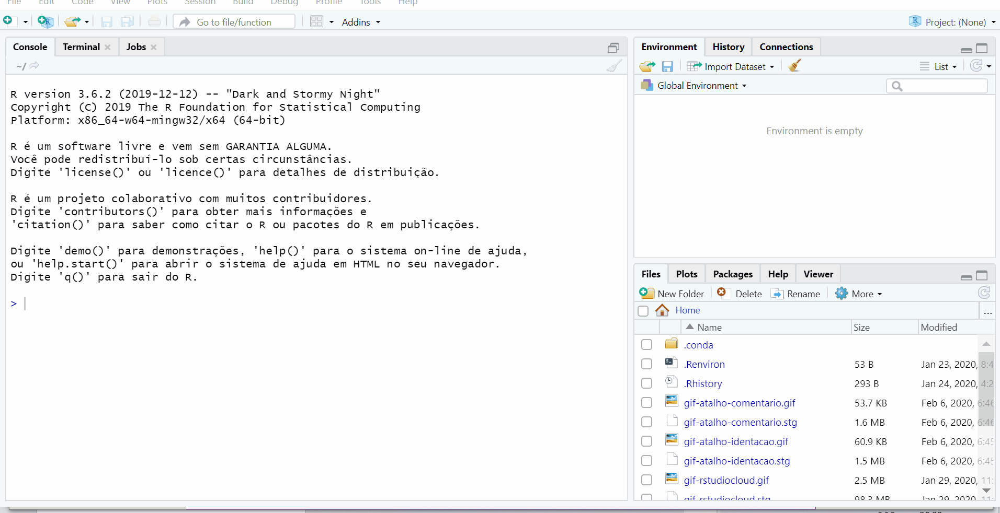
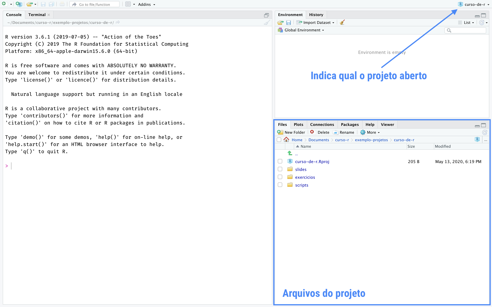
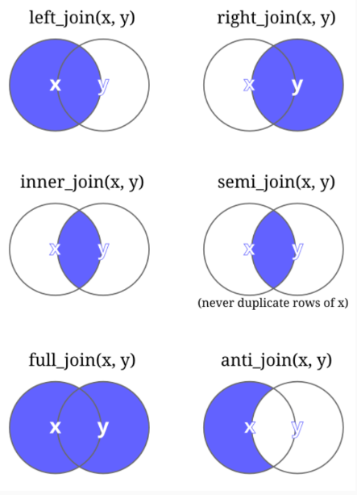
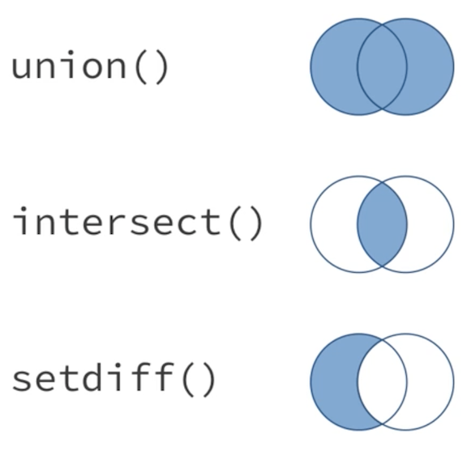
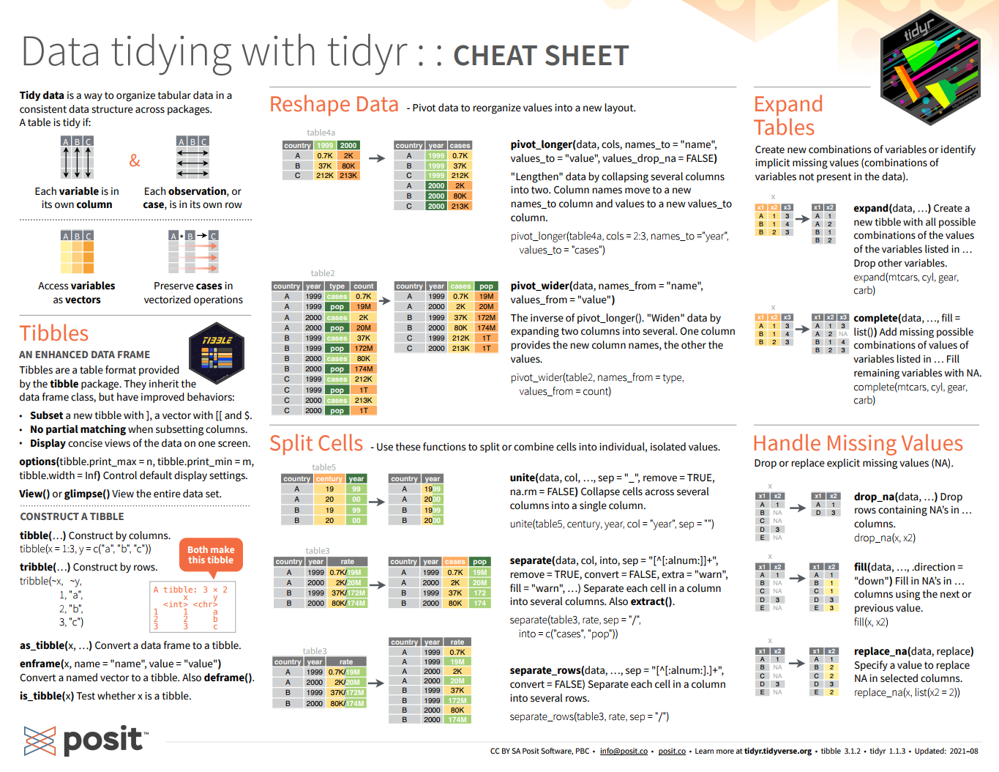

```{r setup, include=FALSE}
options(htmltools.dir.version = FALSE)
knitr::opts_chunk$set(
  fig.width = 9, fig.height = 3.5, fig.retina = 3,
  out.width = "100%",
  cache = FALSE,
  echo = TRUE,
  message = FALSE, 
  warning = FALSE,
  hiline = TRUE
)
```

```{r xaringan-themer, include=FALSE, warning=FALSE}
# xaringanthemer::style_duo_accent(
#   primary_color = "#1381B0",
#   secondary_color = "#FF961C",
#   inverse_header_color = "#FFFFFF"
# )
xaringanthemer::style_duo_accent(
  primary_color = "#005c8b",
  secondary_color = "#0073ae",
  inverse_header_color = "#FFFFFF"
)
```

```{r xaringanExtra, echo=FALSE}
#devtools::install_github("gadenbuie/xaringanExtra")
# xaringanExtra::use_xaringan_extra(c("tile_view", "animate_css", "tachyons"))

xaringanExtra::use_clipboard()
xaringanExtra::use_fit_screen()
xaringanExtra::use_extra_styles(
  hover_code_line = TRUE,         #<<
  mute_unhighlighted_code = TRUE  #<<
)
xaringanExtra::use_share_again()
xaringanExtra::use_scribble()
xaringanExtra::use_tile_view()
xaringanExtra::use_tachyons()
xaringanExtra::use_panelset()
```

# Sumário

1. [R e RStudio](#r-rstudio)
2. [Introdução](#introducao)
3. [Projetos](#projetos)
4. [Importação de dados](#importacao)
5. [Manipulação de dados](#manipulacao)

---

class: inverse center middle
name: r-rstudio

# R e RStudio 

---

## Instalação do R

.pull-left[
<br>
<br>
<br>
<br>
<br>
- [Download](https://cran.r-project.org/)
- Use a versão mais recente `r emo::ji("wink")` 
]
.pull-right[
<br>
<br>
<br>
```{r, fig.align='center', out.width='60%', echo=FALSE}
knitr::include_graphics("img/01-r-logo.svg")
```
]

---

## Instalação do R

```{r, fig.align='center', out.width="80%", echo=FALSE}
knitr::include_graphics("img/02-r-install.png")
```

---

## Instalação do RStudio

.pull-left[
<br>
<br>
<br>
<br>
<br>
- [Download](https://posit.co/download/rstudio-desktop/)
- Use a versão mais recente `r emo::ji("wink")` 
]
.pull-right[
<br>
<br>
<br>
<br>
<br>
```{r, fig.align='center', out.width="70%", echo=FALSE}
knitr::include_graphics("img/03-rstudio.png")
```
]

---

## Instalação do RStudio

```{r, fig.align='center', out.width="80%", echo=FALSE}
knitr::include_graphics("img/04-rstudio-install.png")
```

---

### O que é o R?

> "R é um ambiente de software livre para computação estatística e gráficos." [R Development Core Team](https://cran.r-project.org/)

  - **Por que usar o R?**
  
    - É uma linguagem de programação que possui muitas ferramentar para a análise de dados;
    
    - É em código aberto e gratuito (*open source*);
    
    - Possui uma comunidade ativa de pessoas desenvolvedoras;
    
    - É flexível, permite desenvolver funções e pacotes para facilitar o trabalho;
    
    - Está disponível gratuitamente em diferentes plataformas: Linux, MacOS e Windows;
    
    - Mantido pela [R Development Core Team](https://cran.r-project.org/).
    
---

### RStudio

**RStudio** é uma IDE (*Integrated Development Environment*) da Linguagem R, isto é, um ambiente de desenvolvimento utilizado para editar e executar códigos em R. Ela é mantida pela [Posit](https://posit.co).

```{r, fig.align='center', out.width="80%", echo=FALSE}
knitr::include_graphics("img/05-rstudio.png")
```

---

### RStudio

**Editor/Scripts:** onde os códigos são escritos. O **RStudio** destaca algumas palavras e símbolos para facilitar a leitura do código.

```{r, fig.align='center', out.width="700px", echo=FALSE}
knitr::include_graphics("img/06-rstudio-haydee.jpg")
```

---

### RStudio

**Console:** onde os códigos são executados e os resultados são exibidos. **O R vive aqui!**

```{r, fig.align='center', out.width="700px", echo=FALSE}
knitr::include_graphics("img/07-rstudio-haydee.jpg")
```

---

### RStudio

**Environment:** painel com todos os objetos criados na sessão.

```{r, fig.align='center', out.width="700px", echo=FALSE}
knitr::include_graphics("img/08-rstudio-haydee.jpg")
```

---

### RStudio

**History:** painel com um histórico dos comandos rodados.

```{r, fig.align='center', out.width="700px", echo=FALSE}
knitr::include_graphics("img/09-rstudio-haydee.jpg")
```

---

### RStudio

**Files:** mostra os arquivos no diretório de trabalho. É possível navegar entre os diretórios.

```{r, fig.align='center', out.width="700px", echo=FALSE}
knitr::include_graphics("img/10-rstudio-haydee.jpg")
```

---

### RStudio

**Plots:** painel onde os gráficos serão apresentados.

```{r, fig.align='center', out.width="700px", echo=FALSE}
knitr::include_graphics("img/11-rstudio-haydee.jpg")
```

---

### RStudio

**Packages:** apresenta todos os pacotes instalados e carregados.

```{r, fig.align='center', out.width="700px", echo=FALSE}
knitr::include_graphics("img/12-rstudio-haydee.jpg")
```

---

### RStudio

**Help:** janela onde a documentação das funções serão apresentadas.

```{r, fig.align='center', out.width="700px", echo=FALSE}
knitr::include_graphics("img/13-rstudio-haydee.jpg")
```

---

### Atalhos

Conhecer os atalhos do teclado ajuda bastante durante a programação no **RStudio**.

- **CTRL + ENTER:** avalia/roda a linha selecionada no script;

- **ALT + –:** cria um sinal de atribuição (`<-`);

- **CTRL + SHIFT + M:** adiciona o operador pipe (`%>%` ou `|>`);

- **CTRL + SHIFT + C:** comenta a(s) linha(s) selecionada(s);

- **CTRL + SHIFT + D:** duplica a(s) linha(s) selecionada(s);

- **CTRL + 1:** altera o cursos para o script;

- **CTRL + 2:** altera o cursos para o console;

- **ALT + SHIFT + K:** mostra uma janela com todos os atalhos disponíveis.

<br>

No MacOS, substitua **CTRL** por **CMD** e **ALT** por **OPT**.

---

### Help! 

Ficou com dúvida sobre determinado pacote ou função?

  - Peça ajuda: **help**(nome_do_pacote) ou **?**nome_do_pacote;
  
  - Peça ajuda: **help**(nome_da_funcaoo) ou **?**nome_da_funcao;
  
<br>
  
```{r, eval=FALSE}
help(sum)
?sum
```

<br>

  - Se a dúvida persistir, procure no [Google](https://www.google.com/) ou no [Stack Overflow](https://stackoverflow.com/).
  
  - E se ainda estiver com dúvidas, pergunte para a comunidade:
  
    - há diversos grupos de Telegram, Twitter, Discourse e em outras redes sociais.

---

### [Cheat Sheets](https://rstudio.com/resources/cheatsheets/)

O **RStudio** disponibiliza algumas 'folhas de cola', as **Cheat Sheets**. Elas trazem um resumo de como utilizar diversos pacotes e até o próprio RStudio. Para acessá-las, basta clicar no menu `Help` e então em `Cheat Sheets`, ou através do site da [**Posit**](https://posit.co/resources/cheatsheets/).

[](https://rstudio.github.io/cheatsheets/rstudio-ide.pdf)

---

### O Ciclo da Ciência de Dados

```{r, fig.align='center', out.width="700px", echo=FALSE}
knitr::include_graphics("img/15-ciclo-ciencia-de-dados.png")
```

---

### O Ciclo da Ciência de Dados no R

```{r, fig.align='center', out.width="700px", echo=FALSE}
knitr::include_graphics("img/16-ciclo-ciencia-de-dados-no-r.png")
```

---

class: inverse center middle
name: introducao

# Introdução

.center[(Acompanhe no arquivo `01-introducao.R`)]

---

### R como calculadora

O **R** permite realizar muitas operações matemáticas!

```{r}
2 + 5 # adição

9 - 4 # subtração

5 * 2 # multiplicação

7 / 5 # divisão
```

- **CTRL + ENTER:** executa a linha selecionada no script

---

### R como calculadora

```{r}
9 %% 4 # resto da divisão de 9 por 4

7 %/% 4 # parte inteira da divisão de 7 por 4

8 ^ 2 # potenciação

sqrt(1024) # radiciação
```

A ordem matemática das operações também vale do R.

---

### Funções matemáticas

```{r}
sin(1) # funções trigonométricas

log(1) # logaritmo natural (base e)

log10(10) # logaritmo na base 10

exp(0.5) # exponencial e^(1/2)
```

---

### Objetos

O **R** permite armazenar (salvar) valores dentro de um objeto.

Um **objeto** é um nome que guarda um valor, uma função ou uma base de dados.

- Para atribuir um valor a um objeto no R, utilizamos o operador `<-`.

.center[`nome_do_objeto <- valor`]

- Atalho: **ALT** + **–**: cria o `<-` sinal de atribuição.

---

#### Exemplo:

```{r}
nome <- "Fernando Oliveira Costa"
nome

idade <- 40
idade

cargo_ou_funcao <- "Gerente de Projetos"
cargo_ou_funcao

salario <- 12000.00
salario
```

---

### Nomes dos Objetos

Existem algumas regras para dar nomes aos objetos:

- os nomes devem começar com uma letra. E podem conter letras, números, `_` e `.`. Não usar acentuações e/ou espaços! O autor do livro [R for Data Science](https://r4ds.hadley.nz) recomenda usar **snake_case**, ou seja, palavras escritas em minúsculo separadas por underline (`_`).

- o R é **case sensitive**, isto é, faz a diferenciação entre as letras minúsculas e maiúsculas. Portanto, um objeto chamado `teste` é diferente de outro objeto chamado `Teste`.

```{r}
a <- 2
a

A <- 4
A
```

---

### Operadores Relacionais

- Igual a: **==**

- Diferente de: **!=**

- Maior que: **>**

- Maior ou igual a: **>=**

- Menor que: **<**

- Menor ou igual a: **<=**

---

### Operadores Relacionais

- Igual a: **==**

```{r}
TRUE == TRUE

TRUE == FALSE
```

- Diferente de: **!=**

```{r}
TRUE != TRUE

TRUE != FALSE
```

---

### Operadores Relacionais

- Maior que: **>**

```{r}
15 > 10

10 > 10
```

- Menor que: **<**

```{r}
3 < 5

10 < 5
```

---

### Operadores Relacionais

- Maior ou igual a: **>=**

```{r}
15 >= 10

15 >= 15
```

- Menor ou igual a: **<=**

```{r}
10 <= 10

10 <= 8
```

---

### Operadores Lógicos

- AND - E: **&**

Será verdadeiro (`TRUE`) se as duas condições forem verdadeiras

```{r}
x <- 15

  x > 10 & x <= 20
  
y <- 7

  y > 10 & y <= 15
```

---

### Operadores Lógicos

- OR - OU: **|**

Será verdadeiro (`TRUE`) se uma das duas condições for verdadeira

```{r}
x <- 5

  x >= 10 | x <= 15
  
y <- 2

  y >= 5 | y == 0
```

---

### Operadores Lógicos

- NOT - NEGAÇÃO: **!**

```{r}
!TRUE

!FALSE

x <- c(TRUE, FALSE, TRUE, FALSE)

  !x

y <- 8

  (!y < 5)
```

---

### Pertence

É possível verificar se um valor está inserido dentro de um conjunto de valores (vetor).

É representado pelo operador **%in%**.

```{r}
3 %in% c(1, 2, 3, 4, 5)

3 %in% c(4, 5, 6)

"a" %in% c("a", "b")

"a" %in% c("c", "d", "e")
```

---

### Tipos Básicos de dados

São os tipos de dados que podem ser representados na Linguagem R. É neles que são guardadas as informações.

- **Integer:** números inteiros

- **Double/Numeric:** números racionais

- **Logical:** tipos lógicos (`TRUE` ou `FALSE`)

- **Character:** texto (sempre entre aspas)

- **Factor:** dados categóricos

<br>

A função `class()` retorna o tipo de dado de um objeto.

---

### Números

Um número inteiro seguido de `L` será considerado do tipo **integer**:

```{r}
class(5L)
```

<br>

Números racionais serão considerados do tipo **double/numeric**:

```{r}
class(5)

class(5.1)
```

---

### Lógicos

Verdadeiro (`TRUE`) e Falso (`FALSE`) 

```{r}
class(TRUE)

class(FALSE)
```

<br>

O R entende o `TRUE` sendo igual a 1 (um) e o `FALSE` sendo igual a 0 (zero).

Isso significa que é possível realizar operações matemáticas com ele (por exemplo, somar):

```{r}
TRUE + FALSE + FALSE + TRUE + TRUE + TRUE + FALSE
```

---

### Textos

**Qualquer** código entre aspas (`""`) será interpretado como texto **character**:

```{r}
class("TEXTO")

ensino <- c("Médio", "Superior", "Fundamental", "Fundamental", "Médio")

class(ensino)

class("3")
```

---

### Fatores

Os fatores (ou factors) são usados para representar categorias.

```{r}
# Criando um factor

ensino_categorias <- factor(c("Médio", "Superior", "Fundamental", "Fundamental", "Médio"))

ensino_categorias

class(ensino_categorias)
```

<br>

A função `as.factor()` cria um objeto do tipo `factor` ou converte um objeto já existente.

Na linha `levels` aparecem os rótupos do fator.

---

### NA

**NA** representa um valor desconhecido ou ausente. As operações envolvendo um valor desconhecido também resultarão em valores desconhecidos (`NA`).

```{r}
NA > 10

NA + 10

NA / 5

10 == NA
```

---

### NA

```{r}
NA == NA
```

<br>
<br>

`is.na()` é a função que verifica se um objeto é `NA`.

```{r}
vetor_numerico <- c(NA, 1, 2, 3, 4, 5, NA)

is.na(vetor_numerico)

!is.na(vetor_numerico)
```

---

### na.rm = TRUE

Quando um vetor contém valores ausentes (`NA`), muitas funções não conseguem realizar os cálculos corretamente e retornam `NA` como resultado. Na maioria dos casos, o que se deseja é calcular o resultado ignorando os valores ausentes. Para isso, utiliza-se o argumento `na.rm = TRUE`, que instrui a função a remover os `NAs` antes de calcular.

```{r}
sum(vetor_numerico)

sum(vetor_numerico, na.rm = TRUE)

mean(vetor_numerico)

mean(vetor_numerico, na.rm = TRUE)
```

---

### Conversão de classes

```{r}
vetor_logical <- c(TRUE, TRUE, FALSE, TRUE, FALSE)

as.integer(vetor_logical) # converte para número inteiro

as.numeric(vetor_logical) # converte para número racional

as.character(vetor_logical) # converte para texto

as.factor(vetor_logical) # converte para fator
```

---

### Conversão de classes

```{r}
frutas <- c("amora", "banana", "melancia")

as.integer(frutas)

as.numeric(frutas)

as.character(frutas)

as.factor(frutas)
```

---

### Tipos de Objetos

No **R**, os quatro principais objetos são:

- Vetor;

- Matriz;

- Lista;

- Data Frame.

---

### Vetores

Armazenam elementos de uma **mesma classe** em apenas **uma dimensão**.

Para criá-los, basta passar os valores, separados por vírgulas, para a função `c()`.

<br>

```{r}
primeiro_semestre <- c("Janeiro", "Fevereiro", "Março", "Abril", "Maio", "Junho")

primeiro_semestre

# retorna o comprimento do vetor — quantos elementos ele tem?

length(primeiro_semestre)
```

---

### Vetores

Para criar um vetor com uma sequência de números, basta utilizar o operador **:**

```{r}
# vetor de 1 a 10

1:10

# vetor de 10 a 1

10:1

# betor de -5 a 5

-5:5
```

---

### Vetores

Por serem conjuntos indexados, cada valor dentro de um vetor tem uma posição. Essa posição é dada pela ordem em que os elementos foram dispostos no momento em que o vetor é criado. Dessa forma, é possível acessar individualmente cada valor de um vetor.

Para isso, basta colocar o índice do valor que se deseja acessar dentro de **colchetes** `[]`:

```{r}
# primeiro elemento do vetor

primeiro_semestre[1]

# primeiro e segundo elemento do vetor

primeiro_semestre[1:2]
```

---

### Vetores

```{r}
# remove o primeiro elemento do vetor

primeiro_semestre[-1]

# seleciona o elemento seis até o quatro (e muda a ordem dos elementos)

primeiro_semestre[6:4]
```

É possível colocar um conjunto de índices dentro dos colchetes para pegar os valores contidos nessas posições:

```{r}
# seleciona o primeiro, o terceiro e o quinto elemento do vetor

primeiro_semestre[c(1, 3, 5)]
```

Essas operações são chamadas de **subsetting**, pois são acessados os subconjuntos de valores de um vetor.

---

### Vetores

**Classe do Vetor:**

Um vetor só pode guardar um tipo de objeto e ele terá sempre a mesma classe dos objetos que guarda.

Para saber a classe de um vetor, basta usar a função `class(nome_do_vetor)`.

<br>

```{r}
primeiro_semestre <- c("Janeiro", "Fevereiro", "Março", "Abril", "Maio", "Junho")

class(primeiro_semestre)

anos_bissextos <- c(2000, 2004, 2008, 2012, 2016, 2020, 2024)

class(anos_bissextos)
```

---

### Vetores

**Coerção:**

Ao tentar misturar duas classes de elementos dentro de um vetor, o **R** vai apresentar o comportamento conhecido como **coerção**.

```{r}
segundo_semestre <- c(7, 8, 9, 10, 11, "Dezembro")

segundo_semestre

class(segundo_semestre)
```

Todos os elementos do vetor se transformaram em **texto**. Como um vetor só pode ter uma classe de objeto dentro dele, classes mais fracas serão sempre reprimidas pelas classes mais fortes.

.center[`character > numeric > integer > logical`]

---

### Vetores

**Operações com Vetores:**

É possível realizar operações aritméticas com vetores:

```{r}
vetor_numerico <- c(0, 5, 10, 15, 20)

vetor_numerico + 1
```

Ao rodar `vetor_numerico + 1`, o **R** adiciona 1 de cada um dos elementos do vetor. O mesmo acontece com qualquer outra operação aritmética.

```{r}
vetor_numerico * 2 # multiplica todos os elementos do vetor por 2

vetor_numerico - 1 # subtrai todos os elementos do vetor por 1
```

---

### Vetores

**Vetorização:**

Também é possível fazer operações que envolvem mais de um vetor:

```{r}
vetor1 <- c(1, 2, 3)

vetor2 <- c(10, 20, 30)

vetor1 + vetor2
```

<br>

O **R** vai alinhar os dois vetores e somar os elementos que estão na mesma posição.

---

### Vetores

**Reciclagem:**

Ocorre quando os dois vetores não possuem o mesmo tamanho:

```{r}
vetor1 <- c(1, 2)

vetor2 <- c(10, 20, 30, 40)

vetor1 + vetor2
```

<br>

O **R** alinhou os dois vetores e, como eles não possuem o mesmo tamanho, os elementos do `vetor1` foram repetidos para ficar do mesmo tamanho do `vetor2`. É como se o primeiro vetor fosse `c(1, 2, 1, 2)`.

---

### Vetores 

**Reciclagem:**

Um caso interessante ocorre quando o comprimento dos vetores não são múltiplos um do outro:

```{r warning=TRUE, message=TRUE}
vetor1 <- c(1, 2, 3)

vetor2 <- c(10, 20, 30, 40, 50)

vetor1 + vetor2
```

O **R** realizou a operação, repetindo cada valor do primeiro vetor até que os dois tivessem o mesmo tamanho. Na realidade, a operação realizada foi `c(1, 2, 3, 1, 2) + c(10, 20, 30, 40, 50)`.

Como essa operação não é intuitiva, o **R** devolveu um aviso dizendo que o comprimento do primeiro vetor não é múltiplo do comprimento do segundo vetor.

---

### Vetores

**Filtro:**

```{r}
numeros <- c(-3, -1, 3, 5, 7, 10, 15)
numeros > 3
```

Na primeira operação, o **R** fez uso da **Reciclagem**. Ele transformou o valor 3 em um vetor `c(3, 3, 3, 3, 3, 3, 3)` e testou (comparou) se `c(-3, -1, 3, 5, 7, 10, 15) > c(3, 3, 3, 3, 3, 3, 3)`.

```{r}
numeros[numeros > 3]
```

A segunda operação retornou as posições que receberam `TRUE` e não retornou os valores que receberam `FALSE`. Portanto, a segunda operação é equivalente a:

```{r}
numeros[c(FALSE, FALSE, FALSE, TRUE, TRUE, TRUE, TRUE)]
```

---

### Matrizes

São estruturas que correspondem às matrizes matemáticas, conjuntos bidimensionais contendo elementos dispostos em linhas e colunas. Assim como os vetores, todos os seus elementos são do mesmo tipo. São criadas utilizando a função `matrix()`:

```{r}
matriz1 <- matrix(c(1:12), nrow = 3, ncol = 4)

matriz1

class(matriz1)

dim(matriz1)
```

---

### Matrizes

É possível alterar a ordem de preenchimento da matriz (linhas ao invés de colunas)

```{r}
matriz2 <- matrix(c(1:12), nrow = 3, ncol = 4, byrow = TRUE)

matriz2

class(matriz2)

dim(matriz2)
```

---

### Matrizes

Também é possível adicionar colunas com `cbind()` e linhas com `rbind()`

```{r}
cbind(matriz1, rep(99, 3))

rbind(matriz1, rep(99, 4))
```

---

### Matrizes

**Operações com Matrizes:**

```{r}
# multiplica cada elemento da matriz por 2 (multiplicação escalar)

matriz1 * 2 

# retorna o resto da divisão de cada elemento da matriz1 pelo correspondente em matriz2

matriz1 %% matriz2 
```

---

### Listas

São um tipo especial de vetor que podem conter uma **coleção de diferentes classes**. Possuem uma **estrutura unidimensional**, contando apenas o número de elementos integrantes. São criados usando a função `list()`

```{r}
lista <- list(a = 1:10, b = c("T1", "T2", "T3", "T4"), TRUE, 2 + 2)

lista
```

- Os dois primeiros elementos têm nomes (`$a` e `$b`), enquanto os dois últimos são acessados por índices (`[[3]]` e `[[4]]`) pois não foram nomeados.

---

### Listas

```{r}
class(lista)
```

- A estrutura é realmente uma **lista**.

```{r}
dim(lista)
```

- O resultado **NULL** é esperado pois as listas no R não têm "dimensões" como vetores ou matrizes. Elas são estruturas mais gerais.

```{r}
length(lista)
```

- A lista apresenta 4 elementos, mesmo que alguns deles contenham vetores maiores por dentro.

---

## Data Frame

São tabelas **bidimensionais** (linhas e colunas), em que cada coluna pode ser de uma classe diferente. São criados com a função `data.frame()`:

```{r, echo=FALSE}
mtcars |> 
  head(n = 10) |> 
  knitr::kable()
```

---

### Data Frame

```{r}
# retorna a classe
class(mtcars)

# retorna o número de colunas
ncol(mtcars)

# retorna o número de linhas
nrow(mtcars)

# retorna a dimensão do dataframe — o número de linhas e de colunas
dim(mtcars)
```

---

### Data Frame

```{r}
# retorna a estrutura interna do objeto mtcars, como: tipo do objeto, 
# número de observações (linhas) e variáveis (colunas), nome de cada variável, 
# tipo (classe) de cada variável e os primeiros valores de cada variável

str(mtcars)
```

---

### Data Frame

```{r}
# retorna as seis primeiras linhas de uma tabela
head(mtcars)

# retorna as seis últimas linhas de uma tabela
tail(mtcars)
```

---

### Data Frame

**Selecionando as Colunas:**

Para selecionar as colunas de um dataframe, utilizamos o operador `$`:

.bg-lightest-blue.b-dark-blue.bw2.br3.ph4.mt2.-m[
📌 &nbsp;&nbsp;&nbsp;&nbsp; **Dica:** após escrever o `nome_do_dataframe$`, pressione a tecla `TAB` para ver as colunas disponíveis.
]

```{r}
mtcars$cyl

mtcars$gear

mtcars$mpg
```

---

### Data Frame

**Subsetting:**

Seleciona **elemento(s)** de um `data.frame` usando colchetes `[]`:&nbsp;&nbsp;&nbsp;&nbsp;`data_frame[linha, coluna]`

```{r}
# retorna o elemento presente na segunda linha da terceira coluna
mtcars[2, 3]

# retorna todas as linhas da coluna 1
mtcars[, 1]

# retorna todas as colunas da linha 1
mtcars[1, ]
```

---

### Data Frame

**Subsetting:** 

Seleção de **múltiplas colunas** de um `data.frame`:&nbsp;&nbsp;&nbsp;&nbsp;`data_frame[, c(coluna1, coluna2, ..., colunaN)]`

Há duas formas de fazer isso:

.pull-left[
```{r}
mtcars[, c(1, 2, 4)]
```
]

.pull-right[
```{r}
mtcars[, c("mpg", "cyl", "hp")]
```
]

---

### Data Frame

**Filtrando colunas:**

.panelset[

.panel[.panel-name[Exemplo 1]
```{r}
# seleciona apenas as linhas onde a coluna mpg é exatamente igual a é maior que 20

mtcars[mtcars$mpg > 20, ]
```
]

.panel[.panel-name[Exemplo 2]
```{r}
# seleciona apenas as linhas onde a coluna cyl 'é exatamente igual a 4

mtcars[mtcars$cyl == 4, ]
```
]

.panel[.panel-name[Exemplo 3]
```{r}
# seleciona apenas as linhas onde a coluna hp é menor que 100

mtcars[mtcars$hp < 100, ]
```
]

]

---

### Data Frame

É possível aplicar funções diretamente nas colunas de um `data.frame`:

```{r}
# valor mínimo da coluna mpg
min(mtcars$mpg)

# valor máximo da coluna mpg
max(mtcars$mpg)

# valor médio da coluna mpg
mean(mtcars$mpg)

# valor da mediana da coluna mpg
median(mtcars$mpg)
```

---

### Funções

Enquanto os objetos são nomes que armazenam valores, as **funções** são nomes que armazenam um **conjunto de instruções** em R. Sempre que uma função é executada, o código que ela contém roda automaticamente, e um resultado é devolvido.

As funções permitem **automatizar tarefas** e **evitar repetição de código**, de forma muito mais eficiente do que copiar e colar.

Na prática, as funções são tão comuns e intuitivas que você provavelmente já usou várias delas sem perceber. Aqui vão alguns exemplos que aparecem em seções anteriores:

- `c()` — cria vetores;

- `class()` — mostra a classe de um objeto;

- `dim()` — retorna as dimensões de um `data.frame` ou de uma `matriz`;

- `mean()` — calcula a média de um vetor;

- `max()` — retorna o valor máximo de um vetor.

---

### Funções

**Estrutura de uma Função:**

Uma função é composta por três partes principais:

- **Nome:** é como ela será identificada e chamada no ambiente R;

- **Argumentos:** são os valores (parâmetros) que a função recebe para funcionar;

- **Corpo:** o conjunto de instruções que será executado.

<br>

```{r, eval=FALSE, include=TRUE}
# estrutura para criar uma função
nome_da_funcao <- function(argumentos) {
  corpo da função
}

# para usar a função
nome_da_funcao(argumentos = ...)
```

---

### Funções

**Argumentos:**

Diferente dos objetos, as funções podem **receber argumentos** — valores colocados entre parênteses e que são usados internamente pela função para executar suas tarefas.

Por exemplo, a função `c()` precisa saber **quais valores formarão o vetor** que ela irá criar:

<br>

```{r}
c(1, 5, 10)
```

<br>

Nesse caso, os valores `1`, `5` e `10` são os **argumentos** passados para a função `c()`.

.bg-lightest-blue.b-dark-blue.bw2.br3.ph4.mt2.-m[
📌 &nbsp;&nbsp;&nbsp;&nbsp; **Dica:** os argumentos de uma função são sempre **separados por vírgulas**.
]

---

### Funções

**Argumentos:**

Cada função em R pode funcionar de forma diferente, mesmo quando realiza tarefas semelhantes. 

Por exemplo, a função `sum()` soma os valores passados como argumentos:

```{r}
sum(1, 3)
```

Também é possível passar um **vetor como argumento**, e o resultado será o mesmo:

```{r}
sum(c(1, 3))
```

Ou seja, a função `sum()` sabe lidar tanto com **valores separados** quanto com **vetores** como entrada.

---

### Funções

**Argumentos:**

Algumas funções exigem que os valores sejam passados de forma específica.

A função `mean()`, por exemplo, **espera um vetor como argumento** para calcular a média corretamente.

Veja a diferença:

```{r}
# só considera o primeiro número
mean(1, 3)

# considera os dois valores dentro de um vetor
mean(c(1, 3))
```

Ou seja, ao contrário de `sum()`, que aceita múltiplos argumentos separados, a `mean()` precisa receber **um único vetor** como entrada.

---

### Funções

**Argumentos:** 

Os argumentos de uma função também têm **nomes**, que podem (ou não) ser usados na hora de chamar a função.

Por exemplo, a função `seq()` possui (entre outros) os argumentos `from`, `to` e `by`:

```{r}
seq(from = 4, to = 10, by = 2)
```

Essa chamada cria uma **sequência numérica** que começa em `4` (`from`), vai até `10` (`to`), aumentando de `2` em `2` (`by`).

Também é possúvel usar a função **sem nomear os argumentos**, desde que os valores estejam na **ordem correta**:

```{r}
seq(4, 10, 2)
```

Ou seja, usar os nomes dos argumentos torna o código **mais legível** — mas não é obrigatório, se a ordem for respeitada.

---

### Funções

**Argumentos:** 

Quando é **especificado o nome dos argumentos**, a ordem deles **não importa**:

```{r}
seq(by = 2, to = 10, from = 4)
```

Mas, se **não usar os nomes dos argumentos**, a **ordem importa**, por o R vai associar os valores na sequência padrão (`from`, `to`, `by`):

```{r}
seq(2, 10, 4)
```

Ou seja:

- `r emo::ji("white_check_mark")` &nbsp;&nbsp; **com nomes:** a ordem pode ser trocada;


- `r emo::ji("x")` &nbsp;&nbsp; **sem nomes:** a ordem correta deve ser seguida para obter o resultado esperado.

---

### Funções

**Algumas Funções importantes do R base:**

<br>

| **Função**   |       **O que retorna?**      | **Função**   | **O que retorna?** |
|:-------------|:-----------------------------:|:------------:|:------------------:|
|   `head()`   |       6 primeiras linhas      |    `sum()`   |        soma        |
|   `tail()`   |        6 últimas linhas       |   `mean()`   |        média       |
|    `dim()`   |   número de linhas e colunas  |  `median()`  |       mediana      |
|   `names()`  | nomes das colunas (variáveis) |    `var()`   |      variância     |
|    `str()`   |    estrutura do data frame    |    `sd()`    |    desvio-padrão   |
|   `cbind()`  |      acopla duas tabelas      |    `max()`   |    valor máximo    |
|   `rbind()`  |      empilha duas tabelas     |    `min()`   |    valor mínimo    |
|   `class()`  |        classe do objeto       |   `round()`  |  valor arredondado |

---

### Pacotes

Pacotes são **coleções de funções, dados e documentação** que estendem as funcionalidades do R base.

Para usá-los, é preciso primeiro **instalar** e depois **carregar** o pacote.

Um dos pacotes mais populares e poderosos do R é o `tidyverse`, que reúne diversas ferramentas para ciências de dados.

```{r, fig.align='center', echo=FALSE, out.width='400px', dpi=300}
knitr::include_graphics("img/17-icon-packages.jpg")
```

---

### Pacotes

**Instalação dos Pacotes:**

<br>

- Via CRAN (*Comprehensive R Archive Network*):

`install.packages("nome_do_pacote")`

```{r, include=TRUE, eval=FALSE}
install.packages("tidyverse")
```

<br><br>

- Via GitHub:

`devtools::install_github("nome-do-repositorio/nome_do_pacote")`

```{r, include=TRUE, eval=FALSE}
devtools::install_github("tidyverse/dplyr")
```

---

### Pacotes

`library(nome_do_pacote)`

```{r, include=TRUE, eval=FALSE}
library(tidyverse)
```

Também há outra opção: `nome_do_pacote::nome_da_funcao()`.

```{r, include=TRUE, eval=FALSE}
dplyr::glimpse()
```

<br>

----

<br>

**Dicas sobre os Pacotes:**

1. Só é necessário **instalar** um pacote **uma vez**, mas é necessário **carregá-lo sempre que iniciar uma nova sessão**.

2. Para **instalar** um pactore, use aspas: &nbsp;&nbsp; `install.packages("nome_do_pacote")`.

3. Para **carregar** um pacote, não use aspas: &nbsp;&nbsp; `library(nome_do_pacote)`.

---

## Continue aprendendo!

.panelset[

.panel[.panel-name[Em Português]
.pull-left[
- [Material da Curso-R](https://livro.curso-r.com/)

<a href="http://material.curso-r.com/">
```{r echo=FALSE, out.width="45%", fig.align='center'}
knitr::include_graphics("img/18-cursor.png")
```
</a>
]

.pull-right[
- [R para Ciência de Dados (2ª edição)](https://pt.r4ds.hadley.nz)

<a href="https://pt.r4ds.hadley.nz">
```{r echo=FALSE, out.width="55%", fig.align='center'}
knitr::include_graphics("img/19-r4ds.jpg")
```
</a>
]
]

]

---

class: inverse center middle
name: projetos

# Projetos 

---

## Projetos

Um Projeto é uma pasta no computador que reúne todos os arquivos necessários para realizar uma análise de dados.

A principal razão para a utilização dos Projetos é a **organização**. Com eles, é muito mais fácil importar bases de dados para dentro do `R`, criar análises reprodutíveis e compartilhar o trabalho com outras pessoas.

<br>

<div style="text-align: center;">
  <strong style="font-size: 150%;">Habitue-se, desde cedo, a criar um projeto para cada nova análise.</strong>
</div>

<br>

Para **criar um projeto**, clique em `New Project` no menu `File`. Na janela que se abrir, escolha `New Directory` para criar o projeto em uma nova pasta, ou `Existing Directory` para usar uma pasta que já existe.

Ao criar um projeto, o `RStudio` cria um arquivo `nome-do-projeto.Rproj` na pasta escolhida. Esse arquivo guarda as configurações do projeto e pode ser usado para abrir o `RStudio` diretamente nele.

.footnote[Com o `Git` instalado, pode usar projetos para conectar com repositórios remotos e versionar o código ([GitHub](https://github.com], por exemplo). Para isso, basta clicar em `Version Control`. Para maiores informações, acesse o [Zen do R](https://blog.curso-r.com/posts/2019-07-23-zen-do-r-4/) e o <i>workshop</i> [Introdução a utilização do Git e Github no RStudio](https://www.youtube.com/watch?v=uQL6NOSd9cc) da [Beatriz Milz](https://twitter.com/BeaMilz).]

---

### Projetos

**Criando um novo Projeto:**

```{r, echo=FALSE, out.width="80%", fig.align='center'}

```

---

### Projetos

**RStudio com um Projeto aberto:**

```{r, echo=FALSE, out.width="70%", fig.align='center'}

```

---

### Projetos

**Navegando entre os Projetos:**

```{r, echo=FALSE, out.width="70%", fig.align='center'}
knitr::include_graphics("img/22-exemplo-lista-projetos.png")
```

---

### Pacote: `tidyverse`

É uma coleção de pacotes de `R` desenvolvidos para a Ciência de Dados. 

Os pacotes do `tidyverse` compartilham uma mesma filosofia de desenvolvimento, sintaxe e estruturas de dados. 

Embora o `tidyverse` instale diversos outros pacotes, apenas esses são carrregados: 

<br>


|     **Pacote**    |                      **Função**                      |
|:-----------------:|:----------------------------------------------------:|
|      `tibble`     |               _data frames_ repaginados              |
|      `readr`      | leitura e importação de dados (e.g. `.csv` e `.txt`) |
| `tidyr` e `dplyr` |           arrumação e manipulação de dados           |
|     `stringr`     |                  trabalha com textos                 |
|     `forcats`     |                 trabalha com fatores                 |
|      `purrr`      |                 programação funcional                |
|     `ggplot2`     |           visualização de dados (gráficos)           |

---

class: inverse center middle
name: importacao

# Importação de dados

.center[(Acompanhe no arquivo `02-importacao.R`)]

---

### Caminhos

É importante na tarefa de **importação de dados** saber onde está o arquivo que se quer importar. Toda função de importação vai exigir um **caminho** (uma _string_) que representa o endereço do arquivo no computador.

<br>

----

**Diretório de trabalho (_working directory_):**

É a pasta em que o **R** vai procurar os arquivos na hora de ler as informações ou gravar os arquivos na hora de salvar os objetos.

Se está dentro de um Projeto, o diretório de trabalho será, por padrão, a pasta raiz do Projeto (é a pasta que contém o arquivo `.Rproj`).

Se não estiver usando um Projeto ou não souber qual é o diretório de trabalho, é possível descobri-lo usando a função `getwd()`. Ela vai devolver uma _string_ com o caminho do diretório de trabalho.

A função `setwd()` pode ser utilizada para mudar o diretório de trabalho. Como argumento, ela recebe o caminho para o novo diretório.

---

### Caminhos

**Caminhos absolutos:**

São aqueles que têm início na pasta raiz do computador/usuário. Por exemplo: `/Users/luisagisele/Repositorio/workshop-r`.

**Caminhos absolutos** são uma **má prática**. Se você trocar de computador ou passar o _script_ para outra pessoa, o código não vai funcionar. Isso ocorre porque o caminho absoluto de um arquivo, muito provavelmente, será diferente entre os computadores.

<br>

----

**Caminhos relativos:**

São aqueles que têm início no diretório de trabalho da sessão. Usando o exemplo de caminho absoluto acima, o caminho relativo é: `workshop-r`.

O uso de **caminhos relativos** dentro de um projeto é considerado uma **boa prática**, pois quando a pasta do projeto for compartilhado com alguém, todos os caminhos existentes no código continuarão funcionando em qualquer computador.

---

## Tibbles

São uma evolução da classe `data.frame`.

As funções do **`tidyverse`** para importação, arrumação e manipulação de bases devolvem sempre `tibbles` em vez de `data.frames`.

Embora existam outras diferenças entre as classes, a mais importante é a forma como a tabela é mostrada no _console_.

Quanto a isso, as diferenças são:

- `tibbles` mostram o número de linhas, o número de colunas e a classe das variáveis;

- `tibbles` mostram apenas as 10 primeiras linhas;

- `tibbles` mostram o número de colunas que couber na tela do _console_.

- `tibbles` não nomeiam linhas (`row.names`).

---

### Tibbles

**Exemplo: base `mtcars` como `data.frame`**

```{r, echo=FALSE}
head(mtcars, n = 15)
```

---

### Tibbles

**Exemplo: base `mtcars` como `tibble`**

```{r}
tibble::as_tibble(mtcars)
```

**Perceba que a coluna com os nomes dos modelos dos veículos desaparece na `tibble`.** Isso acontece porque, no `data.frame`, esses nomes fazem parte dos **nomes das linhas (`row.names`)**, e não de uma coluna propriamente dita. Já nas `tibbles`, os nomes das linhas **não são exibidos nem armazenados da mesma forma**, o que pode dar a impressão de que a "coluna" foi excluída.

---

### Tibbles

**Exemplo: base `mtcars` como `tibble`**

Uma maneira de **preservar os nomes dos modelos dos veículos** como coluna ao converter um `data.frame` em `tibble` é utilizar o argumento `rownames = "nome_da_coluna"` dentro da função `as_tibble()`. Assim, a nova `tibble` terá **12 colunas** — uma a mais que a anterior, pois agora os nomes dos modelos passam a fazer da base como uma variável explícita.

```{r}
tibble::as_tibble(mtcars, rownames = "cars")
```

---

### [Cheat Sheets](https://posit.co/resources/cheatsheets/) 

[](https://rstudio.github.io/cheatsheets/data-import.pdf)

---

### Importação de arquivos

- Pacote [`readr`](https://readr.tidyverse.org): utilizados para ler arquivos de texto

  - `read_csv()`: lê arquivos `.csv` (valores separados por vírgula)
  
  - `read_csv2()`: lê arquivos `.csv` (valores separados por ponto e vírgula)
  
  - `read_delim()`: lê arquivos `.txt` (valores separados por tabulação)
  
  - `read_rds()`: lê arquivos `.rds` (formato nativo do R)

- Pacote [`readxl`](https://readxl.tidyverse.org): utilizado para ler arquivos do Excel

  - `read_excel()`: lê arquivos `.xls` e `.xlsx`
  
- Pacote [`haven`](https://haven.tidyverse.org): utilizado para ler arquivos do SPSS, Stata e SAS

  - `read_sas()`: lê arquivos `.sas7bdat`
  
  - `read_spss()`: lê arquivos `.sav`
  
  - `read_dta()`: lê arquivos `.dta`
  
  - `read_stata()`: lê arquivos `.dta`
  
---

### Importação de arquivos

Para ler arquivos de texto (`.csv` ou `.txt`), são utilizadas funções do pacote [`readr`](https://readr.tidyverse.org).

Como exemplo, vamos utilizar a base dos Pinguins, originalmente disponibilizado no pacote [`palmerpenguins`](https://allisonhorst.github.io/palmerpenguins/), que contém dados sobre pinguins da Antártica. 

Essa base também pode ser encontrado traduzido para o português no pacote [`dados`](https://cienciadedatos.github.io/dados/).

Vamos importar essa base para o **R** lendo o arquivo `pinguins.csv` que está dentro da para `dados`. Para isso, utilizamos a função `read_csv()` do pacote `readr`. 

Se o arquivo estiver bem formatado, a função só precisará do caminho até o arquivo para funcionar.

```{r}
library(readr) # carrega o pacote responsável pela importação

pinguins_csv <- read_csv("dados/pinguins.csv")
```

---

### Importação de arquivos

O objeto resultante será um `tibble`:

```{r}
pinguins_csv
```

---

### Importação de arquivos

Em alguns países, como o Brasil, as vírgulas são utilizadas para separar as casas decimais dos números, inviabilizando os arquivos `.csv`.

Nesse caso, os arquivos são separados por ponto-e-vírgula (;). Para ler essas bases no **R**, basta usar a função `read_csv2()` do pacote [`readr`](https://readr.tidyverse.org).

```{r}
library(readr) # carrega o pacote responsável pela importação

pinguins_csv2 <- read_csv2("dados/pinguins2.csv")
```

<br>

----

Arquivos `.txt` podem ser lidos com a função `read_delim()`. Nesse caso, além do caminho até o arquivo, é preciso indicar qual é o caractere utilizado para separar as colunas da base.

Um arquivo separado por tabulação, por exemplo, pode ser lido utilizando o argumento `delim = "\t"`. O código `\t` é uma forma textual de representar a tecla `TAB`.

```{r}
library(readr) # carrega o pacote responsável pela importação

pinguins_txt <- read_delim("dados/pinguins.txt", delim = "\t")
```

---

### Importação de arquivos

**Arquivos direto da Internet:** 

É possível importar dados diretamente da internet. Para isso, basta colocar o _link_ do arquivo/tabela entre aspas no caminho do arquivo.

```{r eval = FALSE, include = TRUE}
titanic <- read_csv(
  "https://raw.githubusercontent.com/beatrizmilz/2020-R-Ladies-SP-Basico/master/docs/data/titanic.csv"
)
```

<br>

----

**Arquivos Excel:** 

Para ler planilhas do Excel (arquivos `.xlsx` ou `.xls`) utilizamos a função `read_excel()` do pacote [`readxl`](https://readxl.tidyverse.org). 

Como esse pacote não faz parte do `tidyverse`, é necessário instalá-lo separadamente. 

```{r eval = FALSE, include = TRUE}
library(readxl) # carrega o pacote

readxl::pinguins_xlsx <- read_excel("dados/pinguins.xlsx")
```

---

### Importação de arquivos

**Arquivos Excel: argumentos úteis**

Planilhas do Excel são facilmente editáveis — e por isso, é comum recebermos bases de dados **desconfiguradas**, ou seja, em um formato que o **R** não consegue importar diretamente.

Para evitar ter que arrumar "na mão", correndo o risco de cometer erros ou alterar dados sem querer, a função `read_excel()` oferece argumentos que ajudam a importar a base corretamente.

Principais argumentos:

- `sheet =`: indica qual aba da planilha deve ser importada.  _(Padrão: primeira aba)_

- `col_names =`: define se a primeira linha contém os nomes das colunas.  _(Padrão: `TRUE`)_

- `col_types =`: especifica o tipo de dado de cada coluna (ex: `"text"`, `"numeric"` etc).  _(Padrão: `"guess"`)_

- `skip =`: pula um número definido de linhas antes da leitura.  _(Padrão: `0`)_

- `n_max =`: define quantas linhas devem ser lidas.  _(Padrão: `Inf`)_

- `NA =`: indica quais valores devem ser interpretados como `NA`.  _(Padrão: `""`)_

---

### Exportação de arquivos

Exportar objetos do **R** significa gravar as bases (ou objetos) em um arquivo no disco rígido (HD) do computador.

De forma geral, para cada função `read_*()` usada na importação, existe uma função correspondente `write_*()` para exportação.

Essas funções são simples: você precisa informar **o objeto que deseja salvar** e o **caminho com o nome do arquivo** (incluindo a extensão!).

```{r eval = FALSE, include = TRUE}
library(readr)  # funções write_csv, write_csv2, write_delim

# CSV com vírgula
write_csv(pinguins, "dados/pinguins.csv")
# CSV com ponto-e-vírgula (mais comum em PT-BR)
write_csv2(pinguins, "dados/pinguins2.csv")

# Arquivo TXT com tabulação
write_delim(pinguins, "dados/pinguins.txt", delim = "\t")
```

Para salvar arquivos em formato **Excel** `.xlsx`, usamos a função `write_xlsx()` do pacote [`writexl`](https://writexl.tidyverse.org), que precisa ser carregado separadamente.

```{r eval = FALSE, include = TRUE}
library(writexl) # carrega o pacote

write_xlsx(pinguins, "dados/pinguins.xlsx")
```

---

### Importação e exportação de arquivos

**Extensão `.rds`**

A extensão `.rds` representa uma estrutura binária de arquivo nativa do R.  
Ela pode ser usada para salvar **qualquer objeto** — não apenas data frames ou tibbles — no disco rígido (HD).

Quando aplicada a conjuntos de dados, essa estrutura binária permite **compactação**, gerando arquivos significativamente menores em comparação com formatos como `.csv`.

Para criar e ler arquivos `.rds`, utilizamos as funções `write_rds()` e `read_rds()`, ambas do pacote [`readr`](https://readr.tidyverse.org).

```{r eval = FALSE, include = TRUE}
library(readr)  # pacote necessário

# escrevendo SEM compactação
write_rds(pinguins, "dados/pinguins.rds")

# escrevendo COM compactação
write_rds(pinguins, "dados/pinguins.rds", compress = "gz")

# lendo a base diretamente
read_rds("dados/pinguins.rds")

# importando para um objeto
pinguins_rds <- read_rds("dados/pinguins.rds")
```

---
  
### Visualização de um objeto
  
**Para visualizar um objeto em aba separada:**

É possível visualizar os dados (ou parte deles) de forma mais confortável clicando no nome do objeto no painel `Global Environment` (aba `Environment`) do RStudio.

Outra opção é usar a função `View(nome_da_base)` diretamente:

```{r eval = FALSE, include = TRUE}
View(pinguins_csv)
```

Isso abrirá o conteúdo do objeto em uma nova aba, com aparência de planilha.

```{r echo=FALSE, out.width="100%", fig.align='center'}
knitr::include_graphics("img/24-view-pinguins.png")
```

---

### Visualização de um objeto

**Para visualizar uma base no _Console_:**

É possível "espiar" os dados de uma forma rápida usando a função `glimpse()` do pacote [`dplyr`](https://dplyr.tidyverse.org). 

Essa função mostra: 

- o número de observações (linhas) e variáveis (colunas), 
- os nomes e tipos das colunas, 
- e alguns valores iniciais de cada variável.

```{r}
library(dplyr)  # carrega o pacote necessário

glimpse(pinguins_csv)
```

---

### <span style='color:#34a15a'>BASE DOS DADOS</span>

A <span style='color:#34a15a'><b>Base dos Dados</b></span> é uma organização não governamental, sem fins lucrativos e <span style='color:#34a15a'><b>open source</b></span>, que atua para universalizar o acesso a <span style='color:#34a15a'><b>dados públicos de qualidade</b></span>.

Em seu repositório, você encontra <span style='color:#34a15a'><b>dados brasileiros já tratados, limpos e padronizados</b></span>, prontos para serem importados diretamente para o **R** por meio do pacote [`basedosdados`](https://basedosdados.org/blog/como-acessar-dados-publicos-em-r).

Além disso, os responsáveis pela <span style='color:#34a15a'><b>Base dos Dados</b></span> mantêm um repositório com os códigos das análises que publicam em _workshops_, redes sociais, artigos e tutoriais.

[](https://github.com/basedosdados/analises)

---

### <span style='color:#34a15a'>BASE DOS DADOS</span>

É possível realizar o _download_ de arquivos `.csv` completos diretamente pelo site.

Entretanto, esse tipo de acesso <span style='color:#34a15a'><b>não está disponível para arquivos muito grandes</b></span>.

----

Para esses casos, utiliza-se o <span style='color:#34a15a'><font size='5'><b>BigQuery:</b></font></span>

Um serviço de banco de dados em nuvem da Google, que permite realizar consultar em linguagem `SQL` diretamente do navegador, com:

- <span style='color:#34a15a'><b>Rapidez:</b></span> mesmo _queries_ complexas são processadas em poucos minutos;

- <span style='color:#34a15a'><b>Escalabilidade:</b></span> o BigQuery se ajusta automaticamente, podendo lidar com volumes gigantescos (até <span style='color:#34a15a'><b>exabytes</b></span>, se necessário);

- <span style='color:#34a15a'><b>Economia:</b></span> todo usuário tem direito a <span style='color:#34a15a'><b>1 TB gratuito por mês</b></span> em consultas.

<br>

<div style="text-align: center;">
  <strong style="font-size: 130%; color: #34a15a;">
    O uso do BigQuery é gratuito até 1 TB/mês. Acima disso, há cobrança por volume de dados processados.
  </strong>
</div>

---

### <span style='color:#34a15a'>BASE DOS DADOS</span>

<span style='color:#34a15a'><b>Como criar um projeto no BigQuery:</b></span>

Para criar um Projeto no _Google Cloud_, basta ter uma conta de e-mail do Google.

Mesmo que você pretenda carregar dados próprios, é necessário criar um Projeto (mesmo vazio) para poder executar _queries_ no _datalake_ público da <span style='color:#34a15a'>Base dos Dados</span>.

1. [Acesse o Google Cloud](https://console.cloud.google.com/projectselector2/home/dashboard). Se for sua primeira vez, aceite os Termos de Serviço.

2. Clique em `Create Project` / `Criar Projeto` e escolha um nome bacana para o projeto.

3. Confirme em `Create` / `Criar`.

Para mais detalhes, consulte a [documentação oficial](https://cloud.google.com/bigquery/docs/sandbox/?hl=pt).

.footnote[
<span style='color:#34a15a'><b>Por que é preciso criar um projeto no Google Cloud?</b></span>
A Google oferece <span style='color:#34a15a'><b>1 TB gratuito por mês</b></span> de uso do BigQuery <span style='color:#34a15a'><b>para cada projeto</b></span>. Você <span style='color:#34a15a'><b>não precisa cadastrar cartão de crédito</b></span> — o BigQuery inicia automaticamente no modo _Sandbox_, que permite usar os recursos <span style='color:#34a15a'><b>sem configurar forma de pagamento</b></span>.
]

---

### <span style='color:#34a15a'>BASE DOS DADOS</span>

<span style='color:#34a15a'><b>Como criar um projeto no BigQuery</b></span>

<span style='color:#34a15a'><b>Habilitar o projeto no R:</b></span>

```r
install.packages("basedosdados")  # instala o pacote

library(basedosdados)  # carrega o pacote

# identifique o projeto sempre que iniciar uma nova sessão no R
set_billing_id("id-do-projeto")
```

Na primeira vez que acessar o _Google Cloud_ pelo **R**, uma página do Google será aberta solicitando a autorização para vincular sua conta ao pacote [`basedosdados`](https://basedosdados.org/blog/como-acessar-dados-publicos-em-r).

----

No canal da [Base dos Dados](https://www.youtube.com/@BasedosDados) no Youtube, há um _Workshop_ ensinando a acessar os dados públicos em **R**: [acesse aqui](https://www.youtube.com/watch?v=M9ayiseIjvI).

No blog da [Base dos Dados](https://dev.to/basedosdados), há um tutorial de como usar a biblioteca [`basedosdados`](https://basedosdados.org/blog/como-acessar-dados-publicos-em-r) no **R**: [acesse aqui](https://dev.to/basedosdados/como-usar-a-biblioteca-basedosdados-no-r-capitulo-1-46kb).


---

### <span style='color:#34a15a'>BASE DOS DADOS</span>

<span style='color:#34a15a'><b>Como criar um projeto no BigQuery</b></span>

```{r echo=FALSE, out.width="85%", fig.align='center'}
knitr::include_graphics("img/26-big-query-projeto-r.gif")
```

---

### <span style='color:#34a15a'>BASE DOS DADOS</span>

<span style='color:#34a15a'><b>Como fixar o projeto da Base dos Dados (BD) no seu BigQuery:</b></span>

```{r echo=FALSE, out.width="80%", fig.align='center'}
knitr::include_graphics("img/27-fixa-bd-no-bigquery.gif")
```

---

### <span style='color:#34a15a'>BASE DOS DADOS — SQL</span>

**SQL** (_Structured Query Language_, ou _Linguagem de Consulta Estruturada_) é a linguagem padrão para **consultas em bancos de dados relacionais**.

Ela permite selecionar, filtrar, agrupar e combinar dados de forma declarativa — ou seja, dizendo o que você quer, e não como fazer.

----

<span style='color:#34a15a'><b>Principais cláusulas (palavras-chave):</b></span>

  - **SELECT**: seleciona as colunas desejadas (é o comando principal do SQL)  

  - **FROM**: especifica a tabela de onde os dados serão extraídos  

  - **WHERE**: define condições (filtros) para os dados selecionados  

  - **GROUP BY**: agrupa os dados com base em uma ou mais colunas  

  - **HAVING**: filtra os grupos criados pelo `GROUP BY`  

  - **ORDER BY**: ordena os dados com base em uma ou mais colunas  

  - **DISTINCT**: remove valores duplicados da seleção  

  - **UNION**: combina os resultados de duas consultas SQL em uma só tabela

---

### <span style='color:#34a15a'>BASE DOS DADOS — SQL</span>

<span style='color:#34a15a'><b>Palavras-chave – Operadores Lógicos:</b></span>

- **AND**: retorna verdadeiro se **todas as condições** forem verdadeiras  

- **OR**: retorna verdadeiro se **pelo menos uma condição** for verdadeira  

- **NOT**: inverte o resultado lógico da condição (retorna o oposto)

----

<span style='color:#34a15a'><b>Palavras-chave – Funções de Agregação:</b></span>

- **AVG**: calcula a média dos valores em um campo  

- **COUNT**: retorna o número de registros selecionados  

- **SUM**: soma os valores de um campo  

- **MAX**: retorna o maior valor em um campo  

- **MIN**: retorna o menor valor em um campo  

- **STDDEV**: calcula o desvio padrão dos valores  

- **VARIANCE**: calcula a variância dos valores

---

### <span style='color:#34a15a'>BASE DOS DADOS — SQL</span>

<span style='color:#34a15a'><b>Palavras-chave – Operadores relacionais:</b></span>

- **<** (_MENOR_): seleciona registros com valores **menores do que** a condição especificada  

- **>** (_MAIOR_): seleciona registros com valores **maiores do que** a condição especificada  

- **<=** (_MENOR OU IGUAL_): seleciona registros com valores **menores ou iguais a** determinada condição  

- **>=** (_MAIOR OU IGUAL_): seleciona registros com valores **maiores ou iguais a** determinada condição  

- **=** (_IGUAL_): seleciona registros com valores **iguais a** determinada condição  

- **<>** (_DIFERENTE_): seleciona registros com valores **diferentes de** determinada condição

<br>

- **BETWEEN**: seleciona registros com valores **dentro de um intervalo fechado** (inclui os limites)  

- **LIKE**: seleciona registros que **correspondem a um padrão de texto**  

- **IN**: seleciona registros cujo valor **está presente em uma lista definida**

---

### <span style='color:#34a15a'>BASE DOS DADOS — SQL</span>

<div class="panelset">

<div class="panel">
<div class="panel-name">Ex. Fictício</div>

```{sql eval = FALSE, include = TRUE}
-- consulta sem filtro

SELECT coluna1, coluna2, coluna3,
       coluna4 AS apelido_da_coluna
FROM `tabela`
```

Imagine que a base seja muito grande e você não irá utilizar todos os dados.

É recomendado <span style='color:#34a15a'><b>filtrar</b></span> os dados ainda na consulta, antes de importá-los para o **R**.

```{sql eval = FALSE, include = TRUE}
-- consulta com filtro

SELECT coluna1, coluna2, coluna3,
       coluna4 AS apelido_da_coluna
FROM `tabela`
WHERE coluna1 = valor AND coluna2 = valor
```

</div>

<div class="panel">
<div class="panel-name">Ex. Real (sem filtro)</div>

```{sql eval = FALSE, include = TRUE}
-- Consulta selecionando colunas específicas

SELECT id_municipio, nome_regiao
FROM `basedosdados.br_bd_diretorios_brasil.municipio`
```

<br>

Para selecionar <span style='color:#34a15a'><b>todas as colunas</b></span> de uma tabela, use `*` após o `SELECT`.

``` {sql eval = FALSE, include = TRUE}
-- Consulta selecionando todas as colunas

SELECT *
FROM `basedosdados.br_bd_diretorios_brasil.municipio`
```

</div>

<div class="panel">
<div class="panel-name">Ex. Real (com filtro)</div>

```{sql eval = FALSE, include = TRUE}
-- Média da taxa de aprovação e IDEB por município e ensino

SELECT id_municipio, ano,
       AVG(taxa_aprovacao) AS tx_aprov,
       ensino,
       AVG(ideb) AS ideb
FROM `basedosdados.br_inep_ideb.municipio`
WHERE ano = 2021
GROUP BY id_municipio, ano, ensino
```

</div>

<div class="panel">
<div class="panel-name">Ex. com JOIN</div>

```{sql eval = FALSE, include = TRUE}
-- Junção entre PIB e população por município

SELECT pib.id_municipio, pib.ano,
       pop.id_municipio, pop.populacao
FROM `basedosdados.br_ibge_pib.municipio` AS pib
LEFT JOIN `basedosdados.br_ibge_populacao.municipio` AS pop
ON pib.id_municipio = pop.id_municipio
```

<br>

<span style='color:#34a15a'><b>Palavras-Chave:</b></span>

- **AS:** define um "apelido" para a coluna e/ou para a tabela

- **LEFT JOIN:** une duas tabelas em uma mesma base de dados

- **ON:** define a "chave" que liga as duas tabelas

</div>

</div>

---

### <span style='color:#34a15a'>BASE DOS DADOS — SQL</span>

```{r echo=FALSE, out.width="90%", fig.align='center'}
knitr::include_graphics("img/28-ex-download-bigquery-r.gif")
```

---

### <span style='color:#34a15a'>BASE DOS DADOS — SQL</span>

Para que o **R** consiga importar os dados da consulta `SQL`, é necessário utilizar a função `read_sql()` do pacote [`basedosdados`](https://basedosdados.org/blog/como-acessar-dados-publicos-em-r) ao final da _query_.

Existem duas formas de fazer isso:

<span style='color:#34a15a'><b>1. Criando um objeto intermediário com a consulta `SQL` e, depois, o objeto final com os dados:</b></span>

```{r eval=FALSE, include=TRUE}
library(basedosdados) # pacote necessário

obj_intermediario <- "SELECT id_municipio, nome_regiao
FROM `basedosdados.br_bd_diretorios_brasil.municipio`"

base_final <- basedosdados::read_sql(obj_intermediario)
```


<span style='color:#34a15a'><b>2. Utilizando o operador `pipe` (`%>%` ou `|>`) para encadear a consulta diretamente à função `read_sql()`:</b></span>

```{r eval=FALSE, include=TRUE}
library(basedosdados) # pacote necessário

base_final <- "SELECT id_municipio, nome_regiao
FROM `basedosdados.br_bd_diretorios_brasil.municipio`" |> 
  read_sql()
```

---

class: inverse center middle
name: manipulacao

# Manipulação de dados

.center[(Acompanhe no arquivo `04-manipulacao.R`)]

---

### Pipe: `%>%` ou `|>`

- `CTRL` + `SHIFT` + `M`: cria o `%>%` &nbsp; (ou `|>`).

Pense no operador `pipe` como uma forma de **escrever uma receita de bolo**:

```{r, eval = FALSE, include = TRUE}
esfrie(
  asse(
    coloque(
      bata(
        acrescente(
          recipiente(rep("farinha", 2), "água", 
                     "fermento", "leite", "óleo"), 
          "farinha", até = "macio"), 
        duração = "3min"), 
      lugar = "forma", tipo = "grande", 
      untada = TRUE), duração = "50min"), 
  "geladeira", "20min")
```

Aqui, precisamos ler **de dentro para fora**: o primeiro comando executado é `recipiente()`, mas o primeiro que aparece é `esfrie()` — justamente o último a ser feito. Confuso, né?

Agora veja como a mesma receita é escrita usando o operador `|>`:


.footnote[Para MacOs, use `CMD` + `SHIFT` + `M` para inserir o pipe `|>`.]

---

### Pipe: `%>%` ou `|>`

- `CTRL` + `SHIFT` + `M`: cria o `%>%` &nbsp; (ou `|>`).

Veja como a **mesma receita** fica muito mais clara com o uso do `|>`:

```{r, eval = FALSE, include = TRUE}
recipiente(rep("farinha", 2), "água", "fermento", "leite", "óleo") %>%
  acrescente("farinha", até = "macio") %>%
  bata(duração = "3min") %>%
  coloque(lugar = "forma", tipo = "grande", untada = TRUE) %>%
  asse(duração = "50min") %>%
  esfrie("geladeira", "20min")
```

Agora a leitura do código segue **de cima para baixo**, como uma lista de etapas — exatamente como uma receita de verdade!

<div style="text-align: center;">
  <strong style="font-size: 110%;">O operador <code>|></code> passa o resultado da operação à esquerda como primeiro argumento da função à direita. Isso torna o código mais limpo, encadeado e fácil de entender.</strong>
</div>

.footnote[
O `%>%` vem do pacote `{magrittr}` e funciona como o `|>`, mas com algumas diferenças. Ainda é muito usado em pacotes como o `{dplyr}`. Quer saber mais? Dá uma olhada:  [magrittr: Ceci n’est pas un pipe](https://cran.r-project.org/web/packages/magrittr/vignettes/magrittr.html)  [R 4.1: novidades e o pipe nativo `|>`](https://www.jumpingrivers.com/blog/new-features-r410-pipe-anonymous-functions/)
]

---

Os exemplos apresentados aqui serão das base abaixo:

```{r}
library(tidyverse)

pinguins <- read_csv("dados/pinguins.csv")
pinguins_raw <- read_csv("dados/pinguins_raw.csv")
```

----

```{r echo=FALSE}
head(pinguins, n = 3)
```

```{r echo=FALSE}
head(pinguins_raw, n = 3)
```

---

### Pacote &nbsp; `dplyr`

O `{dplyr}` é um dos **pacotes mais importantes** para a **manipulação de dados** no R. Ele oferece funções simples e poderosas para transformar linhas e colunas de uma base de dados.

As principais funções são:

- `filter()`: filtra linhas com base em uma condição

- `select()`: seleciona colunas específicas

- `arrange()`: ordena as linhas com base em uma ou mais colunas

- `mutate()`: cria ou modifica colunas

- `group_by()`: agrupa os dados por uma ou mais variáveis

- `summarise()`: resumo os dados (ex: média, mediana, soma, etc.)

- `left_join()`: junta duas tabelas com base em uma chave comum

Essas funções seguem um padrão simples:

  - Sempre recebem uma `tibble` como primeiro argumento;
  - Sempre retornam uma `tibble` como resultado.
  
---

### [Cheat Sheets](https://posit.co/resources/cheatsheets/) 

[](https://rstudio.github.io/cheatsheets/data-transformation.pdf)

---

### Selecionando Colunas:  &nbsp; `select()`

A função `select()` é usada para escolher colunas específicas de uma base de dados.

- O **primeiro argumento** é o nome da base (ex: `pinguins`)

- Os **demais argumentos** são os nomes das colunas que você quer manter

_Não é necessário usar aspas para os nomes das colunas!_

```{r}
select(pinguins, species)
```

---

### Selecionando Colunas:  &nbsp; `select()`

Você também pode selecionar **várias colunas ao mesmo tempo**, separando os nomes por vírgulas:

```{r}
select(pinguins, species, sex, body_mass_g)
```

Esse exemplo retorna apenas as colunas `species`, `sex` e `body_mass_g` da base `pinguins`.

---

### Selecionando Colunas:  &nbsp; `select()`

O operador `:` é útil para selecionar **colunas consecutivas** — ou seja, de uma coluna até outra, seguindo a ordem da base:

```{r}
select(pinguins, island:body_mass_g)
```

Esse código seleciona todas as colunas de `island` até `body_mass_g`, na ordem em que aparecem na base.

---

### Selecionando Colunas:  &nbsp; `select()`

O `{dplyr}` oferece algumas **funções auxiliares** muito úteis para selecionar colunas com base em partes do nome:

- `starts_with("texto")`: seleciona colunas que **começam** com o texto especificado

- `ends_with("texto")`: seleciona colunas que **terminam** com o texto especificado

- `contains("texto")`: seleciona colunas que **contêm** o texto especificado

```{r}
select(pinguins, ends_with("mm"))
```

---

### Selecionando Colunas:  &nbsp; `select()`

Você pode **remover colunas** usando o sinal de menos (`—`) antes do nome da coluna:

```{r}
select(pinguins, -year)
```

Esse código retorna todas as colunas da base `pinguins`, exceto a coluna `year`.

---

### Selecionando Colunas:  &nbsp; `select()`

Para remover **mais de uma coluna**, basta usar o sinal de menos (`—`) junto com a função `c()`:

```{r}
select(pinguins, -c(year, sex))
```

Esse código retorna todas as colunas da base `pinguins`, exceto as colunas `year` e `sex`.

---

### Ordenando linhas: &nbsp; `arrange()`

A função `arrange()` serve para **ordenar as linhas** da base de dados.

- O **primeiro argumento** é a base (ex: `pinguins`)

- Os **demais argumentos** são as colunas usadas como critério de ordenação.

Por padrão, a ordenação é feita em ordem **crescente**.

```{r}
arrange(pinguins, body_mass_g)
```

---

### Ordenando linhas: &nbsp; `arrange()`

Para ordenar de forma **descrescente**, basta usar a função `desc()` dentro do `arrange()`.

No exemplo abaixo, os pinguins são organizados da **maior para a menor massa corporal**:

```{r}
arrange(pinguins, desc(body_mass_g))
```

---

### Ordenando linhas: &nbsp; `arrange()`

Você também pode ordenar por **duas ou mais colunas** ao mesmo tempo.

No exemplo abaixo, as linhas são ordenadas:

- **Primeiro** pelo **comprimento do bico** (`bill_length_mm`), em **ordem descrescente**

- **Depois**, em caso de empate, pela **profundidade do bico** (`bill_depth_mm`), em **ordem crescente**.

```{r}
arrange(pinguins, desc(bill_length_mm), bill_depth_mm)
```

---

### Aplicando mais de uma função

Em muitos casos, queremos aplicar **várias transformações** em sequência em uma base de dados.

Por exemplo, imagine que você quer uma tabela com a **espécie** dos pinguins e a **massa corporal**, ordenada em ordem crescente:

```{r eval=FALSE}
arrange(select(pinguins, species, body_mass_g), body_mass_g)
```

Esse código funciona, mas fica um pouco difícil de ler — precisamos interpretar **de dentro para fora**.

A solução para tornar esse tipo de operação mais clara é usar o operador **pipe** (`|>`):

```{r eval=FALSE}
pinguins |> 
  select(species, body_mass_g) |>
  arrange(body_mass_g)
```

O que está acontecendo aqui?

- Na **segunda linha**, aplicamos a função `select()` na base `pinguins`

- Na **terceira linha**, aplicamos a função `arrange()` na saída da função `select()`.

O código fica mais **intuitivo**, com as operações organizadas em sequência lógica.

---

### Filtrando linhas: &nbsp; `filter()`

A função `filter()` é usada para **selecionar linhas** que atendem a uma determinada condição.

No exemplo abaixo, são filtradas apenas as observações em que o **comprimento da nadadeira** (`flipper_length_mm`) é **maior que 140 mm**:

```{r}
filter(pinguins, flipper_length_mm > 140)
```

---

### Filtrando linhas: &nbsp; `filter()`

Você pode combinar `select()` e `filter()` para trabalhar apenas com as **colunas e linhas de interesse**.

No exemplo abaixo:

- Primeiro, selecionamos as colunas `species` e `flipper_length_mm`

- Depois, filtramos apenas os pinguins com **nadadeiras maiores que 140 mm**.

```{r}
pinguins |> 
  select(species, flipper_length_mm) |>
  filter(flipper_length_mm > 140)
```

---

### Filtrando linhas: &nbsp; `filter()`

Você pode aplicar **dois ou mais filtros** ao mesmo tempo, separando as condições por vírgula dentro do `filter()`.

No exemplo abaixo, o código retorna apenas os pinguins que:

- Estão na ilha de **Torgersen**

- Têm **profundidade de bico maior que 15 mm**.

```{r}
pinguins |> 
  filter(island == "Torgersen", bill_depth_mm > 15)
```

---

### Filtrando linhas: &nbsp; `filter()`

Você também pode fazer **operações diretamente dentro do `filter()`**, comparando os valores das colunas com cálculos feitos na hora.

No exemplo abaixo, o código retorna apenas os pinguins cuja **massa corporal** é **maior que a média da base**:

```{r}
pinguins |> 
  filter(body_mass_g > mean(body_mass_g, na.rm = TRUE))
```

O argumento `na.rm = TRUE` serve para ignorar valores ausentes (`NA`) no cálculo da média.

---

### Criando novas colunas: &nbsp; `mutate()`

A função `mutate()` é usada para:

- **Criar uma nova coluna**

- Ou **modificar uma coluna existente**

No exemplo abaixo, os valores da coluna `bill_length_mm` são divididos por 10, convertendo a unidade de **milímetros (mm)** para **centímetros (cm)**:

```{r}
pinguins |> 
  mutate(bill_length_mm = bill_length_mm / 10)
```

---

### Criando novas colunas: &nbsp; `mutate()`

Você também pode usar `mutate()` para **criar uma nova coluna**, mantendo a variável original intacta.

No exemplo abaixo, é criada a coluna `bill_length_cm`, que converte o comprimento do bico de **milímetros para centímetros**:

```{r}
pinguins |> 
  mutate(bill_length_cm = bill_length_mm / 10)
```

A nova coluna será adicionada **no final da tabela**.

---

### Criando novas colunas: &nbsp; `mutate()`

Com `mutate()`, você também pode realizar **qualquer operação** com uma ou mais colunas.

A única regra é que o resultado de cada operação:

- tenha **o mesmo número de linhas** da base original

- ou **um único valor** (que será repetido em todas as linhas)

Também é possível **criar ou modificar várias colunas ao mesmo tempo** dentro de um mesmo `mutate()`.

```{r}
pinguins |> 
  mutate(mean_bill_length_mm = mean(bill_length_mm, na.rm = TRUE),
         country = "Antarctica") |> 
  select(species, island, bill_length_mm, mean_bill_length_mm, country)
```

---

### Sumarizando colunas: &nbsp; `summarise()`

A **sumarização** é uma forma de **resumir um conjunto de dados** usando alguma medida de interesse.

Exemplos comuns incluem: média, mediana, variância, contagem, proporção etc.

Essas métricas ajudam a entender melhor o comportamento de uma variável.

O exemplo abaixo calcula a **média da massa corporal** dos pinguins:


```{r}
pinguins |> 
  summarise(mean_body_mass_g = mean(body_mass_g, na.rm = TRUE))
```

.footnote[Também pode ser usado a função `summarize()` — ambas as formas funcionam.]

---

### Sumarizando colunas: &nbsp; `summarise()`

Você pode calcular **várias estatísticas ao mesmo tempo** dentro de um único `summarise()`.

Cada métrica calculada se transforma em uma **coluna da nova base**:

```{r}
pinguins |> 
  summarise(
    mean_flipper_length_mm = mean(flipper_length_mm, na.rm = TRUE),
    median_flipper_length_mm = median(flipper_length_mm, na.rm = TRUE),
    dp_flipper_length_mm = sd(flipper_length_mm, na.rm = TRUE)
  )
```

.footnote[Também pode ser usado a função `summarize()` — ambas as formas funcionam.]

---

### Sumarizando colunas: &nbsp; `summarise()`

Você também pode calcular **resumos de colunas diferentes** dentro de um mesmo `summarise()`.

```{r}
pinguins |>  
  summarise(
    mean_flipper_length_mm = mean(flipper_length_mm, na.rm = TRUE),
    mean_bill_length_mm = mean(bill_length_mm, na.rm = TRUE),
    median_bill_depth_mm = median(bill_depth_mm, na.rm = TRUE)
  )
```

Neste exemplo, calculamos a **média ou mediana** de diferentes variáveis numéricas da base.

.footnote[Também pode ser usado a função `summarize()` — ambas as formas funcionam.]

---

### Sumarizando colunas agrupadas: &nbsp; `group_by()`

A função `group_by()` **não altera os dados da base**, mas indica que as operações seguintes devem ser feitas **por grupo**.

No exemplo abaixo, a base `pinguins` é agrupada pela coluna `island`:

```{r}
pinguins |> 
  group_by(island)
```

<!-- .footnote[Essa marcação só tem efeito real quando combinada com funções como `summarise()`.] -->

---

### Sumarizando colunas agrupadas: &nbsp; `group_by()`

Você também pode agrupar por **mais de uma variável ao mesmo tempo**.

```{r}
pinguins |> 
  group_by(island, species)
```

Neste caso, os dados são agrupados **por combinação de `island` e `species`** — ou seja, cada grupo representa uma espécie dentro de uma determinada ilha.

<!-- .footnote[Essa marcação só tem efeito real quando combinada com funções como `summarise()`.] -->

---

### Sumarizando colunas agrupadas

Em muitos casos, queremos **resumir uma variável numérica** para **cada categoria** de uma outra coluna.

Para isso, usamos `summarise()` em conjunto com `group_by()`.

No exemplo abaixo, o código calcula a **média da massa corporal** (`body_mass_g`) para cada ilha (`island`):

```{r}
pinguins |> 
  group_by(island) |> 
  summarise(mean_body_mass_g = mean(body_mass_g, na.rm = TRUE)) |> 
  arrange(desc(mean_body_mass_g))
```

Ou seja, **agrupamos os dados por ilha**, **calculamos a média da massa corporal em cada grupo** e, por fim, **ordenamos do maior para o menor valor**.

.footnote[Também pode ser usado a função `summarize()` — ambas as formas funcionam.]

---

### Ordenando colunas:  &nbsp;  `relocate()`

A função `relocate()` permite **mudar a ordem das colunas** de uma base, colocando-as em outra posição — seja com base no nome ou na posição de outra coluna.

Você pode usar o argumento `.after` para **colocar uma ou mais colunas logo após** uma coluna de referência:

```{r}
pinguins |> 
  relocate(sex, year, .after = island)
```

No exemplo abaixo, as colunas `sex` e `year` foram movidas para **aparecer logo após** a coluna `island`.

---

### Ordenando colunas:  &nbsp;  `relocate()`

Da mesma forma, é possível usar o argumento `.before` para **mover colunas para antes** de outra coluna específica:

```{r}
pinguins |> 
  relocate(sex, year, .before = island)
```

Nesse exemplo, as colunas `species` e `island` foram movidas para **aparecer logo antes** da coluna `island`.

---

### Renomeando colunas: &nbsp; `rename()`

A função `rename()` serve para **alterar os nomes das colunas** de uma base de dados.

- O **primeiro argumento** é o **novo nome** desejado

- O **segundo argumento** é o **nome atual** da coluna

```{r}
pinguins |>  
  rename(
    comprimento_bico_mm = bill_length_mm,
    profundidade_bico_mm = bill_depth_mm,
    comprimento_nadadeira_mm = flipper_length_mm,
    massa_corporal_g = body_mass_g
  )
```

---

### Selecionando linhas: &nbsp; `slice_head()`

A função `slice_head()` é usada para **extrair as primeiras linhas** de uma tabela, de forma controlada.

Ela é útil quando queremos visualizar apenas o início de uma base ou analisar os primeiros registros de cada grupo (quando combinada com `group_by()`).

- O argumento `n = ` define **quantas linhas serão retornadas**.

```{r}
pinguins |> 
  slice_head(n = 8)
```

Neste exemplo, são retornadas as **8 primeiras linhas** da base `pinguins`.

---

### Selecionando linhas: &nbsp; `slice_tail()`

A função `slice_tail()` é usada para **extrair as últimas linhas** de uma tabela.

Ela funciona de forma semelhante ao `slice_head()`, mas retorna os **últimos registros** em vez dos primeiros.

- O argumento `n = ` define **quantas linhas serão retornadas**.

```{r}
pinguins |>  
  slice_tail(n = 5)
```

Neste exemplo, são retornada s as **5 últimas linhas** da base `pinguins`.

---

### Selecionando linhas: &nbsp; `slice_max()`

A função `slice_max()` seleciona as **linhas com os maiores valores** de uma coluna numérica específica.

- O argumento `n = ` define **quantas linhas serão retornadas**.

- Se `n` não for informado, retorna **apenas a linha com o maior valor**.

- Em caso de empate, o número de linhas retornadas pode ser **maior que `n`**.

```{r}
pinguins |> 
  slice_max(bill_depth_mm, n = 5)
```

Neste exemplo, são retornadas as **5 linhas com maior profundidade de bico** (`bill_depth_mm`) da base `pinguins`.

---

### Selecionando linhas: &nbsp; `slice_min()`

A função `slice_min()` seleciona as **linhas com os menores valores** de uma coluna numérica específica.

- O argumento `n = ` define **quantas linhas serão retornadas**.

- Se `n` não for informado, retorna **apenas a linha com o menor valor**.

- Em caso de empate, o número de linhas retornadas pode ser **maior que `n`**.

```{r}
pinguins |> 
  slice_min(flipper_length_mm, n = 5)
```

Neste exemplo, são retornadas as **5 linhas com menor comprimento de nadadeira** (`flipper_length_mm`) da base `pinguins`.

---

### Selecionando linhas: &nbsp; `slice_sample()`

A função `slice_sample()` é usada para **selecionar linhas aleatoriamente** de uma base.

- O argumento `n = ` define **quantas linhas serão sorteadas e retornadas**.

- É útil para criar **amostras aleatórias** simples, testes ou visualizações rápidas.

```{r}
pinguins |> 
  slice_sample(n = 12)
```

Neste exemplo, são retornadas **12 linhas aleatórias** da base `pinguins`.

---

### Limpando a tabela: &nbsp; `distinct()`

A função `distinct()` remove **linhas duplicadas**, considerando os valores de um ou mais colunas.

- Por padrão, retorna **apenas as colunas informadas**

- Com `.keep_all = TRUE`, mantém **todas as colunas** da base original.

```{r}
pinguins |> 
  distinct(body_mass_g, .keep_all = TRUE)
```

Neste exemplo, a base retorna **apenas uma linha para cada valor distinto de `body_mass_g`**, mantendo as demais colunas associadas à primeira ocorrência de cada valor.

---

### Contando valores: &nbsp; `count()`

A função `count()` é usada para **contar a frequência de valores** de cada categoria em uma coluna — especialmente útil para variáveis categóricas.

.pull-left[
```{r}
pinguins |> 
  count(species)
```

Nesse exemplo, o código retorna **quantas observações existem para cada espécie** de pinguim na base de dados.
]

.pull-right[
```{r}
pinguins |> 
  count(species, island)
```

Neste exemplo, o código retorna a **quantidade de pinguins por espécie em cada ilha**, ou seja, uma contagem para cada combinação de `species` e `island`.
]

---

### Combinando dados: &nbsp; `bind_rows()`

A função `bind_rows()` serve para **juntar objetos pela linha** — ou seja, ela empilha os dados, mesmo que tenham colunas diferentes.

- O argumento `.id =` cria uma nova coluna que indica a origem de cada linha (útil para identificar de onde veio cada pedaço da base).

<!-- Neste exemplo, as tabelas são unidas **por linha**, e a coluna `id` identifica se a linha veio de `pinguins_01` ou `pinguins_02`. -->


```{r}
# seleciona algumas linhas e colunas de duas partes da base
pinguins_01 <- slice(pinguins, 1:5) |> select(1:3)
pinguins_02 <- slice(pinguins, 51:55) |> select(4:6)
# junta as linhas das duas tabelas
bind_rows(pinguins_01, pinguins_02, .id = "id")
```

---

### Combinando dados: &nbsp; `bind_cols()`

A função `bind_cols()` é usada para **juntar objetos lado a lado**, ou seja, **por colunas**.

- As bases precisam ter o **mesmo número de linhas**
- O argumento `.name_repair = "unique"` garante que, se houver colunas com nomes repetidos, elas sejam renomeadas automaticamente

```{r}
# seleciona 5 linhas diferentes da base original
pinguins_01 <- slice(pinguins, 1:5)
pinguins_02 <- slice(pinguins, 51:55)
# junta as colunas das duas tabelas
bind_cols(pinguins_01, pinguins_02, .name_repair = "unique")
```

<!-- Neste exemplo, os dados são combinados **horizontalmente**, formando uma nova tabela com mais colunas. -->

---

### Unindo bases: &nbsp; `*_join()`

Combina pares de bases de dados **com base em uma ou mais chaves** — colunas em comum entre elas.

.left-column[

<br>
<br>
<br>
```{r echo=FALSE, out.width="90%"}

```

]

.right-column[

**Junções de mutação**

Adicionam informações de uma base à outra:

- `left_join(x, y)`: mantém todas as observações em **x**
- `right_join(x, y)`: mantém todas as observações em **y**
- `inner_join(x, y)`: mantém apenas as observações **com correspondência em x e y**
- `full_join(x, y)`: mantém **todas** as observações em x e em y

**Junções de filtragem**

Selecionam linhas de x com base na existência de correspondência em y:

- `semi_join(x, y)`: mantém as observações de **x que têm correspondência em y**
- `anti_join(x, y)`: mantém as observações de **x que não têm correspondência em y**

]

---

### Unindo bases: &nbsp; `*_join()`

.pull-left[

```{r echo=FALSE, out.width="70%"}
knitr::include_graphics("img/31-left-join.gif")
```


```{r echo=FALSE, out.width="70%"}
knitr::include_graphics("img/32-inner-join.gif")
```

]

.pull-right[

```{r echo=FALSE, out.width="70%"}
knitr::include_graphics("img/33-right-join.gif")
```


```{r echo=FALSE, out.width="70%"}
knitr::include_graphics("img/34-full-join.gif")
```

]

---

### Unindo bases: &nbsp; `*_join()` — Exemplo

Vamos criar uma nova tabela com **as coordenadas geográficas das ilhas** e, em seguida, fazer a **junção** com a base `pinguins`.

<div class="panelset">
<div class="panel">
<div class="panel-name">1. Criando a base auxiliar</div>

```{r}
# Coordenadas geográficas das ilhas
pinguins_ilhas <- tibble(
  ilha = c("Torgersen", "Biscoe", "Dream", "Alpha"),
  longitude = c(-64.083333, -63.775636, -64.233333, -63),
  latitude = c(-64.766667, -64.818569, -64.733333, -64.316667)
)

pinguins_ilhas
```

</div>

<div class="panel">
<div class="panel-name">2. Unindo as bases — <code>left_join()</code></div>

Agora, usamos `left_join()` para **adicionar as colunas de latitude e longitude** à base `pinguins`, com base no nome da ilha.

```{r}
pinguins_left_join <- left_join(pinguins, pinguins_ilhas, by = c("island" = "ilha"))
glimpse(pinguins_left_join)
```

<!-- A base resultante contém todas as colunas originais da `pinguins` $+$ as coordenadas geográficas da ilha correspondente. -->

</div>
</div>

---

### Operações de conjuntos e comparações de dados

.pull-left[

<br>
<br>

<!-- <center> -->
  <b><font size = 6>Operações para comparar dos dados:</font></b>
<!-- </center> -->

- **`union(x, y)`**: retorna todas as linhas que estão em **x**, **y** ou em ambos

- **`interesect(x, y)`**: retorna apenas as linhas que estão em **x** _e_ em **y**

- **`setdiff(x, y)`**: retorna as linhas que estão em **x**, mas **não** em **y**

- **`setequal(x, y)`**: verifica se **x** e **y** são iguais (independentemente da ordem)

]

.pull-right[
<br>
<br>
```{r echo=FALSE, out.width="85%"}

```

]

---

### Pacote &nbsp; `tidyr`

**O que são dados organizados (_tidy data_)?**

```{r echo=FALSE, out.width="85%", fig.align='center'}
knitr::include_graphics("img/36-tidy-data.png")
```

Dados organizados seguem uma **estrutura padrão**, que facilita a análise e a manipulação dos dados. Em um conjunto de dados _tidy_:

- Cada **coluna** representa uma **variável**

- Cada **linha** representa uma **observação**

- Cada **célula** contém **um único valor**

---

### Pacote &nbsp; `tidyr`

O pacote `{tidyr}` é responsável por **organizar os dados no formato _tidy_**, deixando-os mais fáceis de trabalhar.

<br>

Principais funções:

- `unite()`: junta o conteúdo de várias colunas em uma só

- `separate()`: divide o conteúdo de uma coluna em várias

- `separate_rows()`: divide em várias colunas e linhas

- `drop_na()`: remove linhas com valores ausentes (`NA`)

- `replace_na()`: substitui valores ausentes (`NA`) por outro valor específico

- `pivot_wider()`: transforma dados do formato longo para o formato largo

- `pivot_longer()`: transforma dados do formato largo para o formato longo

---

### [Cheat Sheets](https://posit.co/resources/cheatsheets/) 

[](https://rstudio.github.io/cheatsheets/tidyr.pdf)

---

### União de colunas: &nbsp; `unite()`

A função `unite()` combina o conteúdo de duas ou mais colunas em uma **única coluna de texto**.

No exemplo abaixo, as colunas `species` e `island` são unidas em uma nova coluna chamada `species_island`, separadas por um caractere de sublinhado (`-`).

```{r}
especie_ilha_unido <- pinguins |> 
  unite(
    col = "especie_ilha",     # novo nome da coluna
    species:island,           # colunas a serem unidas
    sep = " - "               # separador entre os valores
  )

head(especie_ilha_unido)
```

---

### Separação de colunas: &nbsp; `separate()`

A função `separate()` divide o conteúdo de uma coluna em **duas ou mais colunas**, com base em um separador.

No exemplo abaixo, a coluna `especie_ilha` é separada em duas colunas: `especie` e `ilha`, usando `" - "` como separador:

```{r}
especie_ilha_separado <- especie_ilha_unido |> 
  separate(
    col = especie_ilha,             # coluna a ser separada
    into = c("especie", "ilha"),    # nomes das novas colunas
    sep = " - "                     # separador utilizado
  )

head(especie_ilha_separado)
```

---

### Remove NAs: &nbsp; `drop_na()`

A função `drop_na()` remove todas as **linhas que contêm valores ausentes (`NA`)**. 

<div class="panelset">
<div class="panel">
<div class="panel-name">Removendo em <b>todas as colunas</b></div>

Por padrão, ela verifica **todas as colunas** da base:

```{r}
pinguins |> 
  drop_na() # remove em todas as colunas
```

</div>

<div class="panel">
<div class="panel-name">Removendo em <b>colunas específicas</b></div>

Também pode especificar **quais colunas** deseja considerar ao remover os `NAs`:

```{r}
pinguins |> 
  drop_na(sex) # remove apenas quando `sex` estiver ausente
```

</div>
</div>

---

### Pivotar os dados: &nbsp; `pivot_*()`

.pull-left[

**`pivot_longer()`**

Transforma os dados em formato **mais longo**, ou seja, com **mais linhas** e **menos colunas**.

É útil para organizar bases que foram estruturadas para entrada ou visualização, e não para análise — algo comum em planilhas.

<br>

**`pivot_wider()`**

Transforma os dados em formato **mais largo**, ou seja, com **mais colunas** e **menos linhas**.

Apesar de menos comum em dados _tidy_, é útil para criar **tabelas resumo** ou preparar dados para ferramentas específicas.

]

.pull-right[

```{r echo=FALSE, out.width="100%", fig.align='center'}
knitr::include_graphics("img/38-original-dfs-tidy.png")
```

]

---

### Larga para longa: &nbsp; `pivot_longer()`

Transforma um banco de dados **do farmato largo para o formato longo** — ou seja, o número de **linhas aumenta** e o número de **colunas diminui**. Os principais argumentos da função `pivot_longer()` são:

- `cols`: colunas que serão _"derretidas"_ em uma única coluna
- `names_to`: nome da nova coluna que irá conter os **nomes originais das colunas** (variáveis)
- `values_to`: nome da nova coluna que irá conter os **valores das colunas originais** (variáveis)

.tiny[
```{r}
pivot_longer(data = pinguins_raw[, c(2, 3, 10:13)], 
             cols = `Culmen Length (mm)`:`Body Mass (g)`, 
             names_to = "medidas", 
             values_to = "valores")
```
]

---

### Longa para larga: &nbsp; `pivot_wider()`

Transforma um banco de dados **do formato longo para o formato largo** — ou seja, o número de **colunas aumenta** e o número de **linhas diminui**. Os principais argumentos da função `pivot_wider()` são:

- `names_from`: variável categórica que irá formar os **nomes das novas colunas**
- `values_from`: variável que irá preencher os **valores das novas colunas**
- `values_fill`: _(opcional)_ valor a ser usado para preencher os `NAs`, quando não houver correspondência

```{r}
pivot_wider(data = pinguins_raw[, c(2, 3, 13)], 
            names_from = Species, 
            values_from = `Body Mass (g)`)
```

