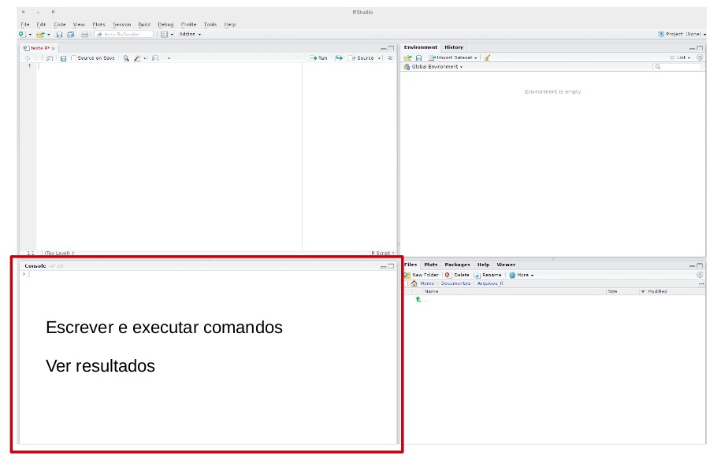
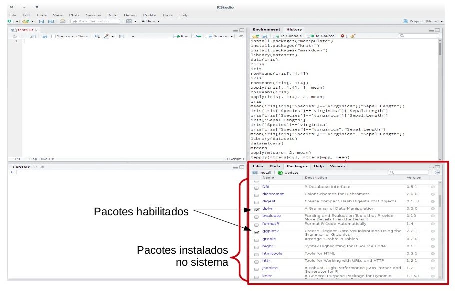

```{r setup, include=FALSE}
options(htmltools.dir.version = FALSE)
knitr::opts_chunk$set(
  fig.width = 9, fig.height = 3.5, fig.retina = 3,
  out.width = "100%",
  cache = FALSE,
  echo = TRUE,
  message = FALSE, 
  warning = FALSE,
  hiline = TRUE
)
```

```{r xaringan-themer, include=FALSE, warning=FALSE}
# xaringanthemer::style_duo_accent(
#   primary_color = "#1381B0",
#   secondary_color = "#FF961C",
#   inverse_header_color = "#FFFFFF"
# )
xaringanthemer::style_duo_accent(
  primary_color = "#005c8b",
  secondary_color = "#0073ae",
  inverse_header_color = "#FFFFFF"
)
```

```{r xaringanExtra, echo=FALSE}
#devtools::install_github("gadenbuie/xaringanExtra")
# xaringanExtra::use_xaringan_extra(c("tile_view", "animate_css", "tachyons"))

xaringanExtra::use_clipboard()

xaringanExtra::use_fit_screen()

xaringanExtra::use_extra_styles(
  hover_code_line = TRUE,         #<<
  mute_unhighlighted_code = TRUE  #<<
)

xaringanExtra::use_share_again()

xaringanExtra::use_scribble()
```

# Sumário

1. [R e RStudio](#r-rstudio)
2. [Introdução](#introducao)

---

class: inverse center middle
name: r-rstudio

# R e RStudio 

---

## Instalação do R

.pull-left[
<br>
<br>
<br>
<br>
<br>
- [Download](https://cran.r-project.org/)
- Use a versão mais recente `r emo::ji("wink")` 
]
.pull-right[
<br>
<br>
<br>
```{r, fig.align='center', out.width='60%', echo=FALSE}
knitr::include_graphics("img/01-r-logo.svg")
```
]

---

## Instalação do R

```{r, fig.align='center', out.width="80%", echo=FALSE}
knitr::include_graphics("img/02-r-install.png")
```

---

## Instalação do RStudio

.pull-left[
<br>
<br>
<br>
<br>
<br>
- [Download](https://posit.co/download/rstudio-desktop/)
- Use a versão mais recente `r emo::ji("wink")` 
]
.pull-right[
<br>
<br>
<br>
<br>
<br>
```{r, fig.align='center', out.width="70%", echo=FALSE}
knitr::include_graphics("img/03-rstudio.png")
```
]

---

## Instalação do RStudio

```{r, fig.align='center', out.width="80%", echo=FALSE}
knitr::include_graphics("img/04-rstudio-install.png")
```

---

### O que é o R?

> "R é um ambiente de software livre para computação estatística e gráficos." [R Development Core Team](https://cran.r-project.org/)

  - **Por que usar o R?**
  
    - É uma linguagem de programação que possui muitas ferramentar para a análise de dados;
    
    - É em código aberto e gratuito (*open source*);
    
    - Possui uma comunidade ativa de pessoas desenvolvedoras;
    
    - É flexível, permite desenvolver funções e pacotes para facilitar o trabalho;
    
    - Está disponível gratuitamente em diferentes plataformas: Linux, MacOS e Windows;
    
    - Mantido pela [R Development Core Team](https://cran.r-project.org/).
    
---

### RStudio

**RStudio** é uma IDE (*Integrated Development Environment*) da Linguagem R, isto é, um ambiente de desenvolvimento utilizado para editar e executar códigos em R. Ela é mantida pela [Posit](https://posit.co).

```{r, fig.align='center', out.width="80%", echo=FALSE}
knitr::include_graphics("img/05-rstudio.png")
```

---

### RStudio

**Editor/Scripts:** onde os códigos são escritos. O **RStudio** destaca algumas palavras e símbolos para facilitar a leitura do código.

```{r, fig.align='center', out.width="700px", echo=FALSE}
knitr::include_graphics("img/06-rstudio-haydee.jpg")
```

---

### RStudio

**Console:** onde os códigos são executados e os resultados são exibidos. **O R vive aqui!**

```{r, fig.align='center', out.width="700px", echo=FALSE}

```

---

### RStudio

**Environment:** painel com todos os objetos criados na sessão.

```{r, fig.align='center', out.width="700px", echo=FALSE}
knitr::include_graphics("img/08-rstudio-haydee.jpg")
```

---

### RStudio

**History:** painel com um histórico dos comandos rodados.

```{r, fig.align='center', out.width="700px", echo=FALSE}
knitr::include_graphics("img/09-rstudio-haydee.jpg")
```

---

### RStudio

**Files:** mostra os arquivos no diretório de trabalho. É possível navegar entre os diretórios.

```{r, fig.align='center', out.width="700px", echo=FALSE}
knitr::include_graphics("img/10-rstudio-haydee.jpg")
```

---

### RStudio

**Plots:** painel onde os gráficos serão apresentados.

```{r, fig.align='center', out.width="700px", echo=FALSE}
knitr::include_graphics("img/11-rstudio-haydee.jpg")
```

---

### RStudio

**Packages:** apresenta todos os pacotes instalados e carregados.

```{r, fig.align='center', out.width="700px", echo=FALSE}

```

---

### RStudio

**Help:** janela onde a documentação das funções serão apresentadas.

```{r, fig.align='center', out.width="700px", echo=FALSE}
knitr::include_graphics("img/13-rstudio-haydee.jpg")
```

---

### Atalhos

Conhecer os atalhos do teclado ajuda bastante durante a programação no **RStudio**.

- **CTRL + ENTER:** avalia/roda a linha selecionada no script;

- **ALT + –:** cria um sinal de atribuição (`<-`);

- **CTRL + SHIFT + M:** adiciona o operador pipe (`%>%` ou `|>`);

- **CTRL + SHIFT + C:** comenta a(s) linha(s) selecionada(s);

- **CTRL + SHIFT + D:** duplica a(s) linha(s) selecionada(s);

- **CTRL + 1:** altera o cursos para o script;

- **CTRL + 2:** altera o cursos para o console;

- **ALT + SHIFT + K:** mostra uma janela com todos os atalhos disponíveis.

<br>

No MacOS, substitua **CTRL** por **CMD** e **ALT** por **OPT**.

---

### Help! 

Ficou com dúvida sobre determinado pacote ou função?

  - Peça ajuda: **help**(nome_do_pacote) ou **?**nome_do_pacote;
  
  - Peça ajuda: **help**(nome_da_funcaoo) ou **?**nome_da_funcao;
  
<br>
  
```{r, eval=FALSE}
help(sum)
?sum
```

<br>

  - Se a dúvida persistir, procure no [Google](https://www.google.com/) ou no [Stack Overflow](https://stackoverflow.com/).
  
  - E se ainda estiver com dúvidas, pergunte para a comunidade:
  
    - há diversos grupos de Telegram, Twitter, Discourse e em outras redes sociais.

---

### [Cheat Sheets](https://rstudio.com/resources/cheatsheets/)

O **RStudio** disponibiliza algumas 'folhas de cola', as **Cheat Sheets**. Elas trazem um resumo de como utilizar diversos pacotes e até o próprio RStudio. Para acessá-las, basta clicar no menu `Help` e então em `Cheat Sheets`, ou através do site da [**Posit**](https://posit.co/resources/cheatsheets/).

[](https://posit.co/resources/cheatsheets/)

---

### O Ciclo da Ciência de Dados

```{r, fig.align='center', out.width="700px", echo=FALSE}
knitr::include_graphics("img/15-ciclo-ciencia-de-dados.png")
```

---

### O Ciclo da Ciência de Dados no R

```{r, fig.align='center', out.width="700px", echo=FALSE}
knitr::include_graphics("img/16-ciclo-ciencia-de-dados-no-r.png")
```

---

class: inverse center middle
name: introducao

# Introdução

.center[(Acompanhe no arquivo `01-introducao.R`)]

---

### R como calculadora

O **R** permite realizar muitas operações matemáticas!

```{r}
2 + 5 # adição

9 - 4 # subtração

5 * 2 # multiplicação

7 / 5 # divisão
```

- **CTRL + ENTER:** executa a linha selecionada no script

---

### R como calculadora

```{r}
9 %% 4 # resto da divisão de 9 por 4

7 %/% 4 # parte inteira da divisão de 7 por 4

8 ^ 2 # potenciação

sqrt(1024) # radiciação
```

A ordem matemática das operações também vale do R.

---

### Funções matemáticas

```{r}
sin(1) # funções trigonométricas

log(1) # logaritmo natural (base e)

log10(10) # logaritmo na base 10

exp(0.5) # exponencial e^(1/2)
```

---

### Objetos

O **R** permite armazenar (salvar) valores dentro de um objeto.

Um **objeto** é um nome que guarda um valor, uma função ou uma base de dados.

- Para atribuir um valor a um objeto no R, utilizamos o operador `<-`.

.center[`nome_do_objeto <- valor`]

- Atalho: **ALT** + **–**: cria o `<-` sinal de atribuição.

---

#### Exemplo:

```{r}
nome <- "Fernando Oliveira Costa"
nome

idade <- 40
idade

cargo_ou_funcao <- "Gerente de Projetos"
cargo_ou_funcao

salario <- 12000.00
salario
```

---

### Nomes dos Objetos

Existem algumas regras para dar nomes aos objetos:

- os nomes devem começar com uma letra. E podem conter letras, números, `_` e `.`. Não usar acentuações e/ou espaços! O autor do livro [R for Data Science](https://r4ds.hadley.nz) recomenda usar **snake_case**, ou seja, palavras escritas em minúsculo separadas por underline (`_`).

- o R é **case sensitive**, isto é, faz a diferenciação entre as letras minúsculas e maiúsculas. Portanto, um objeto chamado `teste` é diferente de outro objeto chamado `Teste`.

```{r}
a <- 2
a

A <- 4
A
```

---

### Operadores Relacionais

- Igual a: **==**

- Diferente de: **!=**

- Maior que: **>**

- Maior ou igual a: **>=**

- Menor que: **<**

- Menor ou igual a: **<=**

---

### Operadores Relacionais

- Igual a: **==**

```{r}
TRUE == TRUE

TRUE == FALSE
```

- Diferente de: **!=**

```{r}
TRUE != TRUE

TRUE != FALSE
```

---

### Operadores Relacionais

- Maior que: **>**

```{r}
15 > 10

10 > 10
```

- Menor que: **<**

```{r}
3 < 5

10 < 5
```

---

### Operadores Relacionais

- Maior ou igual a: **>=**

```{r}
15 >= 10

15 >= 15
```

- Menor ou igual a: **<=**

```{r}
10 <= 10

10 <= 8
```

---

### Operadores Lógicos

- AND - E: **&**

Será verdadeiro (`TRUE`) se as duas condições forem verdadeiras

```{r}
x <- 15

  x > 10 & x <= 20
  
y <- 7

  y > 10 & y <= 15
```

---

### Operadores Lógicos

- OR - OU: **|**

Será verdadeiro (`TRUE`) se uma das duas condições for verdadeira

```{r}
x <- 5

  x >= 10 | x <= 15
  
y <- 2

  y >= 5 | y == 0
```

---

### Operadores Lógicos

- NOT - NEGAÇÃO: **!**

```{r}
!TRUE

!FALSE

x <- c(TRUE, FALSE, TRUE, FALSE)

  !x

y <- 8

  (!y < 5)
```

---

### Pertence

É possível verificar se um valor está inserido dentro de um conjunto de valores (vetor).

É representado pelo operador **%in%**.

```{r}
3 %in% c(1, 2, 3, 4, 5)

3 %in% c(4, 5, 6)

"a" %in% c("a", "b")

"a" %in% c("c", "d", "e")
```

---

### Tipos Básicos de dados

São os tipos de dados que podem ser representados na Linguagem R. É neles que são guardadas as informações.

- **Integer:** números inteiros

- **Double/Numeric:** números racionais

- **Logical:** tipos lógicos (`TRUE` ou `FALSE`)

- **Character:** texto (sempre entre aspas)

- **Factor:** dados categóricos

<br>

A função `class()` retorna o tipo de dado de um objeto.

---

### Números

Um número inteiro seguido de `L` será considerado do tipo **integer**:

```{r}
class(5L)
```

<br>

Números racionais serão considerados do tipo **double/numeric**:

```{r}
class(5)

class(5.1)
```

---

### Lógicos

Verdadeiro (`TRUE`) e Falso (`FALSE`) 

```{r}
class(TRUE)

class(FALSE)
```

<br>

O R entende o `TRUE` sendo igual a 1 (um) e o `FALSE` sendo igual a 0 (zero).

Isso significa que é possível realizar operações matemáticas com ele (por exemplo, somar):

```{r}
TRUE + FALSE + FALSE + TRUE + TRUE + TRUE + FALSE
```

---

### Textos

**Qualquer** código entre aspas (`""`) será interpretado como texto **character**:

```{r}
class("TEXTO")

ensino <- c("Médio", "Superior", "Fundamental", "Fundamental", "Médio")

class(ensino)

class("3")
```

---

### Fatores

Os fatores (ou factors) são usados para representar categorias.

```{r}
# Criando um factor

ensino_categorias <- factor(c("Médio", "Superior", "Fundamental", "Fundamental", "Médio"))

ensino_categorias

class(ensino_categorias)
```

<br>

A função `as.factor()` cria um objeto do tipo `factor` ou converte um objeto já existente.

Na linha `levels` aparecem os rótupos do fator.

---

### NA

**NA** representa um valor desconhecido ou ausente. As operações envolvendo um valor desconhecido também resultarão em valores desconhecidos (`NA`).

```{r}
NA > 10

NA + 10

NA / 5

10 == NA
```

---

### NA

```{r}
NA == NA
```

<br>
<br>

`is.na()` é a função que verifica se um objeto é `NA`.

```{r}
vetor_numerico <- c(NA, 1, 2, 3, 4, 5, NA)

is.na(vetor_numerico)

!is.na(vetor_numerico)
```

---

### na.rm = TRUE

Quando um vetor contém valores ausentes (`NA`), muitas funções não conseguem realizar os cálculos corretamente e retornam `NA` como resultado. Na maioria dos casos, o que se deseja é calcular o resultado ignorando os valores ausentes. Para isso, utiliza-se o argumento `na.rm = TRUE`, que instrui a função a remover os `NAs` antes de calcular.

```{r}
sum(vetor_numerico)

sum(vetor_numerico, na.rm = TRUE)

mean(vetor_numerico)

mean(vetor_numerico, na.rm = TRUE)
```

---

### Conversão de classes

```{r}
vetor_logical <- c(TRUE, TRUE, FALSE, TRUE, FALSE)

as.integer(vetor_logical) # converte para número inteiro

as.numeric(vetor_logical) # converte para número racional

as.character(vetor_logical) # converte para texto

as.factor(vetor_logical) # converte para fator
```

---

### Conversão de classes

```{r}
frutas <- c("amora", "banana", "melancia")

as.integer(frutas)

as.numeric(frutas)

as.character(frutas)

as.factor(frutas)
```

---

### Tipos de Objetos

No **R**, os quatro principais objetos são:

- Vetor;

- Matriz;

- Lista;

- Data Frame.

---

### Vetores

Armazenam elementos de uma **mesma classe** em apenas **uma dimensão**.

Para criá-los, basta passar os valores, separados por vírgulas, para a função `c()`.

<br>

```{r}
primeiro_semestre <- c("Janeiro", "Fevereiro", "Março", "Abril", "Maio", "Junho")

primeiro_semestre

# retorna o comprimento do vetor — quantos elementos ele tem?

length(primeiro_semestre)
```

---

### Vetores

Para criar um vetor com uma sequência de números, basta utilizar o operador **:**

```{r}
# vetor de 1 a 10

1:10

# vetor de 10 a 1

10:1

# betor de -5 a 5

-5:5
```

---

### Vetores

Por serem conjuntos indexados, cada valor dentro de um vetor tem uma posição. Essa posição é dada pela ordem em que os elementos foram dispostos no momento em que o vetor é criado. Dessa forma, é possível acessar individualmente cada valor de um vetor.

Para isso, basta colocar o índice do valor que se deseja acessar dentro de **colchetes** `[]`:

```{r}
# primeiro elemento do vetor

primeiro_semestre[1]

# primeiro e segundo elemento do vetor

primeiro_semestre[1:2]
```

---

### Vetores

```{r}
# remove o primeiro elemento do vetor

primeiro_semestre[-1]

# seleciona o elemento seis até o quatro (e muda a ordem dos elementos)

primeiro_semestre[6:4]
```

É possível colocar um conjunto de índices dentro dos colchetes para pegar os valores contidos nessas posições:

```{r}
# seleciona o primeiro, o terceiro e o quinto elemento do vetor

primeiro_semestre[c(1, 3, 5)]
```

Essas operações são chamadas de **subsetting**, pois são acessados os subconjuntos de valores de um vetor.

---

### Vetores

**Classe do Vetor:**

Um vetor só pode guardar um tipo de objeto e ele terá sempre a mesma classe dos objetos que guarda.

Para saber a classe de um vetor, basta usar a função `class(nome_do_vetor)`.

<br>

```{r}
primeiro_semestre <- c("Janeiro", "Fevereiro", "Março", "Abril", "Maio", "Junho")

class(primeiro_semestre)

anos_bissextos <- c(2000, 2004, 2008, 2012, 2016, 2020, 2024)

class(anos_bissextos)
```

---

### Vetores

**Coerção:**

Ao tentar misturar duas classes de elementos dentro de um vetor, o **R** vai apresentar o comportamento conhecido como **coerção**.

```{r}
segundo_semestre <- c(7, 8, 9, 10, 11, "Dezembro")

segundo_semestre

class(segundo_semestre)
```

Todos os elementos do vetor se transformaram em **texto**. Como um vetor só pode ter uma classe de objeto dentro dele, classes mais fracas serão sempre reprimidas pelas classes mais fortes.

.center[`character > numeric > integer > logical`]

---

### Vetores

**Operações com Vetores:**

É possível realizar operações aritméticas com vetores:

```{r}
vetor_numerico <- c(0, 5, 10, 15, 20)

vetor_numerico + 1
```

Ao rodar `vetor_numerico + 1`, o **R** adiciona 1 de cada um dos elementos do vetor. O mesmo acontece com qualquer outra operação aritmética.

```{r}
vetor_numerico * 2 # multiplica todos os elementos do vetor por 2

vetor_numerico - 1 # subtrai todos os elementos do vetor por 1
```

---


---

---

## Typography

Text can be **bold**, _italic_, ~~strikethrough~~, or `inline code`.

[Link to another slide](#colors).

### Lorem Ipsum

Dolor imperdiet nostra sapien scelerisque praesent curae metus facilisis dignissim tortor. 
Lacinia neque mollis nascetur neque urna velit bibendum. 
Himenaeos suspendisse leo varius mus risus sagittis aliquet venenatis duis nec.

- Dolor cubilia nostra nunc sodales

- Consectetur aliquet mauris blandit

- Ipsum dis nec porttitor urna sed

---
name: colors

## Colors

.left-column[
Text color

[Link Color](#3)

**Bold Color**

_Italic Color_

`Inline Code`
]

.right-column[
Lorem ipsum dolor sit amet, [consectetur adipiscing elit (link)](#3), 
sed do eiusmod tempor incididunt ut labore et dolore magna aliqua. 
Erat nam at lectus urna.
Pellentesque elit ullamcorper **dignissim cras tincidunt (bold)** lobortis feugiat. 
_Eros donec ac odio tempor_ orci dapibus ultrices. 
Id porta nibh venenatis cras sed felis eget velit aliquet.
Aliquam id diam maecenas ultricies mi.
Enim sit amet 
`code_color("inline")`
venenatis urna cursus eget nunc scelerisque viverra.
]

---

# Big Topic or Inverse Slides `#`

## Slide Headings `##`

### Sub-slide Headings `###`

#### Bold Call-Out `####`

This is a normal paragraph text. Only use header levels 1-4.

##### Possible, but not recommended `#####`

###### Definitely don't use h6 `######`

---

# Left-Column Headings

.left-column[
## First

## Second

## Third
]

.right-column[
Dolor quis aptent mus a dictum ultricies egestas.

Amet egestas neque tempor fermentum proin massa!

Dolor elementum fermentum pharetra lectus arcu pulvinar.
]

---
class: inverse center middle

# Topic Changing Interstitial

--

```
class: inverse center middle
```

---
layout: true

## Blocks

---

### Blockquote

> This is a blockquote following a header.
>
> When something is important enough, you do it even if the odds are not in your favor.

---

### Code Blocks

#### R Code

```{r eval=FALSE}
ggplot(gapminder) +
  aes(x = gdpPercap, y = lifeExp, size = pop, color = country) +
  geom_point() +
  facet_wrap(~year)
```

#### JavaScript

```js
var fun = function lang(l) {
  dateformat.i18n = require('./lang/' + l)
  return true;
}
```

---

### More R Code

```{r eval=FALSE}
dplyr::starwars %>% dplyr::slice_sample(n = 4)
```

---

```{r message=TRUE, eval=requireNamespace("cli", quietly = TRUE)}
cli::cli_alert_success("It worked!")
```

--

```{r message=TRUE}
message("Just a friendly message")
```

--

```{r warning=TRUE}
warning("This could be bad...")
```

--

```{r error=TRUE}
stop("I hope you're sitting down for this")
```


---
layout: true

## Tables

---
exclude: `r if (requireNamespace("tibble", quietly=TRUE)) "false" else "true"`

```{r eval=requireNamespace("tibble", quietly=TRUE)}
tibble::as_tibble(mtcars)
```

---

```{r}
knitr::kable(head(mtcars), format = 'html')
```

---
exclude: `r if (requireNamespace("DT", quietly=TRUE)) "false" else "true"`

```{r eval=requireNamespace("DT", quietly=TRUE)}
DT::datatable(head(mtcars), fillContainer = FALSE, options = list(pageLength = 4))
```

---
layout: true

## Lists

---

.pull-left[
#### Here is an unordered list:

*   Item foo
*   Item bar
*   Item baz
*   Item zip
]

.pull-right[

#### And an ordered list:

1.  Item one
1.  Item two
1.  Item three
1.  Item four
]

---

### And a nested list:

- level 1 item
  - level 2 item
  - level 2 item
    - level 3 item
    - level 3 item
- level 1 item
  - level 2 item
  - level 2 item
  - level 2 item
- level 1 item
  - level 2 item
  - level 2 item
- level 1 item

---

### Nesting an ol in ul in an ol

- level 1 item (ul)
  1. level 2 item (ol)
  1. level 2 item (ol)
    - level 3 item (ul)
    - level 3 item (ul)
- level 1 item (ul)
  1. level 2 item (ol)
  1. level 2 item (ol)
    - level 3 item (ul)
    - level 3 item (ul)
  1. level 4 item (ol)
  1. level 4 item (ol)
    - level 3 item (ul)
    - level 3 item (ul)
- level 1 item (ul)

---
layout: true

## Plots

---

```{r plot-example, eval=requireNamespace("ggplot2", quietly=TRUE)}
library(ggplot2)
(g <- ggplot(mpg) + aes(hwy, cty, color = class) + geom_point())
```

---

```{r plot-example-themed, eval=requireNamespace("showtext", quietly=TRUE) && requireNamespace("ggplot2", quietly=TRUE)}
g + xaringanthemer::theme_xaringan(text_font_size = 16, title_font_size = 18) +
  ggtitle("A Plot About Cars")
```

.footnote[Requires `{showtext}`]

---
layout: false

## Square image

<center></center>

.footnote[GitHub Octocat]

---

### Wide image


.footnote[Wide images scale to 100% slide width]

---

## Two images

.pull-left[

]

.pull-right[

]

---

### Definition lists can be used with HTML syntax.

<dl>
<dt>Name</dt>
<dd>Godzilla</dd>
<dt>Born</dt>
<dd>1952</dd>
<dt>Birthplace</dt>
<dd>Japan</dd>
<dt>Color</dt>
<dd>Green</dd>
</dl>

---
class: center, middle

# Thanks!

Slides created via the R packages:

[**xaringan**](https://github.com/yihui/xaringan)<br>
[gadenbuie/xaringanthemer](https://github.com/gadenbuie/xaringanthemer)

The chakra comes from [remark.js](https://remarkjs.com), [**knitr**](http://yihui.name/knitr), and [R Markdown](https://rmarkdown.rstudio.com).
